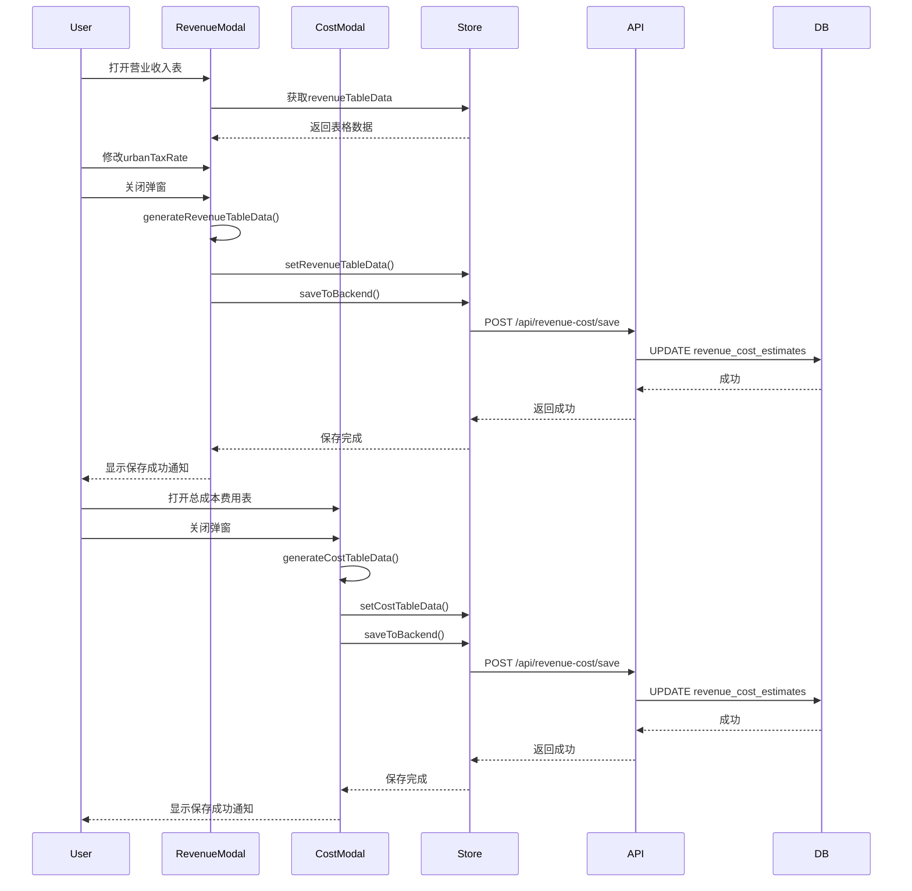

# 营业收入表和总成本费用表完整数据保存实现计划

## 需求概述
在关闭"总成本费用估算表"和"营业收入、营业税金及附加和增值税估算表"弹窗时，将**完整的表格数据**保存到数据库，便于后续模块调用。

## 数据结构设计

### 营业收入表数据结构
```typescript
interface RevenueTableRow {
  序号: string;           // "1", "1.1", "2", "2.1" 等
  收入项目: string;       // "营业收入", "增值税", "销项税额" 等
  合计: number;           // 合计列数值
  运营期: number[];       // 各年数据数组
}

interface RevenueTableData {
  urbanTaxRate: number;    // 城市建设维护税税率 (0.07 或 0.05)
  rows: RevenueTableRow[]; // 所有行数据
  updatedAt: string;       // 最后更新时间
}
```

### 总成本费用表数据结构
```typescript
interface CostTableRow {
  序号: string;           // "1", "1.1", "2", "3" 等
  成本项目: string;       // "营业成本", "外购原材料费" 等
  合计: number;           // 合计列数值
  运营期: number[];       // 各年数据数组
}

interface CostTableData {
  rows: CostTableRow[];   // 所有行数据
  updatedAt: string;      // 最后更新时间
}
```

## 实现方案

### 方案选择
**方案A：扩展现有model_data字段（推荐）**
- 在`model_data`中添加`revenueTableData`和`costTableData`字段
- 优点：无需修改数据库结构，与现有架构一致
- 缺点：model_data会变得更大

**推荐方案A**，因为：
1. 现有架构已经使用model_data存储所有建模数据
2. 表格数据是建模数据的一部分，逻辑上应该放在一起
3. 避免数据库迁移的复杂性

## 详细实现步骤

### 步骤1：修改revenueCostStore.ts

#### 1.1 添加表格数据状态
```typescript
interface RevenueCostState {
  // ... 现有字段
  
  // 表格数据状态
  revenueTableData: {
    urbanTaxRate: number;
    rows: Array<{
      序号: string;
      收入项目: string;
      合计: number;
      运营期: number[];
    }>;
    updatedAt: string;
  } | null;
  
  costTableData: {
    rows: Array<{
      序号: string;
      成本项目: string;
      合计: number;
      运营期: number[];
    }>;
    updatedAt: string;
  } | null;
  
  // 表格数据操作方法
  setRevenueTableData: (data: any) => void;
  setCostTableData: (data: any) => void;
}
```

#### 1.2 修改saveToBackend方法
```typescript
saveToBackend: async () => {
  const state = get()
  try {
    set({ isSaving: true })
    
    if (!state.context?.projectId) {
      throw new Error('项目ID不存在')
    }
    
    // 确保传递完整的model_data结构
    const modelData = {
      revenueItems: state.revenueItems,
      costItems: state.costItems,
      productionRates: state.productionRates,
      aiAnalysisResult: state.aiAnalysisResult,
      costConfig: state.costConfig,
      workflow_step: state.currentStep,
      // 新增表格数据
      revenueTableData: state.revenueTableData,
      costTableData: state.costTableData
    };
    
    const response = await revenueCostApi.save({
      project_id: state.context.projectId,
      model_data: modelData,
      workflow_step: state.currentStep
    })
    
    set({ isSaving: false })
    return response.success
  } catch (error) {
    console.error('保存失败:', error)
    set({ isSaving: false })
    return false
  }
}
```

#### 1.3 修改loadFromBackend方法
```typescript
loadFromBackend: async (projectId: string) => {
  try {
    set({ isSubmitting: true })
    
    const response = await revenueCostApi.getByProjectId(projectId)
    
    if (response.success && response.data?.estimate) {
      const estimate = response.data.estimate
      
      let modelData = null
      if (typeof estimate.model_data === 'string') {
        try {
          modelData = JSON.parse(estimate.model_data)
        } catch (e) {
          console.error('解析model_data失败:', e)
        }
      } else {
        modelData = estimate.model_data
      }
      
      // 更新状态
      set({
        revenueItems: modelData?.revenueItems || [],
        costItems: modelData?.costItems || [],
        productionRates: modelData?.productionRates || [],
        aiAnalysisResult: modelData?.aiAnalysisResult || estimate.ai_analysis_result || null,
        costConfig: modelData?.costConfig || getDefaultCostConfig(),
        currentStep: estimate.workflow_step || 'period',
        // 新增：加载表格数据
        revenueTableData: modelData?.revenueTableData || null,
        costTableData: modelData?.costTableData || null
      })
    }
    
    set({ isSubmitting: false })
    return response.success
  } catch (error) {
    console.error('加载失败:', error)
    set({ isSubmitting: false })
    return false
  }
}
```

#### 1.4 添加设置方法
```typescript
setRevenueTableData: (data) => {
  set({ revenueTableData: data })
  // 触发自动保存
  debouncedSave()
},

setCostTableData: (data) => {
  set({ costTableData: data })
  // 触发自动保存
  debouncedSave()
}
```

### 步骤2：修改DynamicRevenueTable.tsx

#### 2.1 添加生成表格数据的函数
```typescript
/**
 * 生成营业收入表数据
 */
const generateRevenueTableData = () => {
  if (!context) return null;
  
  const operationYears = context.operationYears;
  const years = Array.from({ length: operationYears }, (_, i) => i + 1);
  
  const rows: Array<{
    序号: string;
    收入项目: string;
    合计: number;
    运营期: number[];
  }> = [];
  
  // 1. 营业收入
  const row1 = { 序号: '1', 收入项目: '营业收入', 合计: 0, 运营期: [] as number[] };
  years.forEach((year) => {
    const yearTotal = revenueItems.reduce((sum, item) => {
      const productionRate = getProductionRateForYear(useRevenueCostStore.getState().productionRates, year)
      return sum + calculateYearlyRevenue(item, year, productionRate)
    }, 0);
    row1.运营期.push(yearTotal);
    row1.合计 += yearTotal;
  });
  rows.push(row1);
  
  // 1.1, 1.2, 1.3... 收入项
  revenueItems.forEach((item, idx) => {
    const row = { 
      序号: `1.${idx + 1}`, 
      收入项目: `${item.name}（${(item.vatRate * 100).toFixed(0)}%）`, 
      合计: 0, 
      运营期: [] as number[] 
    };
    
    years.forEach((year) => {
      const productionRate = getProductionRateForYear(useRevenueCostStore.getState().productionRates, year)
      const revenue = calculateYearlyRevenue(item, year, productionRate);
      row.运营期.push(revenue);
      row.合计 += revenue;
    });
    
    rows.push(row);
  });
  
  // 2. 增值税
  const row2 = { 序号: '2', 收入项目: '增值税', 合计: 0, 运营期: [] as number[] };
  years.forEach((year) => {
    const yearVat = calculateVatForYear(year);
    row2.运营期.push(yearVat);
    row2.合计 += yearVat;
  });
  rows.push(row2);
  
  // 2.1 销项税额
  const row2_1 = { 序号: '2.1', 收入项目: '销项税额', 合计: 0, 运营期: [] as number[] };
  years.forEach((year) => {
    const yearTotal = revenueItems.reduce((sum, item) => {
      const productionRate = getProductionRateForYear(useRevenueCostStore.getState().productionRates, year)
      const revenue = calculateYearlyRevenue(item, year, productionRate)
      return sum + (revenue - revenue / (1 + item.vatRate))
    }, 0);
    row2_1.运营期.push(yearTotal);
    row2_1.合计 += yearTotal;
  });
  rows.push(row2_1);
  
  // 2.2 进项税额
  const row2_2 = { 序号: '2.2', 收入项目: '进项税额', 合计: 0, 运营期: [] as number[] };
  years.forEach((year) => {
    const yearTotal = calculateTotalInputTaxForYear(year);
    row2_2.运营期.push(yearTotal);
    row2_2.合计 += yearTotal;
  });
  rows.push(row2_2);
  
  // 2.3 进项税额（固定资产待抵扣）
  const row2_3 = { 序号: '2.3', 收入项目: '进项税额（固定资产待抵扣）', 合计: 0, 运营期: [] as number[] };
  years.forEach((year) => {
    const yearTotal = calculateFixedAssetInputTaxForYear(year);
    row2_3.运营期.push(yearTotal);
    row2_3.合计 += yearTotal;
  });
  rows.push(row2_3);
  
  // 3. 其他税费及附加
  const row3 = { 序号: '3', 收入项目: '其他税费及附加', 合计: 0, 运营期: [] as number[] };
  years.forEach((year) => {
    const vatAmount = calculateVatForYear(year);
    const urbanTax = vatAmount * urbanTaxRate;
    const educationTax = vatAmount * 0.05;
    const otherTaxes = urbanTax + educationTax;
    row3.运营期.push(otherTaxes);
    row3.合计 += otherTaxes;
  });
  rows.push(row3);
  
  // 3.1 城市建设维护税
  const row3_1 = { 序号: '3.1', 收入项目: `城市建设维护税(${(urbanTaxRate * 100).toFixed(0)}%)`, 合计: 0, 运营期: [] as number[] };
  years.forEach((year) => {
    const vatAmount = calculateVatForYear(year);
    const urbanTax = vatAmount * urbanTaxRate;
    row3_1.运营期.push(urbanTax);
    row3_1.合计 += urbanTax;
  });
  rows.push(row3_1);
  
  // 3.2 教育费附加
  const row3_2 = { 序号: '3.2', 收入项目: '教育费附加(3%+地方2%)', 合计: 0, 运营期: [] as number[] };
  years.forEach((year) => {
    const vatAmount = calculateVatForYear(year);
    const educationTax = vatAmount * 0.05;
    row3_2.运营期.push(educationTax);
    row3_2.合计 += educationTax;
  });
  rows.push(row3_2);
  
  return {
    urbanTaxRate: urbanTaxRate,
    rows: rows,
    updatedAt: new Date().toISOString()
  };
};
```

#### 2.2 添加保存函数
```typescript
const handleSaveRevenueTableData = async () => {
  if (!context) return;
  
  const { setRevenueTableData, saveToBackend } = useRevenueCostStore.getState();
  
  // 生成并保存表格数据
  const tableData = generateRevenueTableData();
  if (tableData) {
    setRevenueTableData(tableData);
    
    // 触发保存到后端
    const success = await saveToBackend();
    
    if (success) {
      notifications.show({
        title: '保存成功',
        message: '营业收入表数据已保存',
        color: 'green',
      });
    } else {
      notifications.show({
        title: '保存失败',
        message: '营业收入表数据保存失败',
        color: 'red',
      });
      return false; // 返回失败，不关闭弹窗
    }
  }
  
  return true;
};
```

#### 2.3 修改Modal的onClose
```typescript
<Modal
  opened={showRevenueDetailModal}
  onClose={async () => {
    // 保存数据后再关闭
    const success = await handleSaveRevenueTableData();
    if (success) {
      setShowRevenueDetailModal(false);
    }
  }}
  // ...
>
```

#### 2.4 从Store加载urbanTaxRate
```typescript
const { revenueTableData } = useRevenueCostStore();

// 初始化urbanTaxRate
useEffect(() => {
  if (revenueTableData?.urbanTaxRate) {
    setUrbanTaxRate(revenueTableData.urbanTaxRate);
  }
}, [revenueTableData]);
```

### 步骤3：修改DynamicCostTable.tsx

#### 3.1 添加生成表格数据的函数
```typescript
/**
 * 生成总成本费用表数据
 */
const generateCostTableData = () => {
  if (!context) return null;
  
  const operationYears = context.operationYears;
  const years = Array.from({ length: operationYears }, (_, i) => i + 1);
  
  const rows: Array<{
    序号: string;
    成本项目: string;
    合计: number;
    运营期: number[];
  }> = [];
  
  // 1. 营业成本
  const row1 = { 序号: '1', 成本项目: '营业成本', 合计: 0, 运营期: [] as number[] };
  years.forEach((year) => {
    let total = 0;
    total += calculateRawMaterialsExcludingTax(year, years);
    total += calculateFuelPowerExcludingTax(year, years);
    total += calculateWagesTotal(year, years);
    
    let yearRepair = 0;
    if (costConfig.repair.type === 'percentage') {
      yearRepair += fixedAssetsInvestment * (costConfig.repair.percentageOfFixedAssets || 0) / 100;
    } else {
      yearRepair += costConfig.repair.directAmount || 0;
    }
    total += yearRepair;
    
    const productionRate = costConfig.otherExpenses.applyProductionRate
      ? (productionRates.find(p => p.yearIndex === year)?.rate || 1)
      : 1;
    let yearOtherExpenses = 0;
    if (costConfig.otherExpenses.type === 'percentage') {
      const revenueBase = (revenueItems || []).reduce((sum, revItem) => {
        const income = calculateTaxableIncome(revItem);
        return sum + income;
      }, 0);
      yearOtherExpenses += revenueBase * (costConfig.otherExpenses.percentage || 0) / 100 * productionRate;
    } else {
      yearOtherExpenses += (costConfig.otherExpenses.directAmount || 0) * productionRate;
    }
    total += yearOtherExpenses;
    
    row1.运营期.push(total);
    row1.合计 += total;
  });
  rows.push(row1);
  
  // 1.1 外购原材料费
  const row1_1 = { 序号: '1.1', 成本项目: '外购原材料费', 合计: 0, 运营期: [] as number[] };
  years.forEach((year) => {
    const value = calculateRawMaterialsExcludingTax(year, years);
    row1_1.运营期.push(value);
    row1_1.合计 += value;
  });
  rows.push(row1_1);
  
  // 1.2 外购燃料及动力费
  const row1_2 = { 序号: '1.2', 成本项目: '外购燃料及动力费', 合计: 0, 运营期: [] as number[] };
  years.forEach((year) => {
    const value = calculateFuelPowerExcludingTax(year, years);
    row1_2.运营期.push(value);
    row1_2.合计 += value;
  });
  rows.push(row1_2);
  
  // 1.3 工资及福利费
  const row1_3 = { 序号: '1.3', 成本项目: '工资及福利费', 合计: 0, 运营期: [] as number[] };
  years.forEach((year) => {
    const value = calculateWagesTotal(year, years);
    row1_3.运营期.push(value);
    row1_3.合计 += value;
  });
  rows.push(row1_3);
  
  // 1.4 修理费
  const row1_4 = { 序号: '1.4', 成本项目: '修理费', 合计: 0, 运营期: [] as number[] };
  years.forEach((year) => {
    let yearTotal = 0;
    if (costConfig.repair.type === 'percentage') {
      yearTotal += fixedAssetsInvestment * (costConfig.repair.percentageOfFixedAssets || 0) / 100;
    } else {
      yearTotal += costConfig.repair.directAmount || 0;
    }
    row1_4.运营期.push(yearTotal);
    row1_4.合计 += yearTotal;
  });
  rows.push(row1_4);
  
  // 1.5 其他费用
  const row1_5 = { 序号: '1.5', 成本项目: '其他费用', 合计: 0, 运营期: [] as number[] };
  years.forEach((year) => {
    const productionRate = costConfig.otherExpenses.applyProductionRate
      ? (productionRates.find(p => p.yearIndex === year)?.rate || 1)
      : 1;
    
    let yearTotal = 0;
    if (costConfig.otherExpenses.type === 'percentage') {
      const revenueBase = (revenueItems || []).reduce((sum, revItem) => {
        const income = calculateTaxableIncome(revItem);
        return sum + income;
      }, 0);
      yearTotal += revenueBase * (costConfig.otherExpenses.percentage || 0) / 100 * productionRate;
    } else {
      yearTotal += (costConfig.otherExpenses.directAmount || 0) * productionRate;
    }
    
    row1_5.运营期.push(yearTotal);
    row1_5.合计 += yearTotal;
  });
  rows.push(row1_5);
  
  // 2. 管理费用
  const row2 = { 序号: '2', 成本项目: '管理费用', 合计: 0, 运营期: [] as number[] };
  years.forEach((year) => {
    row2.运营期.push(0);
  });
  rows.push(row2);
  
  // 3. 利息支出
  const row3 = { 序号: '3', 成本项目: '利息支出', 合计: 0, 运营期: [] as number[] };
  years.forEach((year) => {
    let yearInterest = 0;
    const interestRow = repaymentTableData.find(row => row.序号 === '2.2');
    if (interestRow && interestRow.分年数据 && interestRow.分年数据[year - 1] !== undefined) {
      yearInterest = interestRow.分年数据[year - 1];
    }
    row3.运营期.push(yearInterest);
    row3.合计 += yearInterest;
  });
  rows.push(row3);
  
  // 4. 折旧费
  const row4 = { 序号: '4', 成本项目: '折旧费', 合计: 0, 运营期: [] as number[] };
  years.forEach((year) => {
    const yearIndex = year - 1;
    const rowA = depreciationData.find(row => row.序号 === 'A');
    const rowD = depreciationData.find(row => row.序号 === 'D');
    const yearDepreciation = (rowA?.分年数据[yearIndex] || 0) + (rowD?.分年数据[yearIndex] || 0);
    row4.运营期.push(yearDepreciation);
    row4.合计 += yearDepreciation;
  });
  rows.push(row4);
  
  // 5. 摊销费
  const row5 = { 序号: '5', 成本项目: '摊销费', 合计: 0, 运营期: [] as number[] };
  years.forEach((year) => {
    const yearIndex = year - 1;
    const rowE = depreciationData.find(row => row.序号 === 'E');
    const yearAmortization = rowE?.分年数据[yearIndex] || 0;
    row5.运营期.push(yearAmortization);
    row5.合计 += yearAmortization;
  });
  rows.push(row5);
  
  // 6. 开发成本
  const row6 = { 序号: '6', 成本项目: '开发成本', 合计: 0, 运营期: [] as number[] };
  years.forEach((year) => {
    row6.运营期.push(0);
  });
  rows.push(row6);
  
  // 7. 总成本费用合计
  const row7 = { 序号: '7', 成本项目: '总成本费用合计', 合计: 0, 运营期: [] as number[] };
  years.forEach((year) => {
    const yearIndex = year - 1;
    let yearTotal = 0;
    
    // 行1: 营业成本
    let yearRow1 = 0;
    yearRow1 += calculateRawMaterialsExcludingTax(year, years);
    yearRow1 += calculateFuelPowerExcludingTax(year, years);
    yearRow1 += calculateWagesTotal(year, years);
    
    let yearRepair = 0;
    if (costConfig.repair.type === 'percentage') {
      yearRepair += fixedAssetsInvestment * (costConfig.repair.percentageOfFixedAssets || 0) / 100;
    } else {
      yearRepair += costConfig.repair.directAmount || 0;
    }
    yearRow1 += yearRepair;
    
    const productionRate = costConfig.otherExpenses.applyProductionRate
      ? (productionRates.find(p => p.yearIndex === year)?.rate || 1)
      : 1;
    let yearOtherExpenses = 0;
    if (costConfig.otherExpenses.type === 'percentage') {
      const revenueBase = (revenueItems || []).reduce((sum, revItem) => {
        const income = calculateTaxableIncome(revItem);
        return sum + income;
      }, 0);
      yearOtherExpenses += revenueBase * (costConfig.otherExpenses.percentage || 0) / 100 * productionRate;
    } else {
      yearOtherExpenses += (costConfig.otherExpenses.directAmount || 0) * productionRate;
    }
    yearRow1 += yearOtherExpenses;
    
    yearTotal += yearRow1;
    
    // 行3: 利息支出
    let yearInterest = 0;
    const interestRow = repaymentTableData.find(row => row.序号 === '2.2');
    if (interestRow && interestRow.分年数据 && interestRow.分年数据[year - 1] !== undefined) {
      yearInterest = interestRow.分年数据[year - 1];
    }
    yearTotal += yearInterest;
    
    // 行4: 折旧费
    const rowA = depreciationData.find(row => row.序号 === 'A');
    const rowD = depreciationData.find(row => row.序号 === 'D');
    const yearDepreciation = (rowA?.分年数据[yearIndex] || 0) + (rowD?.分年数据[yearIndex] || 0);
    yearTotal += yearDepreciation;
    
    // 行5: 摊销费
    const rowE = depreciationData.find(row => row.序号 === 'E');
    const yearAmortization = rowE?.分年数据[yearIndex] || 0;
    yearTotal += yearAmortization;
    
    row7.运营期.push(yearTotal);
    row7.合计 += yearTotal;
  });
  rows.push(row7);
  
  return {
    rows: rows,
    updatedAt: new Date().toISOString()
  };
};
```

#### 3.2 添加保存函数
```typescript
const handleSaveCostTableData = async () => {
  if (!context) return;
  
  const { setCostTableData, saveToBackend } = useRevenueCostStore.getState();
  
  // 生成并保存表格数据
  const tableData = generateCostTableData();
  if (tableData) {
    setCostTableData(tableData);
    
    // 触发保存到后端
    const success = await saveToBackend();
    
    if (success) {
      notifications.show({
        title: '保存成功',
        message: '总成本费用表数据已保存',
        color: 'green',
      });
    } else {
      notifications.show({
        title: '保存失败',
        message: '总成本费用表数据保存失败',
        color: 'red',
      });
      return false; // 返回失败，不关闭弹窗
    }
  }
  
  return true;
};
```

#### 3.3 修改Modal的onClose
```typescript
<Modal
  opened={showCostDetailModal}
  onClose={async () => {
    // 保存数据后再关闭
    const success = await handleSaveCostTableData();
    if (success) {
      setShowCostDetailModal(false);
    }
  }}
  // ...
>
```

## 数据流程图



## 后续模块调用数据的方式

### 方式1：通过Store获取
```typescript
// 在其他组件中
const { revenueTableData, costTableData, loadFromBackend } = useRevenueCostStore();

// 加载数据
await loadFromBackend(projectId);

// 使用数据
console.log(revenueTableData?.rows);  // 营业收入表所有行
console.log(costTableData?.rows);     // 总成本费用表所有行

// 查找特定行
const revenueRow = revenueTableData?.rows.find(r => r.序号 === '1');
const costRow = costTableData?.rows.find(r => r.序号 === '1');
```

### 方式2：通过API获取
```typescript
// 获取完整的建模数据
const response = await revenueCostApi.getByProjectId(projectId);
const modelData = response.data.estimate.model_data;

// 提取表格数据
const revenueTableData = modelData.revenueTableData;
const costTableData = modelData.costTableData;

// 使用数据
console.log(revenueTableData.rows);
console.log(costTableData.rows);
```

## 测试计划

### 测试用例1：保存营业收入表数据
1. 打开营业收入表弹窗
2. 修改城市建设维护税税率
3. 关闭弹窗
4. 验证：显示保存成功通知
5. 刷新页面
6. 验证：税率保持修改后的值
7. 验证：表格数据正确加载

### 测试用例2：保存总成本费用表数据
1. 打开总成本费用表弹窗
2. 关闭弹窗
3. 验证：显示保存成功通知
4. 刷新页面
5. 验证：表格数据正确加载

### 测试用例3：其他模块调用数据
1. 在新模块中加载项目数据
2. 验证：可以获取到revenueTableData和costTableData
3. 验证：可以遍历所有行数据
4. 验证：可以查找特定序号的行

### 测试用例4：保存失败处理
1. 模拟网络错误
2. 尝试关闭弹窗
3. 验证：显示保存失败通知
4. 验证：弹窗不关闭

## 注意事项

1. **异步处理**：Modal的onClose需要是异步函数，确保数据保存完成后再关闭
2. **错误处理**：保存失败时应该显示错误通知，不关闭弹窗
3. **数据一致性**：确保保存的数据与表格显示的数据一致
4. **向后兼容**：旧数据没有revenueTableData和costTableData字段时，使用默认值
5. **性能优化**：表格数据生成可能较慢，考虑添加加载提示

## 文件修改清单

| 文件 | 修改内容 |
|------|----------|
| `client/src/stores/revenueCostStore.ts` | 添加表格数据状态和方法 |
| `client/src/components/revenue-cost/DynamicRevenueTable.tsx` | 添加generateRevenueTableData函数，添加保存函数，修改Modal onClose |
| `client/src/components/revenue-cost/DynamicCostTable.tsx` | 添加generateCostTableData函数，添加保存函数，修改Modal onClose |

## 总结

本方案通过扩展现有的`model_data`字段来存储完整的表格数据，包括所有行的序号、项目名称、合计和各年数据。后续模块可以通过Store或API轻松获取保存的表格数据，实现数据的跨模块调用。
