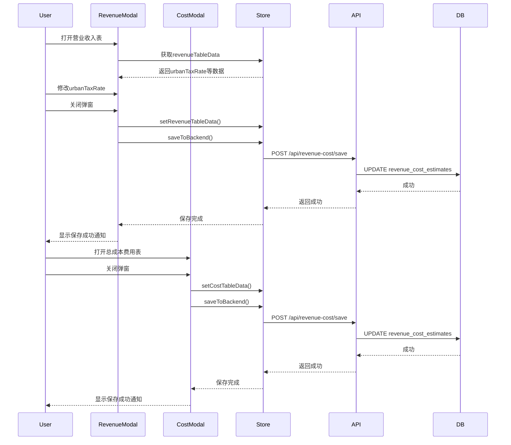

# 营业收入表和总成本费用表数据保存实现计划

## 需求概述
在关闭"总成本费用估算表"和"营业收入、营业税金及附加和增值税估算表"弹窗时，将表格数据保存到数据库，以便后续模块调用。

## 系统架构分析

### 当前数据流
```
前端组件 → revenueCostStore → 自动保存(1秒防抖) → 后端API → 数据库
```

### 现有数据库结构
表名: `revenue_cost_estimates`
- `id`: 主键
- `project_id`: 项目ID
- `calculation_period`: 计算期
- `operation_period`: 运营期
- `model_data`: JSON字段（存储完整的建模数据）
- `ai_analysis_result`: JSON字段（AI分析结果）
- `workflow_step`: 工作流步骤
- `is_completed`: 是否完成
- `created_at`, `updated_at`: 时间戳

### 现有数据结构
`model_data` 包含：
```typescript
{
  revenueItems: RevenueItem[],
  costItems: CostItem[],
  productionRates: ProductionRateConfig[],
  aiAnalysisResult: AiAnalysisResult,
  costConfig: CostConfig,
  workflow_step: string
}
```

## 实现方案

### 方案选择
**方案A：扩展现有model_data字段（推荐）**
- 在`model_data`中添加`revenueTableData`和`costTableData`字段
- 优点：无需修改数据库结构，与现有架构一致
- 缺点：model_data会变得更大

**方案B：新增独立字段**
- 在数据库中新增`revenue_table_data`和`cost_table_data`字段
- 优点：数据结构清晰，便于独立查询
- 缺点：需要数据库迁移

**推荐方案A**，因为：
1. 现有架构已经使用model_data存储所有建模数据
2. 表格数据是建模数据的一部分，逻辑上应该放在一起
3. 避免数据库迁移的复杂性

## 详细实现步骤

### 步骤1：设计表格数据结构

#### 营业收入表数据结构
```typescript
interface RevenueTableData {
  urbanTaxRate: number; // 城市建设维护税税率 (0.07 或 0.05)
  updatedAt: string; // 最后更新时间
}

interface CostTableData {
  updatedAt: string; // 最后更新时间
}
```

**说明**：表格数据不需要存储完整的数据，因为：
1. 表格数据是从`revenueItems`、`costItems`、`costConfig`等基础数据实时计算得出的
2. 只需要存储用户配置的参数（如城市建设维护税税率）
3. 其他模块调用时，可以通过基础数据重新计算表格数据

### 步骤2：修改revenueCostStore.ts

#### 2.1 添加表格数据状态
```typescript
interface RevenueCostState {
  // ... 现有字段
  
  // 表格数据状态
  revenueTableData: {
    urbanTaxRate: number;
    updatedAt: string;
  } | null;
  costTableData: {
    updatedAt: string;
  } | null;
  
  // 表格数据操作方法
  setRevenueTableData: (data: any) => void;
  setCostTableData: (data: any) => void;
}
```

#### 2.2 修改saveToBackend方法
```typescript
saveToBackend: async () => {
  const state = get()
  try {
    set({ isSaving: true })
    
    if (!state.context?.projectId) {
      throw new Error('项目ID不存在')
    }
    
    // 确保传递完整的model_data结构
    const modelData = {
      revenueItems: state.revenueItems,
      costItems: state.costItems,
      productionRates: state.productionRates,
      aiAnalysisResult: state.aiAnalysisResult,
      costConfig: state.costConfig,
      workflow_step: state.currentStep,
      // 新增表格数据
      revenueTableData: state.revenueTableData,
      costTableData: state.costTableData
    };
    
    const response = await revenueCostApi.save({
      project_id: state.context.projectId,
      model_data: modelData,
      workflow_step: state.currentStep
    })
    
    set({ isSaving: false })
    return response.success
  } catch (error) {
    console.error('保存失败:', error)
    set({ isSaving: false })
    return false
  }
}
```

#### 2.3 修改loadFromBackend方法
```typescript
loadFromBackend: async (projectId: string) => {
  try {
    set({ isSubmitting: true })
    
    const response = await revenueCostApi.getByProjectId(projectId)
    
    if (response.success && response.data?.estimate) {
      const estimate = response.data.estimate
      
      let modelData = null
      if (typeof estimate.model_data === 'string') {
        try {
          modelData = JSON.parse(estimate.model_data)
        } catch (e) {
          console.error('解析model_data失败:', e)
        }
      } else {
        modelData = estimate.model_data
      }
      
      // 更新状态
      set({
        revenueItems: modelData?.revenueItems || [],
        costItems: modelData?.costItems || [],
        productionRates: modelData?.productionRates || [],
        aiAnalysisResult: modelData?.aiAnalysisResult || estimate.ai_analysis_result || null,
        costConfig: modelData?.costConfig || getDefaultCostConfig(),
        currentStep: estimate.workflow_step || 'period',
        // 新增：加载表格数据
        revenueTableData: modelData?.revenueTableData || null,
        costTableData: modelData?.costTableData || null
      })
    }
    
    set({ isSubmitting: false })
    return response.success
  } catch (error) {
    console.error('加载失败:', error)
    set({ isSubmitting: false })
    return false
  }
}
```

### 步骤3：修改DynamicRevenueTable.tsx

#### 3.1 添加保存函数
```typescript
const handleSaveRevenueTableData = async () => {
  if (!context) return;
  
  const { setRevenueTableData, saveToBackend } = useRevenueCostStore.getState();
  
  // 保存表格数据
  setRevenueTableData({
    urbanTaxRate: urbanTaxRate,
    updatedAt: new Date().toISOString()
  });
  
  // 触发保存到后端
  await saveToBackend();
  
  notifications.show({
    title: '保存成功',
    message: '营业收入表数据已保存',
    color: 'green',
  });
};
```

#### 3.2 修改Modal的onClose
```typescript
<Modal
  opened={showRevenueDetailModal}
  onClose={async () => {
    // 保存数据后再关闭
    await handleSaveRevenueTableData();
    setShowRevenueDetailModal(false);
  }}
  // ...
>
```

#### 3.3 从Store加载urbanTaxRate
```typescript
const { revenueTableData } = useRevenueCostStore();

// 初始化urbanTaxRate
useEffect(() => {
  if (revenueTableData?.urbanTaxRate) {
    setUrbanTaxRate(revenueTableData.urbanTaxRate);
  }
}, [revenueTableData]);
```

### 步骤4：修改DynamicCostTable.tsx

#### 4.1 添加保存函数
```typescript
const handleSaveCostTableData = async () => {
  if (!context) return;
  
  const { setCostTableData, saveToBackend } = useRevenueCostStore.getState();
  
  // 保存表格数据
  setCostTableData({
    updatedAt: new Date().toISOString()
  });
  
  // 触发保存到后端
  await saveToBackend();
  
  notifications.show({
    title: '保存成功',
    message: '总成本费用表数据已保存',
    color: 'green',
  });
};
```

#### 4.2 修改Modal的onClose
```typescript
<Modal
  opened={showCostDetailModal}
  onClose={async () => {
    // 保存数据后再关闭
    await handleSaveCostTableData();
    setShowCostDetailModal(false);
  }}
  // ...
>
```

### 步骤5：修改RevenueCostModeling.tsx

无需修改，因为数据已经通过store自动加载。

## 数据流程图



## 后续模块调用数据的方式

### 方式1：通过Store获取
```typescript
// 在其他组件中
const { revenueTableData, costTableData, loadFromBackend } = useRevenueCostStore();

// 加载数据
await loadFromBackend(projectId);

// 使用数据
console.log(revenueTableData?.urbanTaxRate);
console.log(costTableData?.updatedAt);
```

### 方式2：通过API获取
```typescript
// 获取完整的建模数据
const response = await revenueCostApi.getByProjectId(projectId);
const modelData = response.data.estimate.model_data;

// 提取表格数据
const revenueTableData = modelData.revenueTableData;
const costTableData = modelData.costTableData;
```

## 测试计划

### 测试用例1：保存营业收入表数据
1. 打开营业收入表弹窗
2. 修改城市建设维护税税率
3. 关闭弹窗
4. 验证：显示保存成功通知
5. 刷新页面
6. 验证：税率保持修改后的值

### 测试用例2：保存总成本费用表数据
1. 打开总成本费用表弹窗
2. 关闭弹窗
3. 验证：显示保存成功通知
4. 刷新页面
5. 验证：数据正常加载

### 测试用例3：其他模块调用数据
1. 在新模块中加载项目数据
2. 验证：可以获取到revenueTableData和costTableData

## 注意事项

1. **异步处理**：Modal的onClose需要是异步函数，确保数据保存完成后再关闭
2. **错误处理**：保存失败时应该显示错误通知，不关闭弹窗
3. **性能优化**：避免频繁保存，只在关闭弹窗时保存
4. **数据一致性**：确保保存的数据与表格显示的数据一致
5. **向后兼容**：旧数据没有revenueTableData和costTableData字段时，使用默认值

## 文件修改清单

| 文件 | 修改内容 |
|------|----------|
| `client/src/stores/revenueCostStore.ts` | 添加表格数据状态和方法 |
| `client/src/components/revenue-cost/DynamicRevenueTable.tsx` | 添加保存函数，修改Modal onClose |
| `client/src/components/revenue-cost/DynamicCostTable.tsx` | 添加保存函数，修改Modal onClose |

## 总结

本方案通过扩展现有的`model_data`字段来存储表格数据，无需修改数据库结构。实现简单、向后兼容，与现有架构保持一致。后续模块可以通过Store或API轻松获取保存的表格数据。
