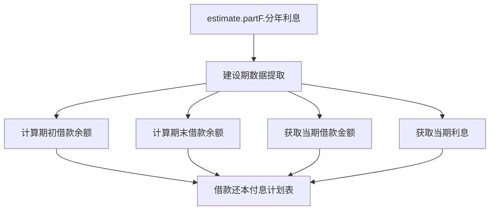

# 借款还本付息计划表建设期数据取值修复计划

## 一、任务背景

借款还本付息计划表需要从建设期利息详情表取建设期的数据，包括：
- 期初借款余额
- 期末借款余额
- 当期借款金额
- 当期利息

## 二、问题分析

### 当前代码存在的问题

在 `client/src/components/revenue-cost/LoanRepaymentScheduleTable.tsx` 中：

1. **第97-110行**：从 `estimate?.partF?.分年利息` 获取建设期数据
   ```typescript
   const yearlyInterestData = estimate?.partF?.分年利息 || [];
   
   const constructionLoanAmount = Array(constructionYears).fill(0);
   const constructionInterest = Array(constructionYears).fill(0);
   
   yearlyInterestData.forEach((yearData: any, index: number) => {
     if (index < constructionYears) {
       constructionLoanAmount[index] = yearData.当期借款金额 || 0;
       constructionInterest[index] = yearData.当期利息 || 0;
     }
   });
   ```

2. **第239-281行**：建设期相关行的计算逻辑存在问题
   - **期初借款余额**（第243-245行）：计算逻辑错误，使用了借款金额的累加
   - **其中：还本**（第261行）：建设期应该为0，因为建设期不还本
   - **付息**（第269行）：应该使用建设期利息详情表中的当期利息
   - **期末借款余额**（第277-279行）：计算逻辑错误

3. **建设期利息详情表数据结构**（来自 `ConstructionInterestModal.tsx`）
   - `yearlyInterestData[yearIndex]?.当期借款金额` - 当期借款金额
   - `yearlyInterestData[yearIndex]?.当期利息` - 当期应计利息
   - `calculateEndOfYearBalance(yearIndex)` - 期末借款余额（累计借款金额）
   - `yearIndex === 0 ? 0 : calculateEndOfYearBalance(yearIndex - 1)` - 期初借款余额

## 三、修复方案

### 3.1 数据获取

从 `estimate?.partF?.分年利息` 获取建设期数据：

```typescript
const yearlyInterestData = estimate?.partF?.分年利息 || [];
```

### 3.2 计算函数

创建辅助函数来计算期初和期末借款余额：

```typescript
// 计算某年期末借款余额（累计借款金额）
const calculateEndOfYearBalance = (yearIndex: number): number => {
  let balance = 0;
  for (let i = 0; i <= yearIndex; i++) {
    if (yearlyInterestData[i]) {
      balance += yearlyInterestData[i].当期借款金额 || 0;
    }
  }
  return balance;
};

// 计算某年期初借款余额
const calculateBeginningOfYearBalance = (yearIndex: number): number => {
  if (yearIndex === 0) return 0;
  return calculateEndOfYearBalance(yearIndex - 1);
};
```

### 3.3 建设期数据数组

```typescript
// 建设期期初借款余额
const constructionBeginningBalance = Array(constructionYears).fill(0).map((_, index) => 
  calculateBeginningOfYearBalance(index)
);

// 建设期当期借款金额
const constructionLoanAmount = Array(constructionYears).fill(0).map((_, index) => 
  yearlyInterestData[index]?.当期借款金额 || 0
);

// 建设期当期利息
const constructionInterest = Array(constructionYears).fill(0).map((_, index) => 
  yearlyInterestData[index]?.当期利息 || 0
);

// 建设期期末借款余额
const constructionEndingBalance = Array(constructionYears).fill(0).map((_, index) => 
  calculateEndOfYearBalance(index)
);

// 建设期当期还本付息（建设期只付息，不还本）
const constructionRepayment = Array(constructionYears).fill(0).map((_, index) => 
  yearlyInterestData[index]?.当期利息 || 0
);

// 建设期还本（建设期为0）
const constructionPrincipalRepayment = Array(constructionYears).fill(0);

// 建设期付息
const constructionInterestPayment = Array(constructionYears).fill(0).map((_, index) => 
  yearlyInterestData[index]?.当期利息 || 0
);
```

### 3.4 表格数据更新

更新表格数据构建部分（第228-380行）：

```typescript
const tableData: LoanRepaymentTableData = {
  rows: [
    // 1 借款还本付息计划
    {
      序号: '1',
      项目: '借款还本付息计划',
      合计: null,
      建设期: constructionPeriod,
      运营期: operationPeriod
    },
    // 1.1 期初借款余额
    {
      序号: '1.1',
      项目: '期初借款余额',
      合计: null,
      建设期: constructionBeginningBalance,
      运营期: beginningBalance
    },
    // 1.2 当期还本付息
    {
      序号: '1.2',
      项目: '当期还本付息',
      合计: null,
      建设期: constructionRepayment,
      运营期: yearlyPayment
    },
    // 其中：还本
    {
      序号: '',
      项目: '其中：还本',
      合计: null,
      建设期: constructionPrincipalRepayment,
      运营期: yearlyPrincipal
    },
    // 付息
    {
      序号: '',
      项目: '付息',
      合计: null,
      建设期: constructionInterestPayment,
      运营期: yearlyInterest
    },
    // 1.3 期末借款余额
    {
      序号: '1.3',
      项目: '期末借款余额',
      合计: null,
      建设期: constructionEndingBalance,
      运营期: endingBalance
    },
    // ... 其他行保持不变
  ],
  updatedAt: new Date().toISOString()
};
```

## 四、实施步骤

### 步骤1：修改 LoanRepaymentScheduleTable.tsx

1. 在 `calculateLoanRepaymentData` useMemo 中添加计算函数
2. 重新计算建设期相关数据数组
3. 更新表格数据构建部分

### 步骤2：验证数据正确性

1. 确保建设期期初借款余额第1年为0
2. 确保建设期期末借款余额正确累计
3. 确保建设期当期还本付息只包含利息
4. 确保建设期还本为0

### 步骤3：测试功能

1. 测试建设期为1年的情况
2. 测试建设期为多年的情况
3. 验证与建设期利息详情表数据一致

## 五、数据流程图



## 六、注意事项

1. **数据来源**：确保 `estimate?.partF?.分年利息` 数据存在且格式正确
2. **边界条件**：处理建设期为0或建设期年限大于分年利息数据长度的情况
3. **数据一致性**：确保借款还本付息计划表与建设期利息详情表的数据一致
4. **建设期特性**：建设期只付息不还本，当期还本付息 = 当期利息

## 七、预期效果

修复后，借款还本付息计划表的建设期数据将：
- 正确显示期初借款余额（第1年为0，之后逐年累计）
- 正确显示期末借款余额（累计借款金额）
- 正确显示当期还本付息（等于当期利息）
- 正确显示其中：还本（建设期为0）
- 正确显示付息（等于当期利息）
- 与建设期利息详情表数据完全一致
