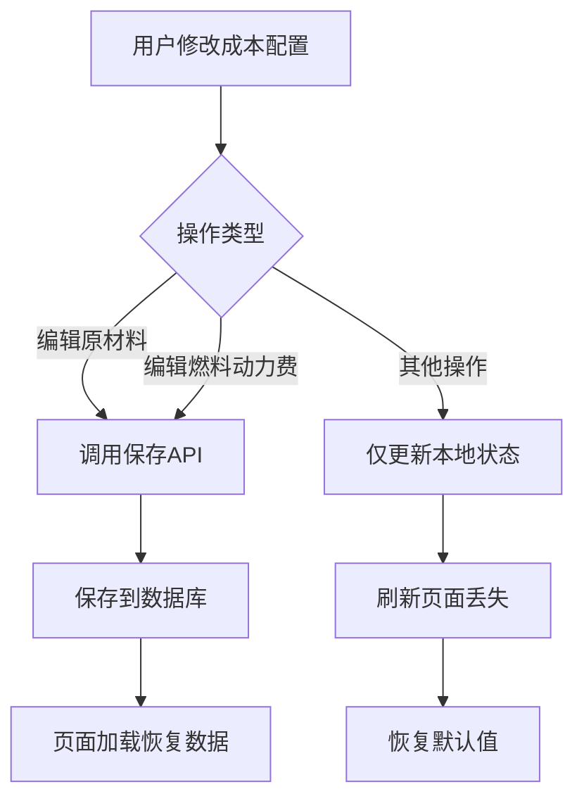

# 成本数据持久化修复方案

## 问题分析

### 问题描述
用户在编辑外购原材料费、外购燃料及动力费、工资及福利费、修理费等成本配置后，刷新页面数据会丢失，恢复到默认值。

### 根本原因
1. **部分操作未保存到数据库**：只有少数操作（如编辑原材料、编辑燃料动力费）会调用保存API
2. **缺少自动保存机制**：大部分配置修改只更新了本地状态（Zustand Store），没有触发后端保存
3. **页面加载时恢复默认值**：由于之前没有保存，刷新页面时从数据库加载不到数据，只能使用默认配置

### 数据流分析



## 解决方案

### 1. 数据库表结构 ✅
`revenue_cost_estimates` 表已包含 `model_data` JSON 字段，可以存储完整的成本配置：
- `rawMaterials`: 外购原材料费配置
- `fuelPower`: 外购燃料及动力费配置
- `wages`: 工资及福利费配置
- `repair`: 修理费配置
- `otherExpenses`: 其他费用配置
- `auxiliaryMaterials`: 辅助材料费用配置

### 2. 后端API ✅
`RevenueCostController.save` 方法已实现，可以接收并保存 `model_data`。

### 3. 前端实现方案

#### 3.1 在 Store 中添加自动保存机制
在 `revenueCostStore.ts` 中添加防抖自动保存功能：

```typescript
// 添加防抖保存函数
let saveTimeout: NodeJS.Timeout | null = null

const debouncedSave = async () => {
  if (saveTimeout) clearTimeout(saveTimeout)
  saveTimeout = setTimeout(async () => {
    const state = get()
    if (state.context?.projectId) {
      await state.saveToBackend()
    }
  }, 1000) // 1秒防抖
}
```

#### 3.2 修改 updateCostConfig 方法
在 `updateCostConfig` 方法中添加自动保存调用：

```typescript
updateCostConfig: (updates) => {
  set((state) => ({
    costConfig: { ...state.costConfig, ...updates }
  }))
  // 触发自动保存
  debouncedSave()
}
```

#### 3.3 修改其他配置更新方法
同样为以下方法添加自动保存：
- `updateProductionRate`
- `addRevenueItem`
- `updateRevenueItem`
- `deleteRevenueItem`
- `addCostItem`
- `updateCostItem`
- `deleteCostItem`

#### 3.4 页面加载时恢复数据
确保 `InvestmentCalculator.tsx` 或相关页面在加载时调用 `loadFromBackend`：

```typescript
useEffect(() => {
  if (id) {
    loadProjectAndEstimate()
    loadRevenueCostData()
  }
}, [id])

const loadRevenueCostData = async () => {
  await useRevenueCostStore.getState().loadFromBackend(id)
}
```

### 4. 实施步骤

#### 步骤1：修改 revenueCostStore.ts
- 添加防抖保存函数
- 修改所有更新方法以触发自动保存
- 添加保存状态指示器

#### 步骤2：修改 DynamicCostTable.tsx
- 移除手动保存调用（因为现在自动保存）
- 添加保存状态提示

#### 步骤3：修改 InvestmentCalculator.tsx
- 确保页面加载时调用 `loadFromBackend`

#### 步骤4：测试验证
- 测试各种配置修改后的持久化
- 测试页面刷新后的数据恢复
- 测试跨页面数据一致性

## 技术细节

### 防抖机制
使用 1 秒防抖，避免频繁保存请求：
- 用户连续修改时，只在最后一次修改后 1 秒触发保存
- 减少不必要的 API 调用

### 保存状态管理
添加 `isSaving` 状态，用于显示保存进度：
- 保存中：显示加载指示器
- 保存成功：显示成功提示
- 保存失败：显示错误提示

### 数据完整性
确保保存的数据包含：
- `revenueItems`: 收入项列表
- `costItems`: 成本项列表
- `productionRates`: 达产率配置
- `costConfig`: 完整的成本配置
- `aiAnalysisResult`: AI分析结果
- `workflow_step`: 当前工作流步骤

## 预期效果

1. **自动保存**：用户修改任何配置后，1秒内自动保存到数据库
2. **数据持久化**：刷新页面后，所有配置保持最新状态
3. **用户体验**：无需手动点击保存按钮，操作更流畅
4. **数据一致性**：跨页面数据保持一致

## 风险评估

| 风险 | 影响 | 缓解措施 |
|------|------|----------|
| 频繁API调用 | 服务器压力 | 使用防抖机制 |
| 保存失败 | 数据丢失 | 添加错误提示和重试机制 |
| 并发保存 | 数据覆盖 | 使用乐观锁或版本控制 |