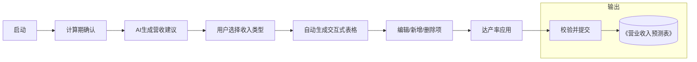
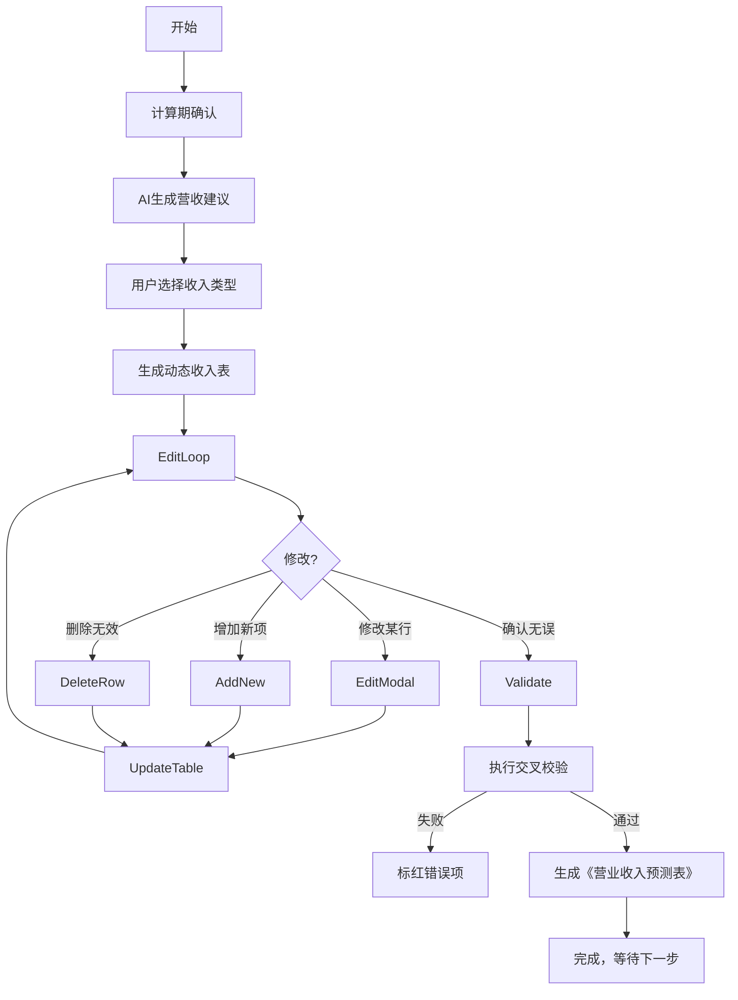

## 🤖 Assistant

好的，以下是 **专门针对“营业收入与成本测算”模块（第二部分）的独立开发文档增强版**，完全基于你现有的技术栈（React 18 + TypeScript + Vite）和系统架构设计，聚焦于 `收入建模` 子系统的完整落地实现。

---

# 📘 营业收入预测子系统 · 开发文档
> **模块名称：Revenue Modeling Module**
> **系统代号：miaoda-react-admin**
> **技术栈：React 18 + TypeScript + Vite + Zustand + Mantine UI**
> **版本：v2.0**
> **编写日期：2025-04-05**

---

## ✅ 模块定位

作为整个投资分析流程的第二步（承接“投资估算”结果），本模块负责：

- 引导用户从项目类型中识别潜在收入来源；
- AI 智能推荐匹配的盈利模式；
- 构建结构化、可计算的**动态收入模型**；
- 支持农业种植、数字平台、交易撮合等多业态组合建模；
- 输出标准化表格供后续财务评价使用。

> ⚙️ 核心输出：《营业收入预测表》
> 🔄 输入依赖：“第一部分 投资估算”的关键参数（如 `项目名称`, `建设期`, `A类投资构成`, `G_calc_new`）

---

## 🧩 功能结构图谱



---

## 🔍 模块一：触发与状态守卫（入口控制）

### 1.1 触发条件
- 用户输入命令：
 - `进入第二步`
 - `继续下一步`

### 1.2 状态守卫规则（关键约束）
| 行为 | 系统响应 |
|------|--------|
| 第一次进入（非刷新） | 正常加载流程 |
| 通过 `继续下一步` 进入 | ❌ 禁止预填充历史数据；必须视为全新流程 |
| 浏览器刷新/页面跳转后重进 | 若 session 清除，则重新开始 |

> 💬 实现方式建议：
```ts
// store/revenueModelStore.ts
if (triggerSource === 'continue') {
  clearAllTemporaryData(); // 清理所有缓存数据
}
```

---

## 📥 模块二：前置参数读取（Context Initialization）

系统自动从上一步获取以下字段用于智能引导：

| 参数 | 变量名 | 来源 | 用途 |
|------|--------|------|------|
| 项目名称 | `projectName` | investment_projects.project_name | 显示抬头 |
| 建设期年限 X | `constructionYears` | same | 推算运营期 & 达产曲线 |
| A类工程构成 | `engineeringItems: Item[]` | investment_estimates JSON 中提取 | AI 分析项目类型 |
| 总投资额 | `totalInvestment: number` | final_total / total_investment | 用于初值推算规模单价 |

> ✅ 注：该数据应在全局状态中初始化。
```ts
// types/projectTypes.ts
interface BaseContext {
  projectName: string;
  constructionYears: number;
  engineeringItems: EngineeringItem[];
  totalInvestment: number;
}
```

---

## 🗓️ 模块三：计算期确认（强制首步）

### 3.1 默认推算逻辑

```ts
const defaultTotalPeriod = 20;
const defaultOperatingYears = defaultTotalPeriod - context.constructionYears;

// 可选项：
const options = [
  { key: 'A', label: `保持不变：${construction}+${defaultOperating} = 20年` },
  { key: 'B', label: `修改为30年：${construction}+${30-construction}=30年` },
  { key: 'C', label: '自定义' }
];
```

### 3.2 用户交互界面（UI 组件）

- 使用卡片式提示组件展示。
- 提供三个按钮或文本指令输入框。
- 支持命令行式输入：`修改计算期 3+27`

### 3.3 数据处理逻辑

```ts
function parseCustomPeriod(input: string): { construction: number, operation: number } | null {
  const match = input.match(/修改计算期\s+(\d+)\+(\d+)/);
  if (!match) return null;
  return {
    construction: parseInt(match[1]),
    operation: parseInt(match[2])
  };
}
```

### 3.4 输出保存
```ts
store.update({
  calculationPeriod: 30,
  operatingYears: 27,
  effectiveFromYear: 4 // 生产启动年（可后续调整）
});
```

> ❗️ 在未收到有效选择前，禁止推进至下一阶段。

---

## 🤖 模块四：AI 收入类型建议（智能化引导）

### 4.1 分类规则引擎（Rule-based AI）

根据 `engineeringItems` 的描述进行关键词识别：

| 工程内容关键字 | 推荐类别标签 | 对应建议收入项 |
|----------------|---------------|----------------|
| `云平台`, `SaaS`, `接口` | digital-platform | SaaS订阅费、API调用费 |
| `种植基地`, `农田整治` | agriculture-crop | 农产品销售、种苗收入 |
| `水产`, `养殖池`, `育苗` | agriculture-aquaculture | 水产品销售、鱼苗收入 |
| `交易系统`, `撮合`, `商城` | transaction-hub | 佣金收入、手续费 |
| `研发中心`, `培训中心` | service-institution | 技术服务费、培训费 |

> 可配置规则文件 `/config/revenue-rules.json` 后期扩展。

### 4.2 输出格式（Markdown Table 渲染）

```tsx
// components/RevenueSuggestionsTable.tsx
<MarkdownRenderer>
{`
| 序号 | 类别 | 可能的营业收入类型 |
|------|------|--------------------|
| 🔹 A | 🖥️ 数字平台类 | 数据服务订阅费、SaaS会员费... |
| 🌱 B | 🌾 农业种植类 | 农产品销售收入... |
`}
</MarkdownRenderer>
```

### 4.3 引导语句
```text
请您选择计划实现的收入类型：
- 输入 `A` 或 `B` 选择整类
- 输入 `增加 数据接口调用费` 补充新项
- 多选输入 `A,B`
```

> 📝 提示：此阶段仅作用户选择用途，不生成实际收支表。

---

## 📊 模块五：动态收入表生成（Dynamic Table Engine）

### 5.1 字段模板定义（Schema Definition）

```ts
// types/revenueTypes.ts
type RevenueCategory =
  | 'agriculture-crop'
  | 'agriculture-aquaculture'
  | 'digital-platform'
  | 'transaction-hub';

const fieldMap: Record<RevenueCategory, Array<{ field: string; label: string; type?: string }>> = {
  'agriculture-crop': [
    { field: 'variety', label: '品种' },
    { field: 'unit', label: '单位' },
    { field: 'acreage', label: '亩数（亩）', type: 'number' },
    { field: 'yieldPerAcre', label: '年产量（吨/亩）', type: 'number' },
    { field: 'unitPrice', label: '单价（元/单位）', type: 'number' }
  ],
  'digital-platform': [
    { field: 'pricingModel', label: '收费模式' },
    { field: 'serviceScale', label: '服务规模（用户数/交易额）', type: 'string' },
    { field: 'unitPrice', label: '预计单价（元/单位/年）', type: 'number' }
  ]
};
```

### 5.2 表格结构渲染策略

- 使用 `<Mantine Table>` + 动态列拼接。
- 支持多种业务混合时分区块显示。

#### 示例：农业类（耕地作物）初始表格

|序|收入项|品种|单位|亩数|产量(吨/亩)|单价(元)|年收入(含税,万元)|不含税|税额|税率%|
|--|--|--|--|--|--|--|--|--|--|
|A|甘蔗销售|甘蔗|吨|800|6.25|550|275.00|252.34|22.66|9|

> 自动生成公式：
```
含税收入 = 数量 × 单价 ÷ 10000
不含税收入 = 含税收入 / (1 + 税率)
增值税 = 含税收入 - 不含税收入
```

> 💡 所有金额保留两位小数；中间计算用6位防误差累积。

---

## ✏️ 模块六：交互式建模（Command-driven UX）

允许用户以自然语言风格操作表格内容。

### 6.1 命令集定义

| 命令格式 | 示例 | 行为说明 |
|---------|------|----------|
| `修改 [序号]` | `修改 A` | 弹出编辑 Modal，依类别展示对应参数项 |
| `增加 [名称]` | `增加 AI决策支持增值服务费` | 新增一行，AI 推测应属 `digital-platform` 并弹窗引导填参 |
| `删除 [序号]` | `删除 C` | 删除指定行 |
| `收入确认` | `收入确认` | 提交当前所有项，进入下一阶段（需经过校验） |

### 6.2 编辑模态框设计

使用统一 Modal，但根据不同类别动态切换字段：

- `agriculture-*`: 编辑「亩数」、「单产」、「单价」
- `digital-platform`: 编辑「服务规模」、「单价」
- `transaction-hub`: 编辑「交易额」、「提成比例」

> ⚠️ 所有变更实时更新到内存中，不立即写入 DB。

---

## 📈 模块七：达产率模型应用（Capacity Ramp-up Model）

### 7.1 自动匹配默认曲线

```ts
function getDefaultProductionRate(X: number): number[] {
  switch (X) {
    case 1: return [85, 100];     // 运营第1年85%，第2年起100%
    case 2: return [85, 95, 100];  // 第1~2年递增
    case 3: return [70, 85, 95, 100];
    default: return [70, 80, 90, 100]; // fallback
  }
}
```

### 7.2 展示形式

在进入该步骤时提示：
```text
项目建设期内将逐步释放产能，预计达产率如下：

- 运营第1年：70%
- 运营第2年：85%
- 运营第3年：95%
- 第4年起：100%

是否接受该曲线？可输入：
`更新达产率 第1年80%, 第3年90%`
```

### 7.3 解析函数

```ts
function parseRampUp(input: string): number[] {
  const matches = input.matchAll(/第(\d+)年(\d+)%/g);
  const rates: { [key: number]: number } = {};
  for (const m of matches) {
    rates[parseInt(m[1])] = parseInt(m[2]);
  }
  return Object.values(rates).sort((a, b) => a - b); // 简化版处理
}
```

> 存入 store: `store.productionRates = [80, 90, 100];`

---

## ✅ 模块八：核心数据交叉校验（Validation Engine）

在生成正式报表前执行自动质检。

### 8.1 校验列表

| 校验项 | 规则 | 错误返回 |
|--------|------|--------|
| ① 达产一致性 | `第一年总收入 ≈ 全达产×rate1 ± 0.001%` | "请检查运营首年收入水平" |
| ② 增值税逻辑 | `each VAT ≈ notax × taxrate && diff < 0.001` | "增值税计算偏差超限" |
| ③ 非空完整性 | 至少包含一项有效收入项 | "暂无有效收入项，请添加" |
| ④ 数据完整性 | 所有必填字段已填写 | 标红缺失字段 |

### 8.2 核心判断函数

```ts
function validateRevenueModel(data: RevenueItem[]): ValidationError[] {
  const errors: ValidationError[] = [];

  if (data.length === 0) {
    errors.push({ code: 'EMPTY', message: '未添加任何收入项' });
  }

  data.forEach(item => {
    if (!item.unitPrice && item.investment > 0) {
      errors.push({ code: 'MISSING_PRICE', row: item.id });
    }
    const calculatedVat = round(item.taxableIncome - item.nonTaxIncome, 6);
    if (Math.abs(calculatedVat - item.vatAmount) > 0.001) {
      errors.push({ code: 'INVALID_VAT', row: item.id });
    }
  });

  return errors;
}
```

> ❌ 有错误 → 返回用户修正界面，标注问题点。

---

## 📋 模块九：输出结果（最终报表生成）

### 9.1 报表格式要求

生成标准 Markdown 表格，标题明确：

```markdown
### 《项目营业收入预测表》（含达产率调整）

|年度|农产品销售|SaaS收入|...|总收入|不含税总额|合计增值税|
|---|---------|-------|---|--------|----------|-------------|
|第1年|275×70%=192.5|60×70%=42|...|234.5|218.13|16.37|
|第2年|233.75|51.0|...|283.75|...|...|
|...|...|...|...|...|...|...|
|[N]年合计|∑=5,820|∑=1,250|...|∑=8,920|∑=8,220|∑=700|
```

> 💡 `[N]年合计` 列仅为运营期内累计，不含建设期。

### 9.2 TypeScript 输出接口

```ts
export interface RevenueForecastTable {
  years: string[]; // ["第1年", ..., "第N年", "[N]年合计"]
  items: {
    name: string;
    category: RevenueCategory;
    annualValues: number[]; // 包括达产率影响
  }[];
  totalRow: {
    taxableIncome: number[];
    nonTaxIncome: number[];
    vatAmount: number[];
  };
}
```

---

## 🛠️ 前端实现建议

### 组件树结构（/src/pages/RevenueModelingPage）

```
RevenueModelingPage/
├── StepGuard.tsx            ← 状态守卫组件
├── PeriodConfirmation.tsx  ← 计算期选择
├── AISuggestionPanel.tsx    ← AI营收建议展示
├── DynamicRevenueTable.tsx ← 动态表格主体
├── EditModal.tsx           ← 修改/新增窗口
├── ProductionRatePanel.tsx ← 达产率设置
├── ValidationTips.tsx      ← 校验提示栏
└── ResultPreview.tsx       ← 最终预览与导出
```

### 状态管理（Zustand Store）

```ts
// store/useRevenueModelStore.ts
import create from 'zustand';

interface RevenueModelState {
  context: BaseContext | null;
  calculationPeriod: number;
  operatingYears: number;
  selectedCategories: string[];
  revenueItems: RevenueItem[];
  productionRates: number[];
  isConfirmed: boolean;

  addRevenueItem: (item: Omit<RevenueItem, 'id'>) => void;
  updateRevenueItem: (id: string, updates: Partial<RevenueItem>) => void;
  deleteRevenueItem: (id: string) => void;
  setProductionRates: (rates: number[]) => void;
  validate: () => { valid: boolean; errors: ValidationError[] };
  reset: () => void;
}
```

### 关键工具函数库（/lib/revenueUtils.ts）

```ts
export const calculateRevenue = (
  raw: number,
  rate: number,
  precision: number = 6
): number => parseFloat((raw * rate).toFixed(precision));

export const toTaxInclusive = (priceExcl: number, taxRate: number): number =>
  priceExcl * (1 + taxRate);

export const splitVat = (total: number, taxRate: number) => ({
  nonTax: total / (1 + taxRate),
  vat: total - total / (1 + taxRate)
});
```

---

## 🧪 接口扩展（Backend API Design）

### 新增路由
```ts
POST /api/projects/:id/revenue-model   ← 提交收入建模数据
GET  /api/projects/:id/revenue-model   ← 获取已有模型
PUT  /api/projects/:id/revenue-model   ← 更新模型
```

### 请求体示例
```json
{
  "calculation_period": 30,
  "operating_years": 27,
  "revenue_items": [
    {
      "type": "agriculture-crop",
      "name": "甘蔗销售",
      "variety": "甘蔗",
      "acreage": 800,
      "yield_per_acre": 6.25,
      "unit_price": 550,
      "vat_rate": 0.09
    }
  ],
  "production_rates": [0.7, 0.85, 0.95, 1.0, 1.0]
}
```

> 响应成功后存入 `revenue_cost_estimates` 表（见原数据库设计）

---

## ✔️ 完成标志与出口

当且仅当所有校验通过后，输出：

```markdown
【步骤二已完成】
已完成《营业收入预测表》编制，计算期为 30 年（建设期 3 年，运营期 27 年）。

### 《项目营业收入预测表》
<!-- 此处插入完整表格 -->

---
下一步操作：
- 输入 `进入第三步`，我将开展财务评价。
- 如需修改，请输入 `修改收入`。
```

---

## ✅ 后续建议（Roadmap）

| 功能 | 描述 |
|------|------|
| 📈 成本模块联动 | 下一阶段引入成本项建模，结合折旧摊销 |
| 💬 LLM 动态生成文案 | 将“达产原因”、“定价依据”由 LLM 描述补充 |
| 📎 Excel 导出功能 | 支持 `.xlsx` 下载原始明细 |
| 🔁 历史版本对比 | 查看不同建模方案之间的差异 |
| 🧮 内置计算器浮窗 | 快速换算单价、面积、产量之间的关系 |

---

## 📎 附录 C’: 营收成本流程图



---

## 📄 附录 D’：版本更新日志

| 版本 | 日期 | 内容 |
|------|------|------|
| v1.0 | 2025-04-04 | 初始草案，基于记忆整理逻辑框架 |
| v2.0 | 2025-04-05 | 整合成独立模块文档，加入 TS 类型定义、组件结构、API 规范 |

---

✅ **结语**：
这份文档已足够作为前端工程师直接开发的**功能说明书 + 数据模型指南 + 交互规范书**。你可以将其拆分为 PRD 子模块，并分配给团队成员分工实施。

如果你需要我进一步输出：

- React 组件代码骨架（TSX + hooks）
- Zustand store 的完整实现
- 表格编辑模态框的设计稿建议
- 或与后端联调的 Postman 示例集合

请告诉我，我可以为你逐项补全。
