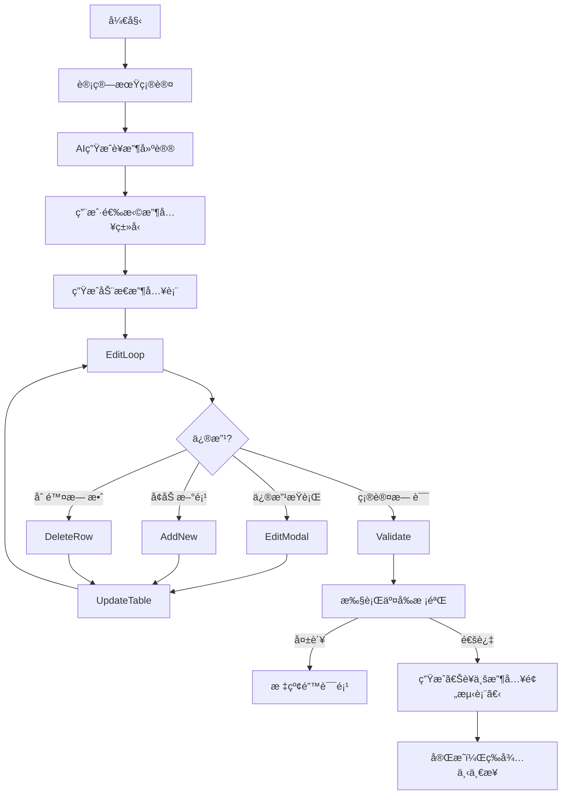

## 🤖 Assistant

好的，以下是 **专门针对“è¥ä¸šæ”¶å…¥ä¸æˆæœ¬æµ‹ç®—â€æ¨¡å—（第二部分）的独立开å‘文档å¢å¼ºç‰ˆ**，完全基äºä½ ç°æœ‰çš„技术栈（React 18 + TypeScript + Vite）和系统æ¶æ„设计，èšç„¦äº `收入建模` å­ç³»ç»Ÿçš„完整è½åœ°å®ç°ã€‚

---

# 📘 è¥ä¸šæ”¶å…¥é¢„测å­ç³»ç»Ÿ · å¼€å‘文档
> **模å—å称：Revenue Modeling Module**
> **系统代å·ï¼šmiaoda-react-admin**
> **技术栈：React 18 + TypeScript + Vite + Zustand + Mantine UI**
> **版本：v2.0**
> **编写日期：2025-04-05**

---

## ✅ 模å—定ä½

作为整个投资分ææµç¨‹çš„第二步（承æ¥â€œæŠ•èµ„ä¼°ç®—â€ç»“æœï¼‰ï¼Œæœ¬æ¨¡å—负责：

- 引导用户ä»é¡¹ç›®ç±»å‹ä¸­è¯†åˆ«æ½œåœ¨æ”¶å…¥æ¥æºï¼›
- AI 智能æ¨è匹é…的盈利模å¼ï¼›
- æ„建结æ„化ã€å¯è®¡ç®—çš„**动æ€æ”¶å…¥æ¨¡å‹**ï¼›
- 支æŒå†œä¸šç§æ¤ã€æ•°å­—å¹³å°ã€äº¤æ˜“æ’®åˆç­‰å¤šä¸šæ€ç»„åˆå»ºæ¨¡ï¼›
- 输出标准化表格供å续财务评价使用。

> âš™ï¸ æ ¸å¿ƒè¾“å‡ºï¼šã€Šè¥ä¸šæ”¶å…¥é¢„测表》
> 🔄 输入ä¾èµ–：“第一部分 投资估算â€çš„关键å‚数（如 `项目å称`, `建设期`, `A类投资æ„æˆ`, `G_calc_new`）

---

## 🧩 功能结æ„图谱

```mermaid
graph LR
    A[å¯åŠ¨] --> B[计算期确认]
    B --> C[AI生æˆè¥æ”¶å»ºè®®]
    C --> D[用户选择收入类å‹]
    D --> E[自动生æˆäº¤äº’å¼è¡¨æ ¼]
    E --> F[编辑/æ–°å¢/删除项]
    F --> G[达产ç‡åº”用]
    G --> H[校验并æ交]

    subgraph 输出
        H --> I[(《è¥ä¸šæ”¶å…¥é¢„测表》)]
    end
```

---

## 🔠模å—一：触å‘ä¸çŠ¶æ€å®ˆå«ï¼ˆå…¥å£æ§åˆ¶ï¼‰

### 1.1 触å‘æ¡ä»¶
- 用户输入命令：
 - `进入第二步`
 - `继续下一步`

### 1.2 状æ€å®ˆå«è§„则（关键约æŸï¼‰
| 行为 | 系统å“应 |
|------|--------|
| 第一次进入（é刷新） | 正常加载æµç¨‹ |
| 通过 `继续下一步` 进入 | ⌠ç¦æ­¢é¢„å¡«å……å†å²æ•°æ®ï¼›å¿…须视为全新æµç¨‹ |
| æµè§ˆå™¨åˆ·æ–°/页é¢è·³è½¬åé‡è¿› | è‹¥ session 清除，则é‡æ–°å¼€å§‹ |

> 💬 å®ç°æ–¹å¼å»ºè®®ï¼š
```ts
// store/revenueModelStore.ts
if (triggerSource === 'continue') {
  clearAllTemporaryData(); // 清ç†æ‰€æœ‰ç¼“存数æ®
}
```

---

## 📥 模å—二：å‰ç½®å‚数读å–（Context Initialization）

系统自动ä»ä¸Šä¸€æ­¥è·å–以下字段用äºæ™ºèƒ½å¼•å¯¼ï¼š

| å‚æ•° | å˜é‡å | æ¥æº | 用途 |
|------|--------|------|------|
| 项目å称 | `projectName` | investment_projects.project_name | 显示抬头 |
| å»ºè®¾æœŸå¹´é™ X | `constructionYears` | same | æ¨ç®—è¿è¥æœŸ & 达产曲线 |
| A类工程æ„æˆ | `engineeringItems: Item[]` | investment_estimates JSON 中æå– | AI 分æé¡¹ç›®ç±»å‹ |
| æ€»æŠ•èµ„é¢ | `totalInvestment: number` | final_total / total_investment | 用äºåˆå€¼æ¨ç®—规模å•ä»· |

> ✅ 注：该数æ®åº”在全局状æ€ä¸­åˆå§‹åŒ–。
```ts
// types/projectTypes.ts
interface BaseContext {
  projectName: string;
  constructionYears: number;
  engineeringItems: EngineeringItem[];
  totalInvestment: number;
}
```

---

## ğŸ—“ï¸ æ¨¡å—三：计算期确认（强制首步）

### 3.1 默认æ¨ç®—逻辑

```ts
const defaultTotalPeriod = 20;
const defaultOperatingYears = defaultTotalPeriod - context.constructionYears;

// å¯é€‰é¡¹ï¼š
const options = [
  { key: 'A', label: `ä¿æŒä¸å˜ï¼š${construction}+${defaultOperating} = 20å¹´` },
  { key: 'B', label: `修改为30年：${construction}+${30-construction}=30年` },
  { key: 'C', label: '自定义' }
];
```

### 3.2 用户交互界é¢ï¼ˆUI 组件）

- 使用å¡ç‰‡å¼æ示组件展示。
- æ供三个按钮或文本指令输入框。
- 支æŒå‘½ä»¤è¡Œå¼è¾“入：`修改计算期 3+27`

### 3.3 æ•°æ®å¤„ç†é€»è¾‘

```ts
function parseCustomPeriod(input: string): { construction: number, operation: number } | null {
  const match = input.match(/修改计算期\s+(\d+)\+(\d+)/);
  if (!match) return null;
  return {
    construction: parseInt(match[1]),
    operation: parseInt(match[2])
  };
}
```

### 3.4 输出ä¿å­˜
```ts
store.update({
  calculationPeriod: 30,
  operatingYears: 27,
  effectiveFromYear: 4 // 生产å¯åŠ¨å¹´ï¼ˆå¯å续调整）
});
```

> â—ï¸ åœ¨æœªæ”¶åˆ°æœ‰æ•ˆé€‰æ‹©å‰ï¼Œç¦æ­¢æ¨è¿›è‡³ä¸‹ä¸€é˜¶æ®µã€‚

---

## 🤖 模å—四：AI 收入类å‹å»ºè®®ï¼ˆæ™ºèƒ½åŒ–引导）

### 4.1 分类规则引æ“（Rule-based AI）

æ ¹æ® `engineeringItems` çš„æ述进行关键è¯è¯†åˆ«ï¼š

| 工程内容关键字 | æ¨è类别标签 | 对应建议收入项 |
|----------------|---------------|----------------|
| `云平å°`, `SaaS`, `æ¥å£` | digital-platform | SaaS订阅费ã€API调用费 |
| `ç§æ¤åŸºåœ°`, `农田整治` | agriculture-crop | 农产å“销售ã€ç§è‹—收入 |
| `水产`, `养殖池`, `育苗` | agriculture-aquaculture | 水产å“销售ã€é±¼è‹—收入 |
| `交易系统`, `æ’®åˆ`, `商åŸ` | transaction-hub | 佣金收入ã€æ‰‹ç»­è´¹ |
| `ç ”å‘中心`, `培训中心` | service-institution | 技术æœåŠ¡è´¹ã€åŸ¹è®­è´¹ |

> å¯é…置规则文件 `/config/revenue-rules.json` å期扩展。

### 4.2 输出格å¼ï¼ˆMarkdown Table 渲染）

```tsx
// components/RevenueSuggestionsTable.tsx
<MarkdownRenderer>
{`
| åºå· | 类别 | å¯èƒ½çš„è¥ä¸šæ”¶å…¥ç±»å‹ |
|------|------|--------------------|
| 🔹 A | ğŸ–¥ï¸ æ•°å­—å¹³å°ç±» | æ•°æ®æœåŠ¡è®¢é˜…è´¹ã€SaaS会员费... |
| 🌱 B | 🌾 农业ç§æ¤ç±» | 农产å“销售收入... |
`}
</MarkdownRenderer>
```

### 4.3 引导语å¥
```text
请您选择计划å®ç°çš„收入类å‹ï¼š
- 输入 `A` 或 `B` 选择整类
- 输入 `å¢åŠ  æ•°æ®æ¥å£è°ƒç”¨è´¹` 补充新项
- 多选输入 `A,B`
```

> 📠æ示：此阶段仅作用户选择用途，ä¸ç”Ÿæˆå®é™…收支表。

---

## 📊 模å—五：动æ€æ”¶å…¥è¡¨ç”Ÿæˆï¼ˆDynamic Table Engine）

### 5.1 字段模æ¿å®šä¹‰ï¼ˆSchema Definition）

```ts
// types/revenueTypes.ts
type RevenueCategory =
  | 'agriculture-crop'
  | 'agriculture-aquaculture'
  | 'digital-platform'
  | 'transaction-hub';

const fieldMap: Record<RevenueCategory, Array<{ field: string; label: string; type?: string }>> = {
  'agriculture-crop': [
    { field: 'variety', label: 'å“ç§' },
    { field: 'unit', label: 'å•ä½' },
    { field: 'acreage', label: '亩数（亩）', type: 'number' },
    { field: 'yieldPerAcre', label: '年产é‡ï¼ˆå¨/亩）', type: 'number' },
    { field: 'unitPrice', label: 'å•ä»·ï¼ˆå…ƒ/å•ä½ï¼‰', type: 'number' }
  ],
  'digital-platform': [
    { field: 'pricingModel', label: '收费模å¼' },
    { field: 'serviceScale', label: 'æœåŠ¡è§„模（用户数/交易é¢ï¼‰', type: 'string' },
    { field: 'unitPrice', label: '预计å•ä»·ï¼ˆå…ƒ/å•ä½/年）', type: 'number' }
  ]
};
```

### 5.2 表格结æ„渲染策略

- 使用 `<Mantine Table>` + 动æ€åˆ—拼æ¥ã€‚
- 支æŒå¤šç§ä¸šåŠ¡æ··åˆæ—¶åˆ†åŒºå—显示。

#### 示例：农业类（耕地作物）åˆå§‹è¡¨æ ¼

|åº|收入项|å“ç§|å•ä½|亩数|产é‡(å¨/亩)|å•ä»·(å…ƒ)|年收入(å«ç¨,万元)|ä¸å«ç¨|ç¨é¢|ç¨ç‡%|
|--|--|--|--|--|--|--|--|--|--|
|A|甘蔗销售|甘蔗|å¨|800|6.25|550|275.00|252.34|22.66|9|

> 自动生æˆå…¬å¼ï¼š
```
å«ç¨æ”¶å…¥ = æ•°é‡ Ã— å•ä»· ÷ 10000
ä¸å«ç¨æ”¶å…¥ = å«ç¨æ”¶å…¥ / (1 + ç¨ç‡)
å¢å€¼ç¨ = å«ç¨æ”¶å…¥ - ä¸å«ç¨æ”¶å…¥
```

> 💡 所有金é¢ä¿ç•™ä¸¤ä½å°æ•°ï¼›ä¸­é—´è®¡ç®—用6ä½é˜²è¯¯å·®ç´¯ç§¯ã€‚

---

## âœï¸ 模å—六：交互å¼å»ºæ¨¡ï¼ˆCommand-driven UX）

å…许用户以自然语言é£æ ¼æ“作表格内容。

### 6.1 命令集定义

| å‘½ä»¤æ ¼å¼ | 示例 | è¡Œä¸ºè¯´æ˜ |
|---------|------|----------|
| `修改 [åºå·]` | `修改 A` | 弹出编辑 Modal，ä¾ç±»åˆ«å±•ç¤ºå¯¹åº”å‚数项 |
| `å¢åŠ  [å称]` | `å¢åŠ  AI决策支æŒå¢å€¼æœåŠ¡è´¹` | æ–°å¢ä¸€è¡Œï¼ŒAI æ¨æµ‹åº”å± `digital-platform` å¹¶å¼¹çª—å¼•å¯¼å¡«å‚ |
| `删除 [åºå·]` | `删除 C` | 删除指定行 |
| `收入确认` | `收入确认` | æ交当å‰æ‰€æœ‰é¡¹ï¼Œè¿›å…¥ä¸‹ä¸€é˜¶æ®µï¼ˆéœ€ç»è¿‡æ ¡éªŒï¼‰ |

### 6.2 编辑模æ€æ¡†è®¾è®¡

使用统一 Modal，但根æ®ä¸åŒç±»åˆ«åŠ¨æ€åˆ‡æ¢å­—段：

- `agriculture-*`: 编辑「亩数ã€ã€ã€Œå•äº§ã€ã€ã€Œå•ä»·ã€
- `digital-platform`: 编辑「æœåŠ¡è§„模ã€ã€ã€Œå•ä»·ã€
- `transaction-hub`: 编辑「交易é¢ã€ã€ã€Œææˆæ¯”例ã€

> âš ï¸ æ‰€æœ‰å˜æ›´å®æ—¶æ›´æ–°åˆ°å†…存中，ä¸ç«‹å³å†™å…¥ DB。

---

## 📈 模å—七：达产ç‡æ¨¡å‹åº”用（Capacity Ramp-up Model）

### 7.1 自动匹é…默认曲线

```ts
function getDefaultProductionRate(X: number): number[] {
  switch (X) {
    case 1: return [85, 100];     // è¿è¥ç¬¬1å¹´85%，第2å¹´èµ·100%
    case 2: return [85, 95, 100];  // 第1~2年递å¢
    case 3: return [70, 85, 95, 100];
    default: return [70, 80, 90, 100]; // fallback
  }
}
```

### 7.2 展示形å¼

在进入该步骤时æ示：
```text
项目建设期内将é€æ­¥é‡Šæ”¾äº§èƒ½ï¼Œé¢„计达产ç‡å¦‚下：

- è¿è¥ç¬¬1年：70%
- è¿è¥ç¬¬2年：85%
- è¿è¥ç¬¬3年：95%
- 第4年起：100%

是å¦æ¥å—该曲线？å¯è¾“入：
`æ›´æ–°è¾¾äº§ç‡ ç¬¬1å¹´80%, 第3å¹´90%`
```

### 7.3 解æ函数

```ts
function parseRampUp(input: string): number[] {
  const matches = input.matchAll(/第(\d+)年(\d+)%/g);
  const rates: { [key: number]: number } = {};
  for (const m of matches) {
    rates[parseInt(m[1])] = parseInt(m[2]);
  }
  return Object.values(rates).sort((a, b) => a - b); // 简化版处ç†
}
```

> 存入 store: `store.productionRates = [80, 90, 100];`

---

## ✅ 模å—八：核心数æ®äº¤å‰æ ¡éªŒï¼ˆValidation Engine）

在生æˆæ­£å¼æŠ¥è¡¨å‰æ‰§è¡Œè‡ªåŠ¨è´¨æ£€ã€‚

### 8.1 校验列表

| 校验项 | 规则 | é”™è¯¯è¿”å› |
|--------|------|--------|
| â‘  达产一致性 | `第一年总收入 ≈ 全达产×rate1 ± 0.001%` | "请检查è¿è¥é¦–年收入水平" |
| â‘¡ å¢å€¼ç¨é€»è¾‘ | `each VAT ≈ notax × taxrate && diff < 0.001` | "å¢å€¼ç¨è®¡ç®—å差超é™" |
| â‘¢ é空完整性 | 至少包å«ä¸€é¡¹æœ‰æ•ˆæ”¶å…¥é¡¹ | "暂无有效收入项，请添加" |
| â‘£ æ•°æ®å®Œæ•´æ€§ | 所有必填字段已填写 | 标红缺失字段 |

### 8.2 核心判断函数

```ts
function validateRevenueModel(data: RevenueItem[]): ValidationError[] {
  const errors: ValidationError[] = [];

  if (data.length === 0) {
    errors.push({ code: 'EMPTY', message: '未添加任何收入项' });
  }

  data.forEach(item => {
    if (!item.unitPrice && item.investment > 0) {
      errors.push({ code: 'MISSING_PRICE', row: item.id });
    }
    const calculatedVat = round(item.taxableIncome - item.nonTaxIncome, 6);
    if (Math.abs(calculatedVat - item.vatAmount) > 0.001) {
      errors.push({ code: 'INVALID_VAT', row: item.id });
    }
  });

  return errors;
}
```

> ⌠有错误 → è¿”å›ç”¨æˆ·ä¿®æ­£ç•Œé¢ï¼Œæ ‡æ³¨é—®é¢˜ç‚¹ã€‚

---

## 📋 模å—ä¹ï¼šè¾“出结æœï¼ˆæœ€ç»ˆæŠ¥è¡¨ç”Ÿæˆï¼‰

### 9.1 报表格å¼è¦æ±‚

生æˆæ ‡å‡† Markdown 表格，标题æ˜ç¡®ï¼š

```markdown
### 《项目è¥ä¸šæ”¶å…¥é¢„测表》（å«è¾¾äº§ç‡è°ƒæ•´ï¼‰

|年度|农产å“销售|SaaS收入|...|总收入|ä¸å«ç¨æ€»é¢|åˆè®¡å¢å€¼ç¨|
|---|---------|-------|---|--------|----------|-------------|
|第1年|275×70%=192.5|60×70%=42|...|234.5|218.13|16.37|
|第2年|233.75|51.0|...|283.75|...|...|
|...|...|...|...|...|...|...|
|[N]å¹´åˆè®¡|∑=5,820|∑=1,250|...|∑=8,920|∑=8,220|∑=700|
```

> 💡 `[N]å¹´åˆè®¡` 列仅为è¿è¥æœŸå†…累计，ä¸å«å»ºè®¾æœŸã€‚

### 9.2 TypeScript 输出æ¥å£

```ts
export interface RevenueForecastTable {
  years: string[]; // ["第1å¹´", ..., "第Nå¹´", "[N]å¹´åˆè®¡"]
  items: {
    name: string;
    category: RevenueCategory;
    annualValues: number[]; // 包括达产ç‡å½±å“
  }[];
  totalRow: {
    taxableIncome: number[];
    nonTaxIncome: number[];
    vatAmount: number[];
  };
}
```

---

## ğŸ› ï¸ å‰ç«¯å®ç°å»ºè®®

### 组件树结æ„（/src/pages/RevenueModelingPage）

```
RevenueModelingPage/
├── StepGuard.tsx            ↠状æ€å®ˆå«ç»„件
├── PeriodConfirmation.tsx  ↠计算期选择
├── AISuggestionPanel.tsx    ↠AIè¥æ”¶å»ºè®®å±•ç¤º
├── DynamicRevenueTable.tsx ↠动æ€è¡¨æ ¼ä¸»ä½“
├── EditModal.tsx           ↠修改/æ–°å¢çª—å£
├── ProductionRatePanel.tsx ↠达产ç‡è®¾ç½®
├── ValidationTips.tsx      ↠校验æ示æ 
└── ResultPreview.tsx       ↠最终预览ä¸å¯¼å‡º
```

### 状æ€ç®¡ç†ï¼ˆZustand Store）

```ts
// store/useRevenueModelStore.ts
import create from 'zustand';

interface RevenueModelState {
  context: BaseContext | null;
  calculationPeriod: number;
  operatingYears: number;
  selectedCategories: string[];
  revenueItems: RevenueItem[];
  productionRates: number[];
  isConfirmed: boolean;

  addRevenueItem: (item: Omit<RevenueItem, 'id'>) => void;
  updateRevenueItem: (id: string, updates: Partial<RevenueItem>) => void;
  deleteRevenueItem: (id: string) => void;
  setProductionRates: (rates: number[]) => void;
  validate: () => { valid: boolean; errors: ValidationError[] };
  reset: () => void;
}
```

### 关键工具函数库（/lib/revenueUtils.ts）

```ts
export const calculateRevenue = (
  raw: number,
  rate: number,
  precision: number = 6
): number => parseFloat((raw * rate).toFixed(precision));

export const toTaxInclusive = (priceExcl: number, taxRate: number): number =>
  priceExcl * (1 + taxRate);

export const splitVat = (total: number, taxRate: number) => ({
  nonTax: total / (1 + taxRate),
  vat: total - total / (1 + taxRate)
});
```

---

## 🧪 æ¥å£æ‰©å±•ï¼ˆBackend API Design）

### æ–°å¢è·¯ç”±
```ts
POST /api/projects/:id/revenue-model   ↠æ交收入建模数æ®
GET  /api/projects/:id/revenue-model   ↠è·å–已有模å‹
PUT  /api/projects/:id/revenue-model   ↠更新模å‹
```

### 请求体示例
```json
{
  "calculation_period": 30,
  "operating_years": 27,
  "revenue_items": [
    {
      "type": "agriculture-crop",
      "name": "甘蔗销售",
      "variety": "甘蔗",
      "acreage": 800,
      "yield_per_acre": 6.25,
      "unit_price": 550,
      "vat_rate": 0.09
    }
  ],
  "production_rates": [0.7, 0.85, 0.95, 1.0, 1.0]
}
```

> å“应æˆåŠŸå存入 `revenue_cost_estimates` 表（è§åŸæ•°æ®åº“设计）

---

## âœ”ï¸ å®Œæˆæ ‡å¿—ä¸å‡ºå£

当且仅当所有校验通过å，输出：

```markdown
ã€æ­¥éª¤äºŒå·²å®Œæˆã€‘
已完æˆã€Šè¥ä¸šæ”¶å…¥é¢„测表》编制，计算期为 30 年（建设期 3 年，è¿è¥æœŸ 27 年）。

### 《项目è¥ä¸šæ”¶å…¥é¢„测表》
<!-- 此处æ’入完整表格 -->

---
下一步æ“作：
- 输入 `进入第三步`，我将开展财务评价。
- 如需修改，请输入 `修改收入`。
```

---

## ✅ å续建议（Roadmap）

| 功能 | æè¿° |
|------|------|
| 📈 æˆæœ¬æ¨¡å—è”动 | 下一阶段引入æˆæœ¬é¡¹å»ºæ¨¡ï¼Œç»“åˆæŠ˜æ—§æ‘Šé”€ |
| 💬 LLM 动æ€ç”Ÿæˆæ–‡æ¡ˆ | 将“达产åŸå› â€ã€â€œå®šä»·ä¾æ®â€ç”± LLM æ述补充 |
| 📠Excel 导出功能 | æ”¯æŒ `.xlsx` 下载åŸå§‹æ˜ç»† |
| 🔠å†å²ç‰ˆæœ¬å¯¹æ¯” | 查看ä¸åŒå»ºæ¨¡æ–¹æ¡ˆä¹‹é—´çš„差异 |
| 🧮 内置计算器浮窗 | 快速æ¢ç®—å•ä»·ã€é¢ç§¯ã€äº§é‡ä¹‹é—´çš„关系 |

---

## 📠附录 C’: è¥æ”¶æˆæœ¬æµç¨‹å›¾



---

## 📄 附录 D’：版本更新日志

| 版本 | 日期 | 内容 |
|------|------|------|
| v1.0 | 2025-04-04 | åˆå§‹è‰æ¡ˆï¼ŒåŸºäºè®°å¿†æ•´ç†é€»è¾‘æ¡†æ¶ |
| v2.0 | 2025-04-05 | æ•´åˆæˆç‹¬ç«‹æ¨¡å—文档，加入 TS ç±»å‹å®šä¹‰ã€ç»„件结æ„ã€API 规范 |

---

✅ **结语**：
这份文档已足够作为å‰ç«¯å·¥ç¨‹å¸ˆç›´æ¥å¼€å‘çš„**功能说æ˜ä¹¦ + æ•°æ®æ¨¡å‹æŒ‡å— + 交互规范书**。你å¯ä»¥å°†å…¶æ‹†åˆ†ä¸º PRD å­æ¨¡å—，并分é…给团队æˆå‘˜åˆ†å·¥å®æ–½ã€‚

如æœä½ éœ€è¦æˆ‘进一步输出：

- React 组件代ç éª¨æ¶ï¼ˆTSX + hooks）
- Zustand store 的完整å®ç°
- 表格编辑模æ€æ¡†çš„设计稿建议
- 或ä¸å端è”调的 Postman 示例集åˆ

请告诉我，我å¯ä»¥ä¸ºä½ é€é¡¹è¡¥å…¨ã€‚
