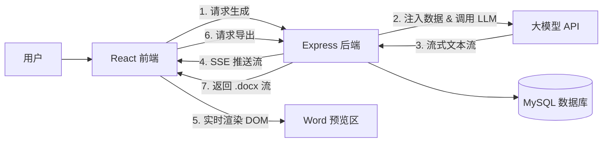

# 投资项目方案报告生成模块实现计划

## 一、项目概述

本模块旨在为投资项目管理系统增加智能报告生成功能，用户完成收入成本预测模块后，可进入报告生成模块，基于项目数据自动生成专业的投资方案报告，并支持导出为 Word 文档。

### 1.1 需求来源
- 需求文档: `doc/投资报告生成模块.md`
- 技术文档: `doc/报告生成技术文档.md`

### 1.2 目标用户
- 投资项目管理人员
- 财务分析师
- 项目决策者

---

## 二、现有代码状态分析

### 2.1 已完成的基础设施

| 组件 | 文件路径 | 状态 | 说明 |
|------|----------|------|------|
| 数据库表结构 | `server/src/db/migrations/003_add_report_tables.sql` | ✅ 已创建 | 包含 report_templates, generated_reports, report_generation_history 三张表 |
| 报告服务 | `server/src/services/reportService.ts` | ✅ 已实现 | 包含流式生成、Word导出、暂停/继续/停止逻辑 |
| SSE 管理器 | `server/src/services/sseManager.ts` | ✅ 已存在 | 管理流式推送 |
| LLM 服务 | `server/src/lib/llm.ts` | ✅ 已存在 | 支持流式和非流式调用 |

### 2.2 待实现的组件

| 组件 | 文件路径 | 优先级 | 说明 |
|------|----------|--------|------|
| 报告控制器 | `server/src/controllers/reportController.ts` | 高 | 处理 API 请求 |
| 报告路由 | `server/src/routes/report.ts` | 高 | API 路由定义 |
| 前端页面 | `client/src/pages/ReportGeneration.tsx` | 高 | 主页面 |
| 提示词编辑器 | `client/src/components/report/PromptEditor.tsx` | 高 | 富文本编辑 |
| 报告预览 | `client/src/components/report/ReportPreview.tsx` | 高 | A4 预览 |
| 变量选择器 | `client/src/components/report/VariablePicker.tsx` | 中 | 变量插入 |
| 模板选择器 | `client/src/components/report/TemplateSelector.tsx` | 中 | 模板管理 |
| 状态管理 | `client/src/stores/reportStore.ts` | 高 | Zustand store |
| API 服务 | `client/src/services/reportApi.ts` | 高 | API 调用 |

---

## 三、技术架构

### 3.1 系统架构图



### 3.2 技术栈

#### 前端
- **框架**: React 18 + TypeScript
- **UI 组件**: Mantine UI (`@mantine/core`, `@mantine/hooks`)
- **富文本**: `@tiptap/react` + `@mantine/tiptap`
- **状态管理**: Zustand
- **HTTP 客户端**: Axios（普通 API），Fetch（SSE）
- **安全**: `dompurify`（HTML 净化）

#### 后端
- **框架**: Express + TypeScript
- **ORM**: mysql2（使用现有数据库访问方式）
- **文档生成**: `docx`
- **流式传输**: Server-Sent Events (SSE)

---

## 四、后端实现详细计划

### 4.1 创建报告控制器

**文件**: `server/src/controllers/reportController.ts`

```typescript
import { Request, Response } from 'express'
import { ReportService } from '../services/reportService.js'
import { v4 as uuidv4 } from 'uuid'
import { pool } from '../db/config.js'

export class ReportController {
  /**
   * 创建新的报告记录
   */
  static async create(req: Request, res: Response): Promise<void> {
    try {
      const { projectId, templateId, title } = req.body
      const userId = (req as any).user.id

      const reportId = uuidv4()
      
      await pool.execute(
        `INSERT INTO generated_reports 
         (id, project_id, template_id, user_id, report_title, generation_status) 
         VALUES (?, ?, ?, ?, ?, 'pending')`,
        [reportId, projectId, templateId, userId, title || '未命名报告']
      )

      res.json({ success: true, reportId })
    } catch (error) {
      console.error('创建报告失败:', error)
      res.status(500).json({ success: false, error: '创建报告失败' })
    }
  }

  /**
   * 启动流式报告生成
   */
  static async generate(req: Request, res: Response): Promise<void> {
    try {
      const { id } = req.params
      const { promptTemplate } = req.body
      const userId = (req as any).user.id

      // 获取报告信息
      const [reports] = await pool.execute(
        'SELECT * FROM generated_reports WHERE id = ?',
        [id]
      )
      
      if (reports.length === 0) {
        res.status(404).json({ success: false, error: '报告不存在' })
        return
      }

      const report = reports[0]
      
      // 获取 LLM 配置
      const [configs] = await pool.execute(
        'SELECT * FROM llm_configs WHERE user_id = ? AND is_default = TRUE',
        [userId]
      )
      
      if (configs.length === 0) {
        res.status(400).json({ success: false, error: '未配置默认的 LLM' })
        return
      }

      const llmConfig = configs[0]
      
      // 获取项目信息
      const [projects] = await pool.execute(
        'SELECT * FROM investment_projects WHERE id = ?',
        [report.project_id]
      )
      
      if (projects.length === 0) {
        res.status(404).json({ success: false, error: '项目不存在' })
        return
      }

      // 设置 SSE 响应头
      res.setHeader('Content-Type', 'text/event-stream')
      res.setHeader('Cache-Control', 'no-cache')
      res.setHeader('Connection', 'keep-alive')
      
      // 启动流式生成
      await ReportService.generateReportStream(id, llmConfig, promptTemplate, projects[0])
      
      // 关闭响应
      res.end()
    } catch (error) {
      console.error('生成报告失败:', error)
      res.status(500).json({ success: false, error: '生成报告失败' })
    }
  }

  /**
   * 获取报告详情
   */
  static async getById(req: Request, res: Response): Promise<void> {
    try {
      const { id } = req.params
      
      const [reports] = await pool.execute(
        `SELECT r.*, t.name as template_name, t.prompt_template 
         FROM generated_reports r 
         LEFT JOIN report_templates t ON r.template_id = t.id 
         WHERE r.id = ?`,
        [id]
      )
      
      if (reports.length === 0) {
        res.status(404).json({ success: false, error: '报告不存在' })
        return
      }

      res.json({ success: true, report: reports[0] })
    } catch (error) {
      console.error('获取报告失败:', error)
      res.status(500).json({ success: false, error: '获取报告失败' })
    }
  }

  /**
   * 获取项目的报告列表
   */
  static async getByProjectId(req: Request, res: Response): Promise<void> {
    try {
      const { projectId } = req.params
      
      const [reports] = await pool.execute(
        `SELECT r.*, t.name as template_name 
         FROM generated_reports r 
         LEFT JOIN report_templates t ON r.template_id = t.id 
         WHERE r.project_id = ? 
         ORDER BY r.created_at DESC`,
        [projectId]
      )

      res.json({ success: true, reports })
    } catch (error) {
      console.error('获取报告列表失败:', error)
      res.status(500).json({ success: false, error: '获取报告列表失败' })
    }
  }

  /**
   * 暂停报告生成
   */
  static async pause(req: Request, res: Response): Promise<void> {
    try {
      const { id } = req.params
      
      await ReportService.pauseReportGeneration(id)
      
      res.json({ success: true })
    } catch (error) {
      console.error('暂停失败:', error)
      res.status(500).json({ success: false, error: '暂停失败' })
    }
  }

  /**
   * 继续报告生成
   */
  static async resume(req: Request, res: Response): Promise<void> {
    try {
      const { id } = req.params
      
      await ReportService.resumeReportGeneration(id)
      
      res.json({ success: true })
    } catch (error) {
      console.error('继续失败:', error)
      res.status(500).json({ success: false, error: '继续失败' })
    }
  }

  /**
   * 停止报告生成
   */
  static async stop(req: Request, res: Response): Promise<void> {
    try {
      const { id } = req.params
      
      await ReportService.stopReportGeneration(id)
      
      res.json({ success: true })
    } catch (error) {
      console.error('停止失败:', error)
      res.status(500).json({ success: false, error: '停止失败' })
    }
  }

  /**
   * 导出 Word 文档
   */
  static async export(req: Request, res: Response): Promise<void> {
    try {
      const { id } = req.params
      
      // 获取报告内容
      const [reports] = await pool.execute(
        'SELECT * FROM generated_reports WHERE id = ?',
        [id]
      )
      
      if (reports.length === 0) {
        res.status(404).json({ success: false, error: '报告不存在' })
        return
      }

      const report = reports[0]
      
      // 生成 Word 文档
      const buffer = await ReportService.generateWordDocument(
        report.report_content || '',
        report.report_title
      )

      // 设置响应头
      res.setHeader('Content-Type', 'application/vnd.openxmlformats-officedocument.wordprocessingml.document')
      res.setHeader('Content-Disposition', `attachment; filename="${encodeURIComponent(report.report_title)}.docx"`)

      res.send(buffer)
    } catch (error) {
      console.error('导出失败:', error)
      res.status(500).json({ success: false, error: '导出失败' })
    }
  }

  /**
   * 获取模板列表
   */
  static async getTemplates(req: Request, res: Response): Promise<void> {
    try {
      const userId = (req as any).user.id
      
      const [templates] = await pool.execute(
        `SELECT * FROM report_templates 
         WHERE user_id = ? OR is_system = TRUE 
         ORDER BY is_system DESC, created_at DESC`,
        [userId]
      )

      res.json({ success: true, templates })
    } catch (error) {
      console.error('获取模板列表失败:', error)
      res.status(500).json({ success: false, error: '获取模板列表失败' })
    }
  }

  /**
   * 保存模板
   */
  static async saveTemplate(req: Request, res: Response): Promise<void> {
    try {
      const { name, description, promptTemplate, isDefault } = req.body
      const userId = (req as any).user.id

      const templateId = uuidv4()
      
      await pool.execute(
        `INSERT INTO report_templates 
         (id, user_id, name, description, prompt_template, is_default, is_system) 
         VALUES (?, ?, ?, ?, ?, ?, FALSE)`,
        [templateId, userId, name, description, promptTemplate, isDefault || false]
      )

      res.json({ success: true, templateId })
    } catch (error) {
      console.error('保存模板失败:', error)
      res.status(500).json({ success: false, error: '保存模板失败' })
    }
  }

  /**
   * 删除模板
   */
  static async deleteTemplate(req: Request, res: Response): Promise<void> {
    try {
      const { id } = req.params
      const userId = (req as any).user.id

      await pool.execute(
        'DELETE FROM report_templates WHERE id = ? AND user_id = ?',
        [id, userId]
      )

      res.json({ success: true })
    } catch (error) {
      console.error('删除模板失败:', error)
      res.status(500).json({ success: false, error: '删除模板失败' })
    }
  }
}
```

### 4.2 创建报告路由

**文件**: `server/src/routes/report.ts`

```typescript
import express from 'express'
import { ReportController } from '../controllers/reportController.js'
import { authenticateToken } from '../middleware/auth.js'

const router = express.Router()

// 所有路由都需要认证
router.use(authenticateToken)

// 报告 CRUD
router.post('/create', ReportController.create)
router.get('/:id', ReportController.getById)
router.get('/project/:projectId', ReportController.getByProjectId)

// 流式生成
router.post('/generate/:id', ReportController.generate)

// 生成控制
router.post('/pause/:id', ReportController.pause)
router.post('/resume/:id', ReportController.resume)
router.post('/stop/:id', ReportController.stop)

// 导出
router.post('/export/:id', ReportController.export)

// 模板管理
router.get('/templates', ReportController.getTemplates)
router.post('/templates', ReportController.saveTemplate)
router.delete('/templates/:id', ReportController.deleteTemplate)

export default router
```

---

## 五、前端实现详细计划

### 5.1 状态管理

**文件**: `client/src/stores/reportStore.ts`

```typescript
import { create } from 'zustand'
import { reportApi } from '../services/reportApi'

interface ReportVariable {
  key: string
  label: string
  value: any
}

interface ReportHistoryItem {
  id: string
  title: string
  createdAt: string
  status: string
}

interface ReportState {
  // 报告信息
  reportId: string | null
  projectId: string | null
  reportTitle: string
  reportContent: string
  generationStatus: 'idle' | 'generating' | 'paused' | 'completed' | 'failed'
  
  // 提示词
  promptTemplate: string
  promptHtml: string
  
  // 模板
  templates: any[]
  selectedTemplateId: string | null
  
  // 变量
  availableVariables: ReportVariable[]
  projectData: any
  
  // 加载状态
  isLoading: boolean
  error: string | null
  
  // Actions
  setProjectId: (id: string) => void
  setReportTitle: (title: string) => void
  setPromptTemplate: (template: string) => void
  setPromptHtml: (html: string) => void
  selectTemplate: (templateId: string) => void
  
  loadTemplates: () => Promise<void>
  loadProjectData: () => Promise<void>
  startGeneration: () => Promise<void>
  pauseGeneration: () => Promise<void>
  resumeGeneration: () => Promise<void>
  stopGeneration: () => Promise<void>
  exportToWord: () => Promise<void>
  resetReport: () => void
}

export const useReportStore = create<ReportState>((set, get) => ({
  reportId: null,
  projectId: null,
  reportTitle: '',
  reportContent: '',
  generationStatus: 'idle',
  promptTemplate: '',
  promptHtml: '',
  templates: [],
  selectedTemplateId: null,
  availableVariables: [],
  projectData: null,
  isLoading: false,
  error: null,

  setProjectId: (id) => set({ projectId: id }),
  setReportTitle: (title) => set({ reportTitle: title }),
  setPromptTemplate: (template) => set({ promptTemplate: template }),
  setPromptHtml: (html) => set({ promptHtml: html }),
  
  selectTemplate: (templateId) => {
    const { templates } = get()
    const template = templates.find(t => t.id === templateId)
    if (template) {
      set({ 
        selectedTemplateId: templateId,
        promptTemplate: template.prompt_template,
        promptHtml: `<p>${template.prompt_template}</p>`
      })
    }
  },

  loadTemplates: async () => {
    set({ isLoading: true })
    try {
      const templates = await reportApi.getTemplates()
      set({ templates, isLoading: false })
    } catch (error: any) {
      set({ error: error.message, isLoading: false })
    }
  },

  loadProjectData: async () => {
    const { projectId } = get()
    if (!projectId) return
    
    set({ isLoading: true })
    try {
      const data = await reportApi.getProjectData(projectId)
      
      // 提取可用变量
      const variables: ReportVariable[] = [
        { key: '{{project_name}}', label: '项目名称', value: data.project?.name },
        { key: '{{total_investment}}', label: '总投资额', value: data.project?.totalInvestment },
        { key: '{{construction_years}}', label: '建设期', value: data.project?.constructionYears },
        { key: '{{operation_years}}', label: '运营期', value: data.project?.operationYears },
        { key: '{{industry}}', label: '所属行业', value: data.project?.industry },
        { key: '{{location}}', label: '项目地点', value: data.project?.location },
        // 财务指标变量
        { key: '{{roi}}', label: '投资回报率', value: data.financialIndicators?.roi },
        { key: '{{irr}}', label: '内部收益率', value: data.financialIndicators?.irr },
        { key: '{{npv}}', label: '净现值', value: data.financialIndicators?.npv },
      ]
      
      set({ 
        projectData: data,
        availableVariables: variables,
        isLoading: false 
      })
    } catch (error: any) {
      set({ error: error.message, isLoading: false })
    }
  },

  startGeneration: async () => {
    const { projectId, promptTemplate, reportTitle } = get()
    if (!projectId) return
    
    set({ isLoading: true, error: null })
    try {
      // 创建报告记录
      const { reportId } = await reportApi.createReport({
        projectId,
        title: reportTitle || '投资项目方案报告'
      })
      
      set({ reportId })
      
      // 启动 SSE 流式生成
      await reportApi.generateReport(reportId, promptTemplate, {
        onChunk: (content) => {
          set((state) => ({
            reportContent: state.reportContent + content,
            generationStatus: 'generating'
          }))
        },
        onComplete: () => {
          set({ generationStatus: 'completed', isLoading: false })
        },
        onError: (error) => {
          set({ error, generationStatus: 'failed', isLoading: false })
        }
      })
    } catch (error: any) {
      set({ error: error.message, isLoading: false })
    }
  },

  pauseGeneration: async () => {
    const { reportId } = get()
    if (!reportId) return
    
    try {
      await reportApi.pause(reportId)
      set({ generationStatus: 'paused' })
    } catch (error: any) {
      set({ error: error.message })
    }
  },

  resumeGeneration: async () => {
    const { reportId } = get()
    if (!reportId) return
    
    try {
      await reportApi.resume(reportId)
      set({ generationStatus: 'generating' })
    } catch (error: any) {
      set({ error: error.message })
    }
  },

  stopGeneration: async () => {
    const { reportId } = get()
    if (!reportId) return
    
    try {
      await reportApi.stop(reportId)
      set({ generationStatus: 'idle', reportContent: '' })
    } catch (error: any) {
      set({ error: error.message })
    }
  },

  exportToWord: async () => {
    const { reportId } = get()
    if (!reportId) return
    
    try {
      await reportApi.exportWord(reportId)
    } catch (error: any) {
      set({ error: error.message })
    }
  },

  resetReport: () => {
    set({
      reportId: null,
      reportContent: '',
      generationStatus: 'idle',
      error: null
    })
  }
}))
```

### 5.2 API 服务

**文件**: `client/src/services/reportApi.ts`

```typescript
import axios from 'axios'

const API_BASE = '/api/report'

export const reportApi = {
  // 创建报告
  async createReport(data: { projectId: string; templateId?: string; title: string }) {
    const response = await axios.post(`${API_BASE}/create`, data)
    return response.data
  },

  // 启动流式生成
  async generateReport(
    reportId: string, 
    promptTemplate: string,
    handlers: {
      onChunk: (content: string) => void
      onComplete: () => void
      onError: (error: string) => void
    }
  ) {
    const response = await fetch(`${API_BASE}/generate/${reportId}`, {
      method: 'POST',
      headers: {
        'Content-Type': 'application/json',
        'Authorization': `Bearer ${localStorage.getItem('token')}`
      },
      body: JSON.stringify({ promptTemplate })
    })

    if (!response.ok) {
      throw new Error('生成失败')
    }

    const reader = response.body?.getReader()
    if (!reader) throw new Error('无法读取响应流')

    const decoder = new TextDecoder()
    let buffer = ''

    while (true) {
      const { done, value } = await reader.read()
      if (done) {
        handlers.onComplete()
        break
      }

      buffer += decoder.decode(value, { stream: true })
      const lines = buffer.split('\n')
      buffer = lines.pop() || ''

      for (const line of lines) {
        if (line.startsWith('data: ')) {
          const data = line.slice(6)
          if (data === '[DONE]') continue
          
          try {
            const parsed = JSON.parse(data)
            if (parsed.type === 'content') {
              handlers.onChunk(parsed.data)
            } else if (parsed.type === 'error') {
              handlers.onError(parsed.data)
            } else if (parsed.type === 'complete') {
              handlers.onComplete()
            }
          } catch {
            // 非 JSON 数据，直接作为内容
            handlers.onChunk(data)
          }
        }
      }
    }
  },

  // 获取报告详情
  async getReport(reportId: string) {
    const response = await axios.get(`${API_BASE}/${reportId}`)
    return response.data
  },

  // 获取项目报告列表
  async getProjectReports(projectId: string) {
    const response = await axios.get(`${API_BASE}/project/${projectId}`)
    return response.data
  },

  // 暂停生成
  async pause(reportId: string) {
    const response = await axios.post(`${API_BASE}/pause/${reportId}`)
    return response.data
  },

  // 继续生成
  async resume(reportId: string) {
    const response = await axios.post(`${API_BASE}/resume/${reportId}`)
    return response.data
  },

  // 停止生成
  async stop(reportId: string) {
    const response = await axios.post(`${API_BASE}/stop/${reportId}`)
    return response.data
  },

  // 导出 Word
  async exportWord(reportId: string) {
    const response = await axios.post(`${API_BASE}/export/${reportId}`, null, {
      responseType: 'blob'
    })

    const blob = new Blob([response.data], {
      type: 'application/vnd.openxmlformats-officedocument.wordprocessingml.document'
    })
    const url = window.URL.createObjectURL(blob)
    const link = document.createElement('a')
    link.href = url
    link.download = `投资方案报告.docx`
    link.click()
    window.URL.revokeObjectURL(url)
  },

  // 获取模板列表
  async getTemplates() {
    const response = await axios.get(`${API_BASE}/templates`)
    return response.data.templates
  },

  // 保存模板
  async saveTemplate(data: { name: string; description?: string; promptTemplate: string }) {
    const response = await axios.post(`${API_BASE}/templates`, data)
    return response.data
  },

  // 删除模板
  async deleteTemplate(templateId: string) {
    const response = await axios.delete(`${API_BASE}/templates/${templateId}`)
    return response.data
  },

  // 获取项目数据（用于变量替换）
  async getProjectData(projectId: string) {
    const response = await axios.get(`/api/projects/${projectId}/summary`)
    return response.data
  }
}
```

### 5.3 提示词编辑器组件

**文件**: `client/src/components/report/PromptEditor.tsx`

```typescript
import { useEditor } from '@tiptap/react'
import StarterKit from '@tiptap/starter-kit'
import Placeholder from '@tiptap/extension-placeholder'
import { RichTextEditor } from '@mantine/tiptap'
import { useReportStore } from '../../stores/reportStore'

export function PromptEditor() {
  const { promptHtml, setPromptHtml, setPromptTemplate, insertVariable } = useReportStore()

  const editor = useEditor({
    extensions: [
      StarterKit,
      Placeholder.configure({
        placeholder: '在此输入提示词...'
      })
    ],
    content: promptHtml,
    onUpdate: ({ editor }) => {
      setPromptHtml(editor.getHTML())
      setPromptTemplate(editor.getText())
    }
  })

  const handleInsertVariable = (variableKey: string) => {
    if (editor) {
      editor.commands.insertContent(variableKey)
    }
  }

  return (
    <div className="prompt-editor">
      <RichTextEditor editor={editor}>
        <RichTextEditor.Toolbar sticky stickyOffset={60}>
          <RichTextEditor.ControlsGroup>
            <RichTextEditor.Bold />
            <RichTextEditor.Italic />
            <RichTextEditor.Underline />
            <RichTextEditor.Strikethrough />
          </RichTextEditor.ControlsGroup>
          
          <RichTextEditor.ControlsGroup>
            <RichTextEditor.H1 />
            <RichTextEditor.H2 />
            <RichTextEditor.H3 />
          </RichTextEditor.ControlsGroup>
          
          <RichTextEditor.ControlsGroup>
            <RichTextEditor.BulletList />
            <RichTextEditor.OrderedList />
          </RichTextEditor.ControlsGroup>
        </RichTextEditor.Toolbar>

        <RichTextEditor.Content />
      </RichTextEditor>
    </div>
  )
}
```

### 5.4 报告预览组件

**文件**: `client/src/components/report/ReportPreview.tsx`

```typescript
import DOMPurify from 'dompurify'
import { Paper, Text, Badge, Loader } from '@mantine/core'
import { marked } from 'marked'
import { useReportStore } from '../../stores/reportStore'

export function ReportPreview() {
  const { reportContent, generationStatus } = useReportStore()

  // 渲染 Markdown 内容
  const renderContent = () => {
    if (!reportContent) {
      return (
        <Text c="dimmed" ta="center" py="xl">
          报告预览区域
          <br />
          请先点击"开始生成"按钮
        </Text>
      )
    }

    try {
      const html = marked.parse(reportContent)
      return (
        <div 
          className="report-content"
          dangerouslySetInnerHTML={{ 
            __html: DOMPurify.sanitize(typeof html === 'string' ? html : '') 
          }} 
        />
      )
    } catch {
      return (
        <Text c="red">
          内容渲染失败
        </Text>
      )
    }
  }

  return (
    <Paper
      shadow="sm"
      p="xl"
      style={{
        width: '210mm',
        minHeight: '297mm',
        margin: '0 auto',
        backgroundColor: '#fff'
      }}
    >
      {/* 生成状态指示器 */}
      {generationStatus === 'generating' && (
        <Badge 
          color="blue" 
          variant="light" 
          size="lg"
          mb="md"
        >
          <Loader size="xs" mr="xs" />
          正在生成...
        </Badge>
      )}
      
      {generationStatus === 'paused' && (
        <Badge color="yellow" variant="light" size="lg" mb="md">
          已暂停
        </Badge>
      )}
      
      {generationStatus === 'completed' && (
        <Badge color="green" variant="light" size="lg" mb="md">
          生成完成
        </Badge>
      )}

      {/* 预览内容 */}
      <div className="preview-content">
        {renderContent()}
      </div>
    </Paper>
  )
}
```

### 5.5 主页面

**文件**: `client/src/pages/ReportGeneration.tsx`

```typescript
import { useEffect } from 'react'
import { useParams, useNavigate } from 'react-router-dom'
import { Grid, Paper, Group, Button, Title, Text, Stack } from '@mantine/core'
import { IconPlayerPlay, IconPlayerPause, IconPlayerStop, IconDownload } from '@tabler/icons-react'
import { useReportStore } from '../stores/reportStore'
import { PromptEditor } from '../components/report/PromptEditor'
import { ReportPreview } from '../components/report/ReportPreview'
import { VariablePicker } from '../components/report/VariablePicker'
import { TemplateSelector } from '../components/report/TemplateSelector'

export function ReportGeneration() {
  const { projectId } = useParams()
  const navigate = useNavigate()
  const store = useReportStore()

  useEffect(() => {
    if (projectId) {
      store.setProjectId(projectId)
      store.loadTemplates()
      store.loadProjectData()
    }
  }, [projectId])

  const handleGenerate = async () => {
    await store.startGeneration()
  }

  const handlePause = () => {
    if (store.generationStatus === 'generating') {
      store.pauseGeneration()
    } else if (store.generationStatus === 'paused') {
      store.resumeGeneration()
    }
  }

  const handleStop = () => {
    store.stopGeneration()
  }

  const handleExport = () => {
    store.exportToWord()
  }

  return (
    <div className="report-generation-page" style={{ padding: '20px' }}>
      <Group justify="space-between" mb="lg">
        <Title order={2}>投资项目方案报告生成</Title>
        <Group>
          <Button 
            variant="subtle" 
            onClick={() => navigate(`/revenue-cost/${projectId}`)}
          >
            返回收入成本建模
          </Button>
        </Group>
      </Group>

      {store.error && (
        <Paper p="md" mb="md" bg="red.0">
          <Text c="red">{store.error}</Text>
        </Paper>
      )}

      <Grid>
        {/* 左侧：编辑区域 */}
        <Grid.Col span={4}>
          <Stack gap="md">
            {/* 模板选择器 */}
            <Paper p="md" withBorder>
              <TemplateSelector />
            </Paper>

            {/* 变量选择器 */}
            <Paper p="md" withBorder>
              <VariablePicker />
            </Paper>

            {/* 提示词编辑器 */}
            <Paper p="md" withBorder style={{ minHeight: '400px' }}>
              <Text size="sm" fw={500} mb="xs">提示词</Text>
              <PromptEditor />
            </Paper>

            {/* 控制按钮 */}
            <Paper p="md" withBorder>
              <Group>
                <Button 
                  leftSection={<IconPlayerPlay size={16} />}
                  onClick={handleGenerate}
                  disabled={store.generationStatus === 'generating'}
                  color="blue"
                >
                  开始生成
                </Button>
                
                <Button 
                  leftSection={
                    store.generationStatus === 'paused' 
                      ? <IconPlayerPlay size={16} />
                      : <IconPlayerPause size={16} />
                  }
                  onClick={handlePause}
                  disabled={store.generationStatus === 'idle'}
                  variant="light"
                >
                  {store.generationStatus === 'paused' ? '继续' : '暂停'}
                </Button>
                
                <Button 
                  leftSection={<IconPlayerStop size={16} />}
                  onClick={handleStop}
                  disabled={store.generationStatus === 'idle'}
                  variant="light"
                  color="red"
                >
                  停止
                </Button>
                
                <Button 
                  leftSection={<IconDownload size={16} />}
                  onClick={handleExport}
                  disabled={!store.reportId}
                  variant="light"
                >
                  导出Word
                </Button>
              </Group>
            </Paper>
          </Stack>
        </Grid.Col>

        {/* 右侧：预览区域 */}
        <Grid.Col span={8}>
          <div 
            style={{ 
              backgroundColor: '#f0f0f0',
              padding: '20px',
              minHeight: '100vh',
              borderRadius: '8px'
            }}
          >
            <ReportPreview />
          </div>
        </Grid.Col>
      </Grid>
    </div>
  )
}
```

### 5.6 路由配置

**文件**: `client/src/routes/routes.tsx`

添加路由:

```typescript
// 添加 import
const ReportGeneration = lazy(() => import('@/pages/ReportGeneration'))

// 添加路由
<Route path="/report/:projectId" element={
  <ProtectedRoute>
    <ReportGeneration />
  </ProtectedRoute>
} />
```

---

## 六、数据库表结构（已存在，无需修改）

### 6.1 report_templates 表

```sql
CREATE TABLE report_templates (
  id VARCHAR(36) PRIMARY KEY DEFAULT (UUID()),
  user_id VARCHAR(36) NOT NULL,
  name VARCHAR(255) NOT NULL,
  description TEXT,
  prompt_template TEXT NOT NULL,
  is_default BOOLEAN DEFAULT FALSE,
  is_system BOOLEAN DEFAULT FALSE,
  created_at TIMESTAMP DEFAULT CURRENT_TIMESTAMP,
  updated_at TIMESTAMP DEFAULT CURRENT_TIMESTAMP ON UPDATE CURRENT_TIMESTAMP,
  FOREIGN KEY (user_id) REFERENCES users(id) ON DELETE CASCADE,
  INDEX idx_user_id (user_id),
  INDEX idx_is_default (is_default)
);
```

### 6.2 generated_reports 表

```sql
CREATE TABLE generated_reports (
  id VARCHAR(36) PRIMARY KEY DEFAULT (UUID()),
  project_id VARCHAR(36) NOT NULL,
  template_id VARCHAR(36),
  user_id VARCHAR(36) NOT NULL,
  report_title VARCHAR(255) NOT NULL,
  report_content LONGTEXT,
  report_data JSON,
  generation_status ENUM('generating', 'completed', 'failed', 'paused') DEFAULT 'generating',
  file_path VARCHAR(500),
  created_at TIMESTAMP DEFAULT CURRENT_TIMESTAMP,
  updated_at TIMESTAMP DEFAULT CURRENT_TIMESTAMP ON UPDATE CURRENT_TIMESTAMP,
  FOREIGN KEY (project_id) REFERENCES investment_projects(id) ON DELETE CASCADE,
  FOREIGN KEY (template_id) REFERENCES report_templates(id) ON DELETE SET NULL,
  FOREIGN KEY (user_id) REFERENCES users(id) ON DELETE CASCADE,
  INDEX idx_project_id (project_id),
  INDEX idx_user_id (user_id),
  INDEX idx_status (generation_status),
  INDEX idx_created_at (created_at)
);
```

---

## 七、依赖安装

### 7.1 后端依赖

```bash
npm install uuid
npm install --save-dev @types/uuid
```

### 7.2 前端依赖

```bash
npm install @tiptap/react @tiptap/starter-kit @tiptap/extension-placeholder @mantine/tiptap
npm install zustand
npm install dompurify
npm install marked
npm install --save-dev @types/dompurify @types/marked
```

---

## 八、验收标准

- [ ] 能够通过提示词生成报告并显示在预览区
- [ ] 文字逐字出现，实现流式"打字机"效果
- [ ] 暂停/继续/停止功能正常
- [ ] 提示词中包含变量时自动替换为实际数据
- [ ] 点击导出按钮下载 Word 文档，排版整洁
- [ ] UI 风格与系统其他模块一致
- [ ] LLM 不可用时显示友好错误提示

---

## 九、任务清单

| 序号 | 任务 | 优先级 | 预计工作量 |
|------|------|--------|------------|
| 1 | 创建后端 reportController.ts | 高 | 2小时 |
| 2 | 创建后端 report.ts 路由 | 高 | 30分钟 |
| 3 | 添加路由到主路由文件 | 高 | 15分钟 |
| 4 | 创建前端 reportStore.ts | 高 | 2小时 |
| 5 | 创建前端 reportApi.ts | 高 | 1小时 |
| 6 | 创建 PromptEditor.tsx | 高 | 2小时 |
| 7 | 创建 ReportPreview.tsx | 高 | 1.5小时 |
| 8 | 创建 VariablePicker.tsx | 中 | 1小时 |
| 9 | 创建 TemplateSelector.tsx | 中 | 1小时 |
| 10 | 创建 ReportGeneration.tsx 主页面 | 高 | 2小时 |
| 11 | 添加路由配置 | 高 | 15分钟 |
| 12 | 集成依赖安装脚本 | 低 | 15分钟 |
| 13 | 测试和修复 | 高 | 3小时 |
