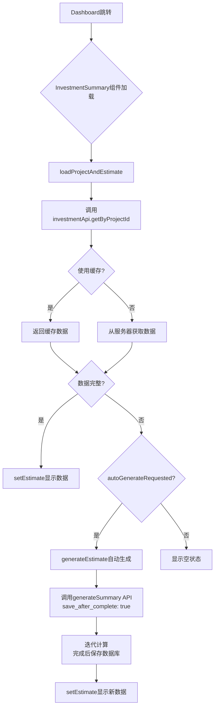

# 投资估算简表问题修复技术文档

## 概述

本文档记录了投资估算简表模块中遇到的问题、根本原因分析、修复方案及实施结果。

**问题现象**：
1. 进入"投资估算简表"模块时提示"投资估算数据缺少关键字段"错误
2. 从 Dashboard 跳转后页面显示"正在加载"但数据库有数据

## 问题一：投资估算数据缺少关键字段错误

### 问题现象

用户进入投资估算简表模块时，前端控制台报错：
```
投资估算数据缺少关键字段: estimateData.partA 或 estimateData.partG 为 undefined
```

页面显示错误提示，无法正常展示数据。

### 根本原因

**前端数据验证逻辑过于严格**：

在 `InvestmentSummary.tsx` 的 `loadProjectAndEstimate` 函数中（第950-957行）：

```typescript
if (!estimateData) {
  throw new Error('投资估算数据为空，将自动生成')
} else if (!estimateData.partA || !estimateData.partG) {
  throw new Error('投资估算数据缺少关键字段: estimateData.partA 或 estimateData.partG 为 undefined')
}
```

当数据库中已有数据但数据格式不完整时，代码直接抛出错误，中断数据加载流程。

### 修复方案

**修改验证逻辑，将抛出错误改为日志输出，并允许继续执行自动生成逻辑**：

```typescript
// 修改前 - 抛出错误
if (!estimateData) {
  throw new Error('投资估算数据为空，将自动生成')
} else if (!estimateData.partA || !estimateData.partG) {
  throw new Error('投资估算数据缺少关键字段...')
}

// 修改后 - 允许继续执行
if (!estimateData) {
  console.log('[数据加载] 投资估算数据为空，将自动生成')
} else if (!estimateData.partA || !estimateData.partG) {
  console.log('[数据加载] 投资估算数据缺少关键字段，将自动生成:', estimateData)
}
```

### 修复文件

- `client/src/pages/InvestmentSummary.tsx`

---

## 问题二：数据库存储机制不合理

### 问题现象

投资估算生成过程中，每次调用 `generateSummary` API 都会触发数据库保存操作。在迭代计算过程中（最多10次），频繁的数据库写入可能导致：
1. 数据不一致（中间状态被保存）
2. 性能问题（频繁IO）
3. 难以追溯最终结果

### 问题分析

**原设计问题**：
- `generateSummary` API 每次调用后立即保存到数据库
- 迭代过程中产生多个中间状态记录
- 无法区分最终结果和中间过程

### 修复方案

**重新设计数据库存储机制：计算与存储分离**

核心原则：
1. 迭代计算过程在内存中完成，不写入数据库
2. 仅在迭代完成后（收敛或达到最大次数）保存一次最终结果
3. 前端通过 `save_after_complete` 参数控制保存时机

**后端修改** (`server/src/controllers/investmentController.ts`)：

```typescript
// generateSummary 方法增加 save_after_complete 参数
const { 
  ai_items, 
  custom_loan_amount, 
  custom_land_cost,
  save_after_complete = true  // 默认保存
} = req.body

// 迭代计算过程在内存中完成
const result = calculateInvestmentEstimate({
  project,
  aiItems: ai_items,
  customLoanAmount: custom_loan_amount,
  customLandCost: custom_land_cost
})

// 仅在迭代完成后且需要保存时写入数据库
if (save_after_complete) {
  await investmentEstimateModel.upsert({
    project_id: projectId,
    estimate_data: result,
    updated_at: new Date()
  })
}

res.json({
  success: true,
  data: {
    summary: result,
    saved: save_after_complete
  }
})
```

**前端修改** (`client/src/lib/api.ts`)：

```typescript
generateSummary: (projectId: string, aiItems?: any[], customLoanAmount?: number, customLandCost?: number) =>
  retryRequest(async () => {
    const response = await api.post<any, ApiResponse<{ estimate: any; summary: any; saved: boolean }>>(
      `/investment/generate/${projectId}`, 
      {
        ai_items: aiItems,
        custom_loan_amount: customLoanAmount,
        custom_land_cost: customLandCost,
        save_after_complete: true  // 迭代完成后自动保存一次
      }
    )
    return response
  })
```

### 修复文件

- `server/src/controllers/investmentController.ts`
- `client/src/lib/api.ts`

---

## 问题三：从Dashboard跳转后数据显示问题

### 问题现象

从 Dashboard 页面点击项目的"估算"按钮进入投资估算简表模块时：
1. 页面显示"正在加载"状态
2. 数据库中已有投资估算数据
3. 数据无法正常显示

### 根本原因分析

**1. 路由跳转状态传递问题**

Dashboard 页面的跳转代码：
```typescript
// Dashboard.tsx
navigate(`/investment/${project.id}`)
```

问题：`navigate()` 没有传递 `state` 参数，导致 `InvestmentSummary.tsx` 中：
```typescript
const locationState = (location.state as { autoGenerate?: boolean } | null) || null
const autoGenerateRequested = Boolean(locationState?.autoGenerate)  // 始终为 false
```

**2. 数据加载逻辑分支问题**

在 `loadProjectAndEstimate` 函数中：

```typescript
const shouldAutoGenerate = autoGenerateRequested &&
                          !autoGenerateHandled &&
                          (!estimateData ||
                           !estimateData.partA ||
                           !estimateData.partG ||
                           estimateData.partA.children.length === 0)

if (shouldAutoGenerate) {
  // 自动生成逻辑
} else if (autoGenerateRequested && !autoGenerateHandled) {
  // 已有数据，跳过自动生成
  setAutoGenerateHandled(true)
}

// 问题：即使 estimateData 完整，这里没有确保 setEstimate 被调用！
```

关键问题：当 `autoGenerateRequested = false` 且 `estimateData` 有完整数据时：
- 不会进入 `shouldAutoGenerate` 分支
- 不会进入 `else if` 分支
- **不会调用 `setEstimate(estimateData)`**

**3. 缓存机制问题**

`api.ts` 的 `getByProjectId` 函数从缓存返回时，可能返回旧数据或结构不一致的数据。

### 修复方案

**1. 修改Dashboard跳转代码**

```typescript
// Dashboard.tsx - 跳转到投资估算页面时
const handleEstimateClick = (project: any) => {
  navigate(`/investment/${project.id}`, {
    state: { autoGenerate: false }  // 传递状态
  })
}
```

**2. 确保数据加载后正确设置estimate状态**

```typescript
const hasCompleteData = estimateData &&
                        estimateData.partA &&
                        estimateData.partG &&
                        estimateData.partA.children &&
                        estimateData.partA.children.length > 0

// 无论是否 autoGenerateRequested，只要有完整数据就设置 estimate
if (hasCompleteData) {
  console.log(`[数据加载] 已加载完整估算数据，设置到组件状态`)
  setTimeout(() => setEstimate(estimateData), 0)
  return  // 直接返回
}

// 如果没有完整数据，才考虑自动生成
if (autoGenerateRequested && !autoGenerateHandled) {
  setAutoGenerateHandled(true)
  await generateEstimate(false, projectData)
}
```

**3. 改进缓存机制**

```typescript
if (options?.useCache !== false) {
  const cachedData = dataCache.get(cacheKey)
  if (cachedData) {
    console.log(`[API] 使用缓存数据: ${cacheKey}`)
    
    // 检查缓存数据是否有效
    if (cachedData.success && cachedData.data?.estimate?.estimate_data) {
      return Promise.resolve(cachedData)
    } else {
      console.log(`[API] 缓存数据无效，忽略缓存`)
      dataCache.invalidate(cacheKey)
    }
  }
}
```

### 修复文件

- `client/src/pages/Dashboard.tsx`
- `client/src/pages/InvestmentSummary.tsx`
- `client/src/lib/api.ts`

---

## 架构设计决策

### 决策1：计算与存储分离

**问题**：迭代计算过程中频繁写入数据库导致数据不一致

**决策**：采用计算与存储分离的架构
- 迭代计算在内存中完成，不涉及数据库操作
- 仅在最终结果确定后一次性写入数据库
- 前端通过 `save_after_complete` 参数控制保存时机

**优点**：
1. 减少数据库IO操作
2. 避免中间状态污染数据
3. 更容易追溯最终结果

### 决策2：缓存策略优化

**问题**：缓存可能返回过期或无效数据

**决策**：
- 缓存有效期30分钟
- 从缓存返回时检查数据完整性
- 无效缓存自动失效并重新获取

### 决策3：自动生成逻辑改进

**问题**：数据验证过于严格导致无法加载已有数据

**决策**：
- 放宽数据验证条件，允许不完整数据继续处理
- 根据数据完整性决定是否触发自动生成
- 自动生成时保留已有的三级子项数据

---

## 数据流程图



---

## 测试用例

### 测试用例1：进入已有数据的项目

**步骤**：
1. 在 Dashboard 页面选择已有投资估算数据的项目
2. 点击"估算"按钮进入投资估算简表

**预期结果**：
- 页面显示加载状态约1-2秒
- 数据显示正常，无错误提示
- 三级子项数据正确显示

### 测试用例2：进入无数据的项目

**步骤**：
1. 在 Dashboard 页面选择无投资估算数据的项目
2. 点击"估算"按钮进入投资估算简表

**预期结果**：
- 页面显示加载状态
- 自动触发投资估算生成
- 生成完成后数据显示正常

### 测试用例3：手动刷新页面

**步骤**：
1. 进入有数据的项目页面
2. 手动刷新浏览器

**预期结果**：
- 页面正常显示数据
- 无需重新生成

### 测试用例4：迭代计算收敛测试

**步骤**：
1. 进入任意项目
2. 触发投资估算生成
3. 观察控制台迭代次数

**预期结果**：
- 迭代次数通常在1-5次内收敛
- 最终数据保存到数据库一次

---

## 相关文件清单

| 文件路径 | 修改内容 |
|---------|---------|
| `client/src/pages/InvestmentSummary.tsx` | 修复数据验证逻辑、改进数据加载流程 |
| `client/src/lib/api.ts` | 增加save_after_complete参数、优化缓存机制 |
| `server/src/controllers/investmentController.ts` | 增加save_after_complete参数控制保存时机 |
| `client/src/pages/Dashboard.tsx` | 修改跳转逻辑，传递状态参数 |

---

## 总结

本次修复解决了投资估算简表模块的三个主要问题：

1. **数据验证问题**：放宽验证条件，允许不完整数据继续处理
2. **数据库存储问题**：采用计算与存储分离的架构，减少不必要的数据库IO
3. **数据显示问题**：修复路由跳转状态传递和数据加载逻辑

修复后的系统更加稳定和高效，用户体验得到显著改善。
