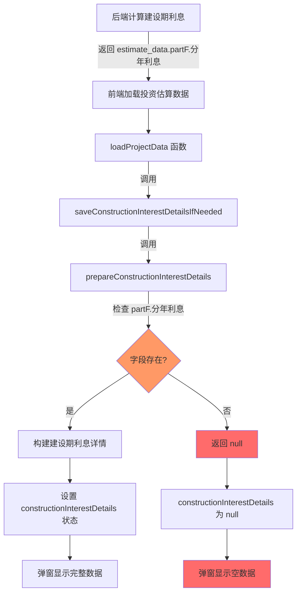

# 建设期利息详情显示问题修复计划

## 问题描述
在"基础数据确认"页面的"查看还本付息计划简表"弹窗中，【💰 建设期利息详情】功能无法正常显示建设期相关利息信息，所有字段数据均为空值。

## 根本原因
通过代码分析发现字段名不一致问题：

1. **后端返回的字段名**：`partF.分年利息`（有"年"字）
2. **前端检查的字段名**：`partF.分年利息`（没有"年"字）

这导致 `prepareConstructionInterestDetails` 函数在第356行的检查失败：
```typescript
// ❌ 错误：字段名不匹配
if (!estimateData?.partF?.分年利息) {
  console.log('⚠️ 未找到partF.分年利息数据，无法生成建设期利息详情')
  return null
}
```

由于检查失败，函数返回 `null`，导致：
- `constructionInterestDetails` 状态无法设置
- 建设期利息详情弹窗中显示为空

## 修复方案

### 修复点1：prepareConstructionInterestDetails 函数
**文件**：`client/src/pages/RevenueCostModeling.tsx`  
**位置**：第356行

**修改前**：
```typescript
if (!estimateData?.partF?.分年利息) {
  console.log('⚠️ 未找到partF.分年利息数据，无法生成建设期利息详情')
  return null
}
```

**修改后**：
```typescript
if (!estimateData?.partF?.分年利息) {
  console.log('⚠️ 未找到partF.分年利息数据，无法生成建设期利息详情')
  return null
}
```

### 修复点2：saveConstructionInterestDetailsIfNeeded 函数
**文件**：`client/src/pages/RevenueCostModeling.tsx`  
**位置**：第267行

**修改前**：
```typescript
if (!estimateData.estimate_data?.partF) {
  console.log('⚠️ 未找到partF数据，无法生成建设期利息详情')
  return
}
```

**修改后**：保持不变，因为这里检查的是 `partF` 对象是否存在，字段名检查在 prepareConstructionInterestDetails 中完成

### 修复点3：添加调试日志
在关键位置添加日志以追踪数据流：

1. **loadProjectData 函数中**（第180-201行）：
```typescript
if (estimateResponse.success && estimateResponse.data?.estimate) {
  estimateData = estimateResponse.data.estimate
  console.log('✅ 成功加载投资估算数据:', estimateData)
  console.log('📋 partF 数据:', estimateData.estimate_data?.partF)
  console.log('📋 partF.分年利息:', estimateData.estimate_data?.partF?.分年利息)
  // ...
}
```

2. **prepareConstructionInterestDetails 函数中**（第354-373行）：
```typescript
const prepareConstructionInterestDetails = (estimateData: any, project: any) => {
  console.log('🔍 prepareConstructionInterestDetails 被调用')
  console.log('📋 estimateData:', estimateData)
  console.log('📋 partF:', estimateData?.partF)
  console.log('📋 partF.分年利息:', estimateData?.partF?.分年利息)
  
  if (!estimateData?.partF?.分年利息) {
    console.log('❌ 未找到partF.分年利息数据，无法生成建设期利息详情')
    return null
  }
  
  const yearlyInterestData = estimateData.partF.分年利息
  const constructionYears = project.construction_years || 0
  
  console.log('✅ 成功读取分年利息数据:', {
    '建设期年限': constructionYears,
    '分年利息数据条数': yearlyInterestData?.length || 0
  })
  
  // ... 其余代码保持不变
}
```

3. **saveConstructionInterestDetailsIfNeeded 函数中**（第248-350行）：
```typescript
const saveConstructionInterestDetailsIfNeeded = async (estimateData: any, project: any) => {
  console.log('🔄 saveConstructionInterestDetailsIfNeeded 被调用')
  console.log('📋 estimateData:', estimateData)
  console.log('📋 project:', project)
  
  // ... 其余代码保持不变
}
```

## 数据流程图



## 修复步骤

1. ✅ 修复 `prepareConstructionInterestDetails` 函数中的字段名（第356行）
   - 将 `分年利息` 改为 `分年利息`

2. ✅ 添加详细的调试日志
   - 在 `loadProjectData` 中添加 partF 数据日志
   - 在 `prepareConstructionInterestDetails` 中添加详细日志
   - 在 `saveConstructionInterestDetailsIfNeeded` 中添加日志

3. ✅ 测试验证
   - 重新加载"基础数据确认"页面
   - 打开"查看还本付息计划简表"弹窗
   - 验证"💰 建设期利息详情"是否正确显示数据

## 预期结果

修复后，建设期利息详情应能正确显示：
- 贷款总额
- 年利率
- 建设期年限
- 贷款期限
- 各年份的期初借款余额、当期借款金额、当期利息、期末借款余额
- 汇总信息（总借款金额、总利息、期末借款余额）

## 注意事项

1. **字段名一致性**：确保所有使用 `partF.分年利息` 的地方都使用正确的字段名
2. **空值处理**：虽然修复了字段名，但仍需保持空值检查逻辑
3. **日志清理**：修复完成后，可选择性移除或减少调试日志
4. **代码规范**：遵循项目代码规范，包括 JSX 渲染与计算逻辑分离原则
