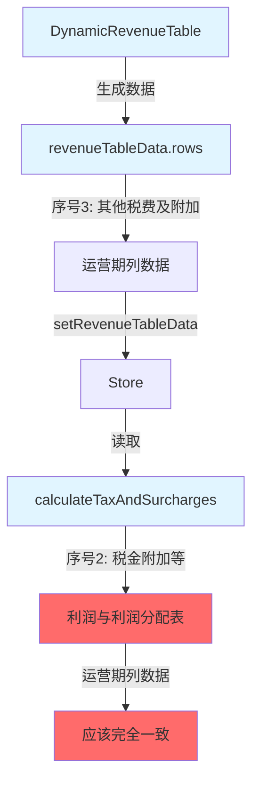

# 利润与利润分配表"税金附加等"数据一致性问题修复计划

## 问题描述

**问题：** 项目投资现金流量配置页面中"利润与利润分配表"序号为2的"税金附加等"运营期列数据显示为0或空值，与"营业收入、营业税金及附加和增值税估算表"序号为3的"其他税费及附加"运营期列数据不一致。

## 数据流向分析

### 数据来源
1. **DynamicRevenueTable.tsx** - 生成"营业收入、营业税金及附加和增值税估算表"数据
   - 序号3 = "其他税费及附加"（包含城市建设维护税 + 教育费附加）
   - 数据存储在 `revenueTableData.rows` 中

2. **FinancialIndicatorsTable.tsx** - 生成"利润与利润分配表"数据
   - 序号2 = "税金附加等"
   - 通过 `calculateTaxAndSurcharges()` 函数获取数据

### 当前代码状态
查看 `FinancialIndicatorsTable.tsx` 第1616-1647行的 `calculateTaxAndSurcharges` 函数：

```typescript
// 计算税金及附加
const calculateTaxAndSurcharges = (year?: number): number => {
  if (year !== undefined) {
    // 直接从 revenueTableData 中获取"其他税费及附加"（序号3）的运营期列数据
    if (revenueTableData && revenueTableData.rows) {
      const row = revenueTableData.rows.find(r => r.序号 === '3');
      if (row && row.运营期 && row.运营期[year - 1] !== undefined) {
        return row.运营期[year - 1];
      }
    }
  }
  // 如果没有表格数据，使用原有计算逻辑作为后备
  return calculateOtherTaxesAndSurchargesLocal(year);
};
```

**代码逻辑分析：**
- 代码逻辑**看起来是正确的**，已经从 `revenueTableData.rows` 中查找序号为 '3' 的行
- 问题可能在于：
  1. `revenueTableData` 为 null 或 undefined
  2. `revenueTableData.rows` 不存在或为空数组
  3. 数据保存和读取之间存在时序问题

## 修复计划

### 步骤1：在 DynamicRevenueTable.tsx 中添加调试日志
**目标：** 追踪序号3（其他税费及附加）数据的生成过程

**操作：**
- 在 `generateRevenueTableData` 函数中，生成序号3的数据后添加 `console.log`
- 输出内容：序号3的运营期列数据

**代码位置：** `client/src/components/revenue-cost/DynamicRevenueTable.tsx` 第999-1008行附近

### 步骤2：在 FinancialIndicatorsTable.tsx 中添加调试日志
**目标：** 追踪序号2（税金附加等）数据的读取过程

**操作：**
- 在 `calculateTaxAndSurcharges` 函数中添加 `console.log`
- 输出内容：
  - 从 `revenueTableData` 读取到的序号3数据
  - 返回的值

**代码位置：** `client/src/components/revenue-cost/FinancialIndicatorsTable.tsx` 第1616-1647行附近

### 步骤3：检查 revenueTableData 保存状态
**目标：** 确保 `revenueTableData` 在保存前有正确的数据

**操作：**
- 在 `generateRevenueTableData` 函数返回前，添加状态检查
- 如果 `revenueTableData` 为 null 或 rows 为空，输出警告日志

### 步骤4：检查数据订阅状态
**目标：** 确保 `FinancialIndicatorsTable.tsx` 正确订阅了 `revenueTableData` 的变化

**操作：**
- 检查 `useRevenueCostStore` 的调用是否正确传递了 `revenueTableData`
- 确认组件通过 `useRevenueCostStore()` 获取了最新的状态

### 步骤5：验证修复后的数据一致性
**目标：** 确保两个表格的运营期列数据完全一致

**操作：**
- 在浏览器控制台中对比两个表格的数据
- 检查序号3和序号2的运营期列数据是否一致

### 步骤6：检查其他类似问题
**目标：** 检查项目中是否存在其他类似的数据不一致问题

**操作：**
- 搜索其他表格的数据读取逻辑
- 检查是否也存在数据传递问题

## 数据流程图



## 修复要点

1. **数据追踪：** 通过添加调试日志，可以清晰地看到数据流向
2. **状态检查：** 确保数据在保存前已正确生成
3. **订阅验证：** 确保组件正确订阅了 store 的变化
4. **一致性验证：** 修复后对比两个表格的数据

## 预期结果

修复后，"利润与利润分配表"的"税金附加等"运营期列数据应该与"营业收入、营业税金及附加和增值税估算表"的"其他税费及附加"运营期列数据完全一致。
