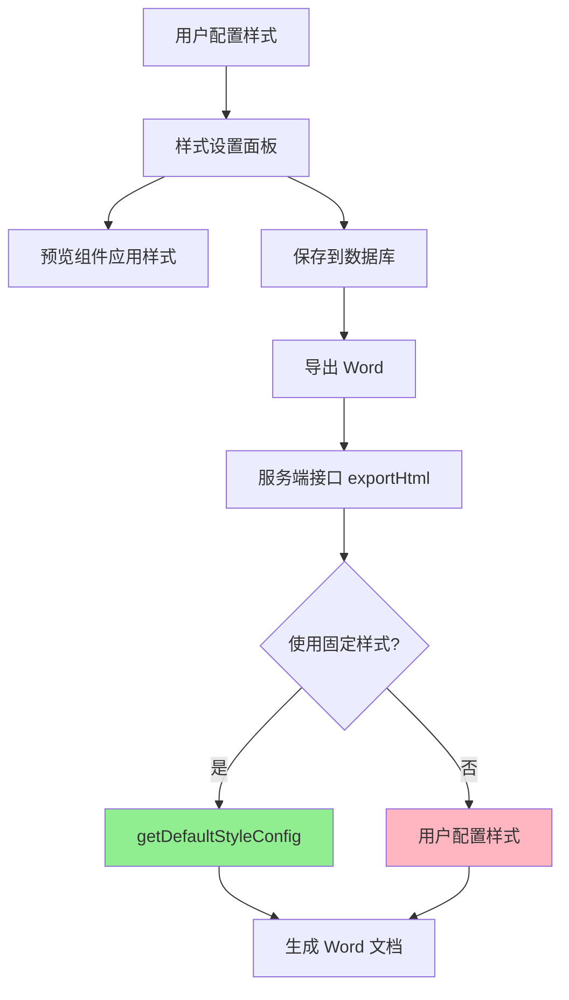

# 报告样式配置分离计划

## 问题背景

当前架构中，`ReportStyleConfig` 是统一的配置类型，同时用于：
1. **客户端预览** - `StyleSettingsPanel.tsx` 和 `ReportPreview.tsx` 使用
2. **服务端导出** - `reportService.ts: generateWordFromHtml()` 使用

**用户需求**：样式设置面板只控制预览样式，Word 导出使用固定样式（不受用户配置影响）。

## 解决方案

修改 `reportService.ts`，在导出 Word 时忽略用户传入的样式配置，使用固定的默认导出样式。

## 实施步骤

### 步骤 1：修改 `reportService.ts: generateWordFromHtml()` 方法

**目标**：导出时使用固定的默认样式，不使用用户配置

**修改内容**：
1. 添加 `useFixedExportStyle: boolean` 参数（默认 true）
2. 当 `useFixedExportStyle === true` 时，使用 `getDefaultStyleConfig()` 覆盖用户配置
3. 固定导出样式规则：
   - 标题1字体：黑体
   - 标题2字体：黑体
   - 正文字体：宋体
   - 字号固定为标准值

### 步骤 2：修改 `reportController.ts: exportHtml` 接口

**目标**：在调用 `generateWordFromHtml()` 时传入固定样式标识

**修改内容**：
```typescript
// 调用时使用固定导出样式
const docxBuffer = await ReportService.generateWordFromHtml(
  htmlContent,
  title,
  styleConfig, // 保留参数但内部忽略
  true         // 新增参数：使用固定导出样式
)
```

### 步骤 3：验证修复效果

1. 测试样式设置面板可以正常保存和预览样式
2. 验证 Word 导出使用固定样式（标题黑体、正文宋体）
3. 确认预览和导出的样式不再关联

## 详细修改点

### 文件：`server/src/services/reportService.ts`

**位置**：`generateWordFromHtml()` 方法（第 2011-2174 行）

**当前代码问题**：
```typescript
static async generateWordFromHtml(
  htmlContent: string,
  title: string,
  styleConfig?: ReportStyleConfig  // 用户配置会覆盖导出样式
): Promise<Buffer> {
  const config = styleConfig || this.getDefaultStyleConfig()
  // ...
}
```

**修改后**：
```typescript
static async generateWordFromHtml(
  htmlContent: string,
  title: string,
  styleConfig?: ReportStyleConfig,
  useFixedExportStyle: boolean = true  // 新增参数
): Promise<Buffer> {
  // 如果 useFixedExportStyle 为 true，使用固定导出样式
  const config = useFixedExportStyle 
    ? this.getDefaultStyleConfig() 
    : (styleConfig || this.getDefaultStyleConfig())
  // ...
}
```

### 文件：`server/src/controllers/reportController.ts`

**位置**：`exportHtml` 接口

**修改内容**：
```typescript
// 调用 generateWordFromHtml 时传入固定样式标识
const docxBuffer = await ReportService.generateWordFromHtml(
  htmlContent,
  title,
  styleConfig,
  true  // 使用固定导出样式
)
```

## 架构图



## 预期效果

1. ✅ 样式设置面板正常工作，预览显示用户配置的样式
2. ✅ Word 导出使用固定样式（标题黑体、正文宋体）
3. ✅ 预览和导出样式完全分离
4. ✅ 样式配置保存功能保留（仅用于预览）

## 风险评估

| 风险 | 级别 | 应对措施 |
|------|------|----------|
| 导出接口需要保留 styleConfig 参数但不使用 | 低 | 添加注释说明参数已弃用 |
| 现有用户可能期望导出也应用样式 | 低 | 在界面上说明"预览样式"和"导出样式"的区别 |
