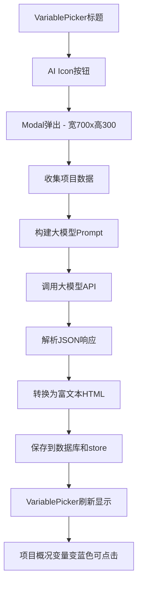

# 项目概况生成功能实施计划

## 1. 概述

在报告生成模块的"可用变量"卡片（VariablePicker）中，将"项目描述"替换为"项目概况"变量：
- 项目概况为空时显示为灰色（不可点击）
- 项目概况有内容时颜色正常（可点击复制）
- 在标题右侧添加AI图标按钮，点击弹出Modal生成项目概况

## 2. 功能需求

### 2.1 变量调整

| 变更前 | 变更后 |
|-------|-------|
| `{{project_description}}` - 项目描述 | `{{project_overview}}` - 项目概况 |
| 原始项目描述字段 | AI生成的项目概况HTML内容 |

### 2.2 变量显示规则

| 状态 | 颜色 | 可点击 |
|-----|------|-------|
| 项目概况为空 | 灰色（gray） | 不可点击 |
| 项目概况有内容 | 蓝色（blue） | 可点击复制 |

### 2.3 数据来源

| 字段 | 数据来源 |
|-----|---------|
| 项目名称 | 项目基本信息 |
| 建设单位 | 项目基本信息 |
| 建设地点 | 项目基本信息 |
| 建设规模 | 投资估算简表第一部分 |
| 投资规模 | 投资估算简表 |
| 资金来源 | 投资估算简表建设期信息 |
| 建设周期 | 项目基本信息 |
| 所涉产品或服务 | 收入成本估算表 |

## 3. 技术架构



## 4. 实施步骤

### 步骤1：创建项目概况生成Modal组件

**文件**: `client/src/components/report/ProjectOverviewModal.tsx`

**功能**:
- Modal尺寸: width=700, height=300
- 包含Tiptap富文本编辑器（只读）
- 包含"生成"和"保存"按钮

### 步骤2：修改VariablePicker组件

**文件**: `client/src/components/report/VariablePicker.tsx`

**修改内容**:
1. 将"项目描述"替换为"项目概况"
2. 根据projectOverview状态设置变量颜色
3. 添加Modal触发按钮（标题右侧AI图标）
4. 处理空值/有值两种状态的显示

### 步骤3：修改reportStore

**文件**: `client/src/stores/reportStore.ts`

**修改内容**:
1. 添加`projectOverview`状态
2. 添加`saveProjectOverview`方法
3. 添加`loadProjectOverview`方法
4. 在`availableVariables`中使用`projectOverview`替代`project_description`

### 步骤4：实现数据收集和大模型调用

**新增服务方法**: `reportApi.generateProjectOverview` 和 `reportApi.saveProjectOverview`

## 5. 详细实现

### 5.1 ProjectOverviewModal组件

```typescript
// client/src/components/report/ProjectOverviewModal.tsx

import { useState, useMemo } from 'react'
import { Modal, Group, Button, Stack, Text, Box } from '@mantine/core'
import { useEditor, EditorContent } from '@tiptap/react'
import StarterKit from '@tiptap/starter-kit'
import { Sparkles, Save } from 'lucide-react'
import { useReportStore } from '../../stores/reportStore'
import { notifications } from '@mantine/notifications'
import { reportApi } from '../../services/reportApi'

interface ProjectOverviewData {
  projectName: string
  constructionUnit: string
  constructionSite: string
  constructionScale: string
  investmentScale: string
  fundingSource: string
  constructionPeriod: string
  productsServices: string[]
}

interface ProjectOverviewModalProps {
  opened: boolean
  onClose: () => void
}

export function ProjectOverviewModal({ opened, onClose }: ProjectOverviewModalProps) {
  const { projectData, projectId, saveProjectOverview } = useReportStore()
  const [generating, setGenerating] = useState(false)
  const [saving, setSaving] = useState(false)

  const editor = useEditor({
    extensions: [StarterKit],
    content: '',
    editable: false,
    editorProps: {
      attributes: {
        class: 'prose prose-sm focus:outline-none min-h-[150px] p-4 border rounded',
      },
    },
  })

  // 收集项目数据
  const projectOverviewData = useMemo((): ProjectOverviewData | null => {
    if (!projectData) return null

    const project = projectData.project || {}
    const estimate = projectData.estimate || {}
    const revenueItems = projectData.revenueItems || []

    // 从投资估算简表提取建设规模
    const partAChildren = estimate.partA?.children || []
    const constructionScaleText = partAChildren
      .map((item: any) => `${item.name || ''}: ${item.amount || 0}万元`)
      .join('；')

    // 提取总投资规模
    const totalInvestment = project.totalInvestment || 0
    const investmentScaleText = `总投资${totalInvestment}万元`

    // 资金来源
    const loanAmount = estimate.loanAmount || 0
    const selfFundedAmount = totalInvestment - loanAmount
    const fundingSourceText = `申请银行贷款${loanAmount}万元，占投资估算总额的${((loanAmount / totalInvestment) * 100).toFixed(2)}%；业主自筹${selfFundedAmount}万元，占投资估算总额的${((selfFundedAmount / totalInvestment) * 100).toFixed(2)}%`

    // 产品/服务
    const productsServices = revenueItems.map((item: any) => item.name || '').filter(Boolean)

    return {
      projectName: project.name || '',
      constructionUnit: project.constructionUnit || '',
      constructionSite: project.location || '',
      constructionScale: constructionScaleText || '暂无数据',
      investmentScale: investmentScaleText || '暂无数据',
      fundingSource: fundingSourceText || '暂无数据',
      constructionPeriod: `${project.constructionYears || 0}年`,
      productsServices: productsServices.length > 0 ? productsServices : ['暂无数据']
    }
  }, [projectData])

  // 构建大模型Prompt
  const buildPrompt = (data: ProjectOverviewData): string => {
    return `
根据以下项目信息，生成项目概况：

项目名称：${data.projectName}
建设单位：${data.constructionUnit}
建设地点：${data.constructionSite}
建设周期：${data.constructionPeriod}

建设规模信息：
${data.constructionScale}

投资规模信息：
${data.investmentScale}

资金来源信息：
${data.fundingSource}

产品/服务信息：
${data.productsServices.join('、')}

请按照以下JSON格式输出项目概况（不要添加markdown代码块标记，不要用```json包裹）：
{
  "projectName": "项目名称",
  "constructionUnit": "建设单位",
  "constructionSite": "建设地点",
  "constructionScale": "详细的建设规模描述",
  "investmentScale": "详细的投资规模描述，包括各分项金额",
  "fundingSource": "资金来源描述，包括贷款和自筹比例",
  "constructionPeriod": "建设周期描述",
  "productsServices": ["产品/服务1", "产品/服务2"]
}
    `.trim()
  }

  // JSON转HTML
  const jsonToHtml = (data: ProjectOverviewData): string => {
    return `
      <h3>${data.projectName}</h3>
      <p><strong>建设单位：</strong>${data.constructionUnit}</p>
      <p><strong>建设地点：</strong>${data.constructionSite}</p>
      <p><strong>建设规模：</strong>${data.constructionScale}</p>
      <p><strong>投资规模：</strong>${data.investmentScale}</p>
      <p><strong>资金来源：</strong>${data.fundingSource}</p>
      <p><strong>建设周期：</strong>${data.constructionPeriod}</p>
      <p><strong>所涉产品或服务：</strong>${data.productsServices.join('、')}</p>
    `.trim()
  }

  // 生成项目概况
  const handleGenerate = async () => {
    if (!projectId) {
      notifications.show({
        title: '错误',
        message: '缺少项目ID',
        color: 'red',
      })
      return
    }

    if (!projectOverviewData) {
      notifications.show({
        title: '错误',
        message: '无法获取项目数据',
        color: 'red',
      })
      return
    }

    setGenerating(true)

    try {
      const prompt = buildPrompt(projectOverviewData)

      await reportApi.generateProjectOverview(projectId, prompt, {
        onChunk: (content) => {
          try {
            const cleanContent = content
              .replace(/```json/g, '')
              .replace(/```/g, '')
              .trim()
            
            const data = JSON.parse(cleanContent) as ProjectOverviewData
            const html = jsonToHtml(data)
            editor?.commands.setContent(html)
          } catch (e) {
            editor?.commands.setContent(content)
          }
        },
        onComplete: () => {
          setGenerating(false)
          notifications.show({
            title: '成功',
            message: '项目概况生成完成',
            color: 'green',
          })
        },
        onError: (error) => {
          setGenerating(false)
          notifications.show({
            title: '错误',
            message: error || '生成失败',
            color: 'red',
          })
        }
      })
    } catch (error: any) {
      setGenerating(false)
      notifications.show({
        title: '错误',
        message: error.message || '生成失败',
        color: 'red',
      })
    }
  }

  // 保存项目概况
  const handleSave = async () => {
    const content = editor?.getHTML() || ''
    if (!content) {
      notifications.show({
        title: '提示',
        message: '请先生成项目概况',
        color: 'orange',
      })
      return
    }

    setSaving(true)
    try {
      await saveProjectOverview(content)
      notifications.show({
        title: '成功',
        message: '项目概况已保存',
        color: 'green',
      })
      onClose()
    } catch (error: any) {
      notifications.show({
        title: '错误',
        message: error.message || '保存失败',
        color: 'red',
      })
    } finally {
      setSaving(false)
    }
  }

  return (
    <Modal
      opened={opened}
      onClose={onClose}
      title={
        <Group gap="xs">
          <Sparkles size={16} color="var(--mantine-color-blue-6)" />
          <Text fw={500}>AI生成项目概况</Text>
        </Group>
      }
      size="700px"
    >
      <Stack gap="md">
        {/* 生成和保存按钮 */}
        <Group justify="flex-end">
          <Button
            variant="light"
            color="blue"
            leftSection={<Sparkles size={14} />}
            onClick={handleGenerate}
            loading={generating}
            disabled={!projectOverviewData}
          >
            生成
          </Button>
          <Button
            variant="filled"
            color="green"
            leftSection={<Save size={14} />}
            onClick={handleSave}
            loading={saving}
          >
            保存
          </Button>
        </Group>

        {/* 富文本编辑器 */}
        <Box style={{ minHeight: '180px' }}>
          <EditorContent editor={editor} />
        </Box>
      </Stack>
    </Modal>
  )
}
```

### 5.2 VariablePicker组件修改

```typescript
// client/src/components/report/VariablePicker.tsx 修改

import { useState } from 'react'
import { Text, Badge, Group, Stack, ActionIcon, Tooltip } from '@mantine/core'
import { Sparkles } from 'lucide-react'
import { useReportStore } from '../../stores/reportStore'
import { ProjectOverviewModal } from './ProjectOverviewModal'

export function VariablePicker() {
  const { projectOverview, setPromptTemplate } = useReportStore()
  const [modalOpened, setModalOpened] = useState(false)

  const handleCopyVariable = (variableKey: string) => {
    navigator.clipboard.writeText(variableKey)
  }

  return (
    <div className="variable-picker">
      <Group justify="space-between" mb="xs">
        <Text size="sm" fw={500}>可用变量</Text>
        <Tooltip label="AI生成项目概况">
          <ActionIcon
            variant="subtle"
            color="blue"
            size="sm"
            onClick={() => setModalOpened(true)}
          >
            <Sparkles size={14} />
          </ActionIcon>
        </Tooltip>
      </Group>
      
      <Stack gap="xs">
        {/* 基本信息 */}
        <div>
          <Text size="xs" c="dimmed" mb="xs">基本信息</Text>
          <Group gap={4}>
            {/* 项目名称 */}
            <Badge
              variant="light"
              color="blue"
              style={{ cursor: 'pointer' }}
              onClick={() => handleCopyVariable('{{project_name}}')}
              title="点击复制"
            >
              项目名称
            </Badge>
            
            {/* 项目概况 - 根据状态显示不同颜色 */}
            <Badge
              variant="light"
              color={projectOverview ? 'blue' : 'gray'}
              style={{ 
                cursor: projectOverview ? 'pointer' : 'not-allowed',
                opacity: projectOverview ? 1 : 0.5
              }}
              onClick={() => {
                if (projectOverview) {
                  handleCopyVariable('{{project_overview}}')
                }
              }}
              title={projectOverview ? '点击复制' : '请先AI生成项目概况'}
            >
              项目概况
            </Badge>
            
            {/* 其他基本信息 */}
            <Badge
              variant="light"
              color="blue"
              style={{ cursor: 'pointer' }}
              onClick={() => handleCopyVariable('{{construction_unit}}')}
              title="点击复制"
            >
              建设单位
            </Badge>
            <Badge
              variant="light"
              color="blue"
              style={{ cursor: 'pointer' }}
              onClick={() => handleCopyVariable('{{total_investment}}')}
              title="点击复制"
            >
              总投资额
            </Badge>
            <Badge
              variant="light"
              color="blue"
              style={{ cursor: 'pointer' }}
              onClick={() => handleCopyVariable('{{construction_years}}')}
              title="点击复制"
            >
              建设期
            </Badge>
            <Badge
              variant="light"
              color="blue"
              style={{ cursor: 'pointer' }}
              onClick={() => handleCopyVariable('{{operation_years}}')}
              title="点击复制"
            >
              运营期
            </Badge>
          </Group>
        </div>
        
        {/* 项目信息 */}
        <div>
          <Text size="xs" c="dimmed" mb="xs">项目信息</Text>
          <Group gap={4}>
            <Badge
              variant="light"
              color="cyan"
              style={{ cursor: 'pointer' }}
              onClick={() => handleCopyVariable('{{project_type}}')}
              title="点击复制"
            >
              项目类型
            </Badge>
            <Badge
              variant="light"
              color="cyan"
              style={{ cursor: 'pointer' }}
              onClick={() => handleCopyVariable('{{location}}')}
              title="点击复制"
            >
              项目地点
            </Badge>
          </Group>
        </div>
        
        {/* 财务指标 */}
        <div>
          <Text size="xs" c="dimmed" mb="xs">财务指标</Text>
          <Group gap={4}>
            <Badge
              variant="light"
              color="green"
              style={{ cursor: 'pointer' }}
              onClick={() => handleCopyVariable('{{roi}}')}
              title="点击复制"
            >
              投资回报率
            </Badge>
            <Badge
              variant="light"
              color="green"
              style={{ cursor: 'pointer' }}
              onClick={() => handleCopyVariable('{{irr}}')}
              title="点击复制"
            >
              内部收益率
            </Badge>
            <Badge
              variant="light"
              color="green"
              style={{ cursor: 'pointer' }}
              onClick={() => handleCopyVariable('{{npv}}')}
              title="点击复制"
            >
              净现值
            </Badge>
          </Group>
        </div>
        
        {/* 表格资源 */}
        <div>
          <Text size="xs" c="dimmed" mb="xs">表格资源</Text>
          <Group gap={4}>
            <Badge variant="light" color="teal">投资估算简表</Badge>
            <Badge variant="light" color="teal">收入成本明细表</Badge>
            <Badge variant="light" color="teal">财务指标汇总表</Badge>
            <Badge variant="light" color="teal">还款计划表</Badge>
          </Group>
        </div>
      </Stack>
      
      <Text size="xs" c="dimmed" mt="xs">
        💡 点击变量标签即可复制，粘贴到提示词中使用
      </Text>
      
      <ProjectOverviewModal
        opened={modalOpened}
        onClose={() => setModalOpened(false)}
      />
    </div>
  )
}
```

### 5.3 reportStore修改

```typescript
// client/src/stores/reportStore.ts 新增内容

interface ReportState {
  // ... 现有状态
  projectOverview: string | null  // 保存的项目概况
  
  // 新增方法
  saveProjectOverview: (content: string) => Promise<void>
  loadProjectOverview: () => Promise<void>
}

// 在create函数中添加
const store = create<ReportState>((set, get) => ({
  // ... 现有状态
  projectOverview: null,

  saveProjectOverview: async (content: string) => {
    const { projectId } = get()
    if (!projectId) throw new Error('缺少项目ID')
    
    set({ isLoading: true, error: null })
    try {
      const response = await reportApi.saveProjectOverview(projectId, content)
      if (response?.success) {
        set({ projectOverview: content, isLoading: false })
      } else {
        throw new Error(response?.error || '保存失败')
      }
    } catch (error: any) {
      set({ error: error.message, isLoading: false })
      throw error
    }
  },

  loadProjectOverview: async () => {
    const { projectId } = get()
    if (!projectId) return
    
    try {
      const response = await reportApi.getProjectOverview(projectId)
      if (response?.success) {
        set({ projectOverview: response.data?.content || null })
      }
    } catch (error) {
      console.error('加载项目概况失败:', error)
    }
  },
  
  // 在loadProjectData中调用loadProjectOverview
  loadProjectData: async () => {
    // ... 现有逻辑
    await get().loadProjectOverview()
  },
  
  // 修改loadProjectData中的availableVariables，移除project_description，添加project_overview
  loadProjectData: async () => {
    // ...
    const variables: ReportVariable[] = [
      // ...
      // 移除project_description
      // { key: '{{project_description}}', label: '项目描述', value: projectData.project?.description || '' },
      // 添加project_overview
      { key: '{{project_overview}}', label: '项目概况', value: '', category: 'basic' },
      // ...
    ]
  },
}))
```

## 6. API需求

### 6.1 前端API

```typescript
// client/src/services/reportApi.ts

// 生成项目概况
async generateProjectOverview(
  projectId: string,
  prompt: string,
  handlers: {
    onChunk: (content: string) => void
    onComplete: () => void
    onError: (error: string) => void
  }
) {
  // SSE流式调用实现
}

// 保存项目概况
async saveProjectOverview(projectId: string, content: string) {
  const response = await api.post<any, ApiResponse>('/report/project/overview', {
    projectId,
    content
  })
  return response
}

// 获取项目概况
async getProjectOverview(projectId: string) {
  const response = await api.get<any, ApiResponse<{ content: string }>>(
    `/report/project/overview/${projectId}`
  )
  return response
}
```

### 6.2 后端API端点

| 端点 | 方法 | 说明 |
|-----|------|------|
| `/api/report/project/overview` | POST | 保存项目概况 |
| `/api/report/project/overview/:projectId` | GET | 获取项目概况 |
| `/api/report/generate/overview/:projectId` | POST | 生成项目概况（SSE） |

## 7. 数据库需求

新增表 `report_project_overview`：

```sql
CREATE TABLE report_project_overview (
  id VARCHAR(36) PRIMARY KEY,
  project_id VARCHAR(36) NOT NULL,
  content LONGTEXT NOT NULL,
  created_at DATETIME DEFAULT CURRENT_TIMESTAMP,
  updated_at DATETIME DEFAULT CURRENT_TIMESTAMP ON UPDATE CURRENT_TIMESTAMP,
  INDEX idx_project_id (project_id)
);
```

## 8. 依赖文件清单

| 文件路径 | 操作 | 说明 |
|---------|------|------|
| `client/src/components/report/ProjectOverviewModal.tsx` | 新建 | 项目概况生成Modal组件 |
| `client/src/components/report/VariablePicker.tsx` | 修改 | 替换变量显示逻辑和添加Modal |
| `client/src/services/reportApi.ts` | 修改 | 添加保存和获取项目概况API |
| `client/src/stores/reportStore.ts` | 修改 | 添加projectOverview状态和方法 |
| `server/src/routes/report.ts` | 修改 | 添加项目概况相关API端点 |
| `server/src/db/migrations/xxx.sql` | 新增 | 添加report_project_overview表 |

## 9. 测试要点

1. ✅ AI图标按钮可点击弹出Modal
2. ✅ Modal尺寸为700x300
3. ✅ 生成按钮调用大模型正常
4. ✅ 保存后项目概况变量变蓝色可点击
5. ✅ 空项目概况显示灰色不可点击
6. ✅ 点击变量可复制到剪贴板
7. ✅ 空状态和错误处理正常
