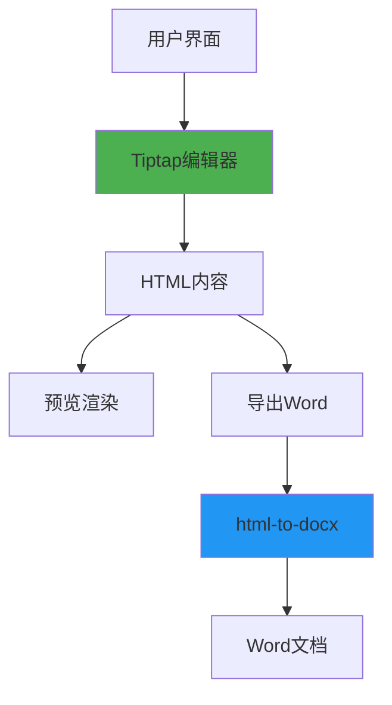
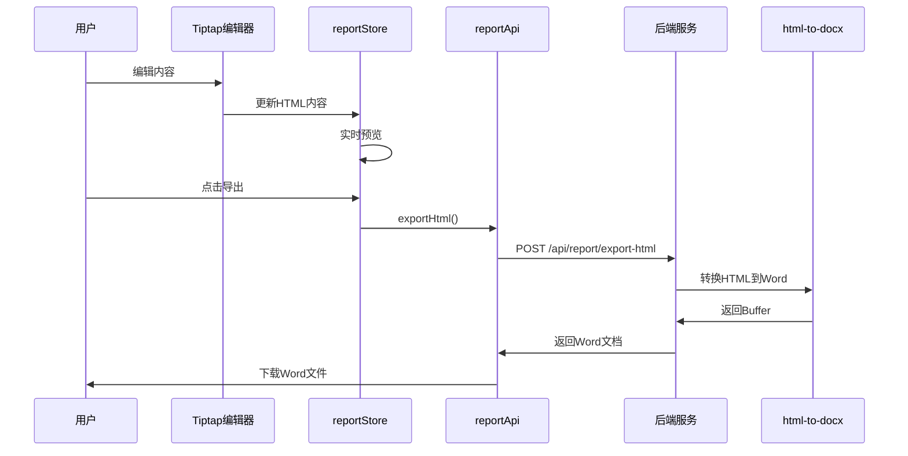

# 所见即所得编辑器实施计划

## 项目背景

当前系统的报告预览区使用自定义HTML渲染，与Word导出存在样式不一致的问题。为解决这一问题，需要实现真正的所见即所得（WYSIWYG）编辑器，确保预览效果与导出效果一致。

## 技术选型

### 1. 编辑器框架
- **选择**：`@tiptap/react`（已安装v3.14.0）
- **理由**：
  - 项目已有使用经验（PromptEditor、ProjectOverviewModal）
  - 基于ProseMirror，功能强大
  - 支持自定义扩展
  - 良好的TypeScript支持

### 2. 扩展插件
| 插件 | 版本 | 用途 |
|------|------|------|
| @tiptap/starter-kit | 3.14.0 | 基础功能（标题、列表、加粗等） |
| @tiptap/extension-placeholder | 3.14.0 | 占位符提示 |
| @tiptap/extension-underline | 3.14.0 | 下划线 |
| @tiptap/extension-strike | 3.14.0 | 删除线 |
| @tiptap/extension-text-align | 3.14.0 | 文本对齐 |
| @tiptap/extension-link | 3.14.0 | 链接 |
| @tiptap/extension-highlight | 3.14.0 | 高亮 |
| @tiptap/extension-table | 待安装 | 表格支持 |
| @tiptap/extension-image | 待安装 | 图片支持 |

### 3. Word导出
- **选择**：`html-to-docx`（已安装v1.8.0）
- **理由**：
  - HTML到Word的转换更精确
  - 支持丰富的HTML样式
  - 与Tiptap的HTML输出兼容性好

## 系统架构设计

### 1. 整体架构



### 2. 数据流



### 3. 组件结构

```
client/src/components/report/
├── ReportEditor.tsx              # 新建：主编辑器组件
│   ├── EditorToolbar.tsx          # 新建：工具栏
│   ├── EditorContent.tsx          # 新建：编辑器内容区
│   └── EditorPreview.tsx          # 新建：实时预览
├── ReportPreview.tsx              # 修改：改为使用Tiptap只读模式
└── PromptEditor.tsx              # 已有：提示词编辑器（参考）
```

## 实施步骤

### 阶段1：基础编辑器实现（3-4天）

#### 1.1 创建编辑器组件
**文件**：`client/src/components/report/ReportEditor.tsx`

**功能**：
- 使用Tiptap创建可编辑区域
- 支持基础格式化（加粗、斜体、下划线）
- 支持标题（H1-H6）
- 支持列表（有序、无序）
- 实时同步到reportStore

**代码框架**：
```typescript
import { useEditor, EditorContent } from '@tiptap/react'
import StarterKit from '@tiptap/starter-kit'
import Underline from '@tiptap/extension-underline'
import Strike from '@tiptap/extension-strike'
import TextAlign from '@tiptap/extension-text-align'
import { useReportStore } from '../../stores/reportStore'

export function ReportEditor() {
  const { reportContent, setReportContent } = useReportStore()

  const editor = useEditor({
    extensions: [
      StarterKit,
      Underline,
      Strike,
      TextAlign.configure({
        types: ['heading', 'paragraph']
      })
    ],
    content: reportContent,
    editable: true,
    onUpdate: ({ editor }) => {
      setReportContent(editor.getHTML())
    }
  })

  return (
    <div className="report-editor">
      <EditorToolbar editor={editor} />
      <EditorContent editor={editor} />
    </div>
  )
}
```

#### 1.2 创建工具栏组件
**文件**：`client/src/components/report/EditorToolbar.tsx`

**功能**：
- 格式化按钮（加粗、斜体、下划线）
- 标题选择器
- 对齐方式选择
- 列表按钮
- 清除格式

**UI设计**：
- 使用Mantine的ButtonGroup
- 图标使用Tabler Icons
- 响应式布局

#### 1.3 集成到报告生成页面
**修改文件**：`client/src/pages/ReportGeneration.tsx`

**改动**：
- 在预览区下方添加"编辑模式"切换
- 编辑模式显示ReportEditor
- 预览模式显示ReportPreview

### 阶段2：HTML到Word导出优化（2-3天）

#### 2.1 修改导出流程
**修改文件**：`client/src/stores/reportStore.ts`

**改动**：
```typescript
exportToWord: async () => {
  const { reportId, reportTitle, reportContent, styleConfig } = get()

  if (!reportId) {
    set({ error: '请先生成报告' })
    return
  }

  try {
    // 使用html-to-docx导出
    await reportApi.exportHtml({
      title: reportTitle,
      htmlContent: reportContent,
      styleConfig
    })
  } catch (error: any) {
    console.error('导出失败:', error)
    set({ error: error.message || '导出失败' })
  }
}
```

#### 2.2 优化HTML输出
**目标**：确保Tiptap输出的HTML符合html-to-docx要求

**关键点**：
- 使用语义化HTML标签
- 内联样式而非外部CSS
- 表格使用标准的`<table>`标签
- 图片使用base64编码

#### 2.3 创建HTML模板生成器
**文件**：`client/src/utils/htmlTemplateBuilder.ts`

**功能**：
- 将Tiptap的HTML内容包装成完整的HTML文档
- 注入样式配置
- 添加必要的元数据

**代码框架**：
```typescript
export function buildHtmlTemplate(
  content: string,
  styleConfig: ReportStyleConfig,
  title: string
): string {
  return `
    <!DOCTYPE html>
    <html>
    <head>
      <meta charset="utf-8" />
      <style>
        ${generateStyles(styleConfig)}
      </style>
    </head>
    <body>
      <h1 style="text-align: center;">${title}</h1>
      ${content}
    </body>
    </html>
  `
}

function generateStyles(config: ReportStyleConfig): string {
  return `
    body {
      font-family: ${config.fonts.body};
      font-size: ${config.fontSizes.body}pt;
      line-height: ${config.paragraph.lineSpacing};
    }
    h1, h2, h3, h4, h5, h6 {
      font-family: ${config.fonts.heading};
      font-weight: bold;
    }
    table {
      border-collapse: collapse;
      width: 100%;
    }
    th, td {
      border: 1px solid #000;
      padding: 8pt;
    }
  `
}
```

### 阶段3：高级功能实现（2-3天）

#### 3.1 表格支持
**安装插件**：
```bash
npm install @tiptap/extension-table @tiptap/extension-table-row @tiptap/extension-table-cell @tiptap/extension-table-header
```

**实现功能**：
- 插入表格
- 表格工具栏（添加行/列、删除行/列、合并单元格）
- 表格样式配置

#### 3.2 图片支持
**安装插件**：
```bash
npm install @tiptap/extension-image
```

**实现功能**：
- 插入图片（本地文件、URL）
- 图片大小调整
- 图片对齐方式

#### 3.3 样式配置面板
**功能**：
- 字体选择
- 字号调整
- 行间距调整
- 段落间距调整
- 页面边距调整

**UI设计**：
- 使用Mantine的Modal
- 实时预览样式变化

### 阶段4：预览与导出一致性优化（1-2天）

#### 4.1 统一样式系统
**目标**：确保预览和导出使用相同的样式配置

**实现**：
- 创建统一的样式配置对象
- 预览区使用CSS变量
- 导出时将样式转换为内联样式

#### 4.2 实时预览优化
**功能**：
- 编辑时实时更新预览
- 预览区使用只读模式的Tiptap编辑器
- 分页预览（模拟Word分页）

#### 4.3 导出测试
**测试用例**：
1. 基础文本样式（字体、字号、颜色）
2. 段落格式（对齐、缩进、间距）
3. 标题层级（H1-H6）
4. 列表（有序、无序）
5. 表格（边框、背景、对齐）
6. 图片（大小、位置）
7. 页面设置（边距、方向）

### 阶段5：用户体验优化（1-2天）

#### 5.1 快捷键支持
**常用快捷键**：
- Ctrl+B：加粗
- Ctrl+I：斜体
- Ctrl+U：下划线
- Ctrl+K：插入链接
- Ctrl+Shift+S：删除线

#### 5.2 撤销/重做
**功能**：
- 支持多级撤销/重做
- 快捷键Ctrl+Z / Ctrl+Y

#### 5.3 自动保存
**功能**：
- 编辑时自动保存到本地存储
- 页面刷新后恢复内容

#### 5.4 导入/导出
**功能**：
- 导入Word文档（转换为HTML）
- 导出为HTML文件
- 导出为Markdown

## 关键技术点

### 1. Tiptap编辑器配置

#### 1.1 扩展配置
```typescript
const editor = useEditor({
  extensions: [
    StarterKit.configure({
      heading: {
        levels: [1, 2, 3, 4, 5, 6]
      },
      bulletList: {
        keepMarks: true,
        keepAttributes: false
      },
      orderedList: {
        keepMarks: true,
        keepAttributes: false
      }
    }),
    Underline,
    Strike,
    TextAlign.configure({
      types: ['heading', 'paragraph']
    }),
    Placeholder.configure({
      placeholder: '开始输入报告内容...'
    })
  ],
  content: initialContent,
  editorProps: {
    attributes: {
      class: 'prose prose-sm sm:prose lg:prose-lg xl:prose-2xl mx-auto focus:outline-none'
    }
  }
})
```

#### 1.2 只读模式
```typescript
const editor = useEditor({
  editable: false,  // 只读模式
  content: reportContent
})
```

### 2. HTML到Word转换

#### 2.1 html-to-docx配置
```typescript
const options = {
  table: { row: { cantSplit: true } },
  footer: true,
  pageNumber: true,
  font: styleConfig.fonts.body,
  fontSize: styleConfig.fontSizes.body,
  lineSpacing: styleConfig.paragraph.lineSpacing * 240,
  margins: {
    top: styleConfig.page.margin.top * 28.35 * 20,
    bottom: styleConfig.page.margin.bottom * 28.35 * 20,
    left: styleConfig.page.margin.left * 28.35 * 20,
    right: styleConfig.page.margin.right * 28.35 * 20
  }
}
```

#### 2.2 样式转换
```typescript
// CSS单位转换
function convertUnit(value: number, from: 'px' | 'pt' | 'cm', to: 'twip'): number {
  const conversions = {
    'px-to-twip': value * 15,
    'pt-to-twip': value * 20,
    'cm-to-twip': value * 567
  }
  return conversions[`${from}-to-${to}`] || value
}
```

### 3. 样式一致性

#### 3.1 CSS变量
```css
:root {
  --font-body: '宋体';
  --font-heading: '黑体';
  --font-size-body: 16px;
  --font-size-title: 32px;
  --line-height: 1.5;
}
```

#### 3.2 内联样式生成
```typescript
function generateInlineStyles(config: ReportStyleConfig): string {
  return `
    style="font-family: ${config.fonts.body}; 
           font-size: ${config.fontSizes.body}pt; 
           line-height: ${config.paragraph.lineSpacing};"
  `
}
```

## 风险评估

### 1. 技术风险

| 风险 | 影响 | 概率 | 缓解措施 |
|------|------|------|---------|
| Tiptap与html-to-docx兼容性问题 | 高 | 中 | 提前进行兼容性测试，准备备选方案 |
| 性能问题（大文档编辑） | 中 | 低 | 实现虚拟滚动，分块加载 |
| 样式转换不精确 | 高 | 中 | 建立样式映射表，增加测试用例 |

### 2. 用户体验风险

| 风险 | 影响 | 概率 | 缓解措施 |
|------|------|------|---------|
| 学习成本高 | 中 | 中 | 提供操作指南，简化工具栏 |
| 功能缺失 | 高 | 低 | 逐步迭代，收集用户反馈 |

### 3. 兼容性风险

| 风险 | 影响 | 概率 | 缓解措施 |
|------|------|------|---------|
| 浏览器兼容性 | 中 | 低 | 使用现代浏览器，提供降级方案 |
| Word版本兼容性 | 高 | 中 | 测试多个Word版本，使用标准格式 |

## 测试计划

### 1. 单元测试

**测试范围**：
- HTML模板生成器
- 样式转换函数
- 导出功能

**测试工具**：Jest + React Testing Library

### 2. 集成测试

**测试场景**：
1. 编辑器初始化
2. 内容编辑与保存
3. 样式配置应用
4. 导出功能
5. 预览与导出一致性

**测试工具**：Cypress

### 3. 手动测试

**测试用例**：
- [ ] 基础文本编辑（输入、删除、复制、粘贴）
- [ ] 格式化（加粗、斜体、下划线、删除线）
- [ ] 标题（H1-H6）
- [ ] 列表（有序、无序、嵌套）
- [ ] 对齐（左、中、右、两端）
- [ ] 颜色（文字颜色、背景颜色）
- [ ] 链接（插入、编辑、删除）
- [ ] 表格（插入、编辑、删除）
- [ ] 图片（插入、调整大小、对齐）
- [ ] 样式配置（字体、字号、行间距、边距）
- [ ] 导出Word（样式一致性、格式正确性）
- [ ] 撤销/重做
- [ ] 自动保存
- [ ] 快捷键

## 时间安排

| 阶段 | 任务 | 预计时间 |
|------|------|---------|
| 阶段1 | 基础编辑器实现 | 3-4天 |
| 阶段2 | HTML到Word导出优化 | 2-3天 |
| 阶段3 | 高级功能实现 | 2-3天 |
| 阶段4 | 预览与导出一致性优化 | 1-2天 |
| 阶段5 | 用户体验优化 | 1-2天 |
| 测试 | 单元测试、集成测试、手动测试 | 2-3天 |
| 总计 | | 11-17天 |

## 里程碑

1. **M1（第4天）**：基础编辑器可用，支持基础格式化
2. **M2（第7天）**：导出功能正常，预览与导出基本一致
3. **M3（第10天）**：表格和图片功能可用
4. **M4（第12天）**：样式配置面板完成
5. **M5（第17天）**：所有功能完成，通过测试

## 后续优化方向

1. **协作编辑**：支持多人同时编辑
2. **版本控制**：支持文档版本历史
3. **模板系统**：提供报告模板库
4. **AI辅助**：集成AI进行内容生成和优化
5. **移动端适配**：优化移动端编辑体验

## 参考资料

- [Tiptap官方文档](https://tiptap.dev/)
- [html-to-docx文档](https://github.com/lalalic/html-to-docx)
- [ProseMirror文档](https://prosemirror.net/)
- [Word文档格式规范](https://docs.microsoft.com/en-us/openspecs/office_standards)
