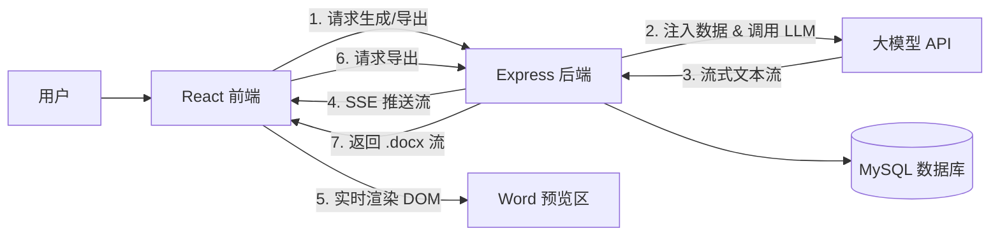

这份文档将作为开发人员的技术实现指南，涵盖了架构设计、数据流、组件结构、API 细节及数据库设计。
---
# 投资项目智能报告生成模块 - 技术设计文档 (TDD)
| 文档版本 | V1.0 |
| :--- | :--- |
| **撰写日期** | 2023-10-27 |
| **面向对象** | 前端/后端开发工程师 |
| **技术栈** | React 18, TS, Mantine, Tiptap, Express, MySQL |
---
## 1. 系统架构概览
本模块采用典型的 **前后端分离架构**，并通过 **Server-Sent Events (SSE)** 实现大模型生成的流式响应。

---
## 2. 前端技术设计
### 2.1 核心依赖
- **UI 框架**: React 18 + TypeScript
- **组件库**: `@mantine/core`, `@mantine/hooks`
- **富文本**: `@tiptap/react`, `@tiptap/starter-kit`, `@tiptap/extension-placeholder`
- **状态管理**: Zustand
- **HTTP**: Axios (REST), Fetch (SSE)
- **安全**: `dompurify` (HTML 净化)
### 2.2 状态管理
采用 Zustand 管理报告生成相关的所有状态，确保状态与 UI 解耦。
**Store 接口定义**:
```typescript
interface ReportState {
  // 提示词相关
  promptHtml: string;       // Tiptap 编辑器 HTML 内容
  promptText: string;       // 发送给 LLM 的纯文本
  availableVariables: Array<{key: string, label: string}>; // 可用变量列表
  
  // 生成状态
  isGenerating: boolean;
  isPaused: boolean;
  generatedContent: string; // 累积的生成内容 (Markdown 或 HTML)
  currentProjectId: string | null;
  
  // 历史记录
  history: ReportHistoryItem[];
  // Actions
  setPromptHtml: (html: string) => void;
  setPromptText: (text: string) => void;
  fetchVariables: (projectId: string) => Promise<void>;
  startStreamGeneration: (projectId: string) => Promise<void>;
  togglePause: () => void;
  exportToWord: (content: string) => Promise<void>;
}
```
**流式生成逻辑**:
使用 `fetch` API 获取 `ReadableStream`，通过 `reader.read()` 循环读取数据块，并追加到 `generatedContent` 状态中。
### 2.3 组件层级设计
```text
src/modules/report
├── components/
│   ├── PromptEditor.tsx       # 基于 @mantine/tiptap 的富文本编辑器
│   ├── ReportPreview.tsx      # A4 纸张预览容器 (CSS 模拟)
│   └── VariablePicker.tsx    # 变量选择组件 (Chip/Select)
├── stores/
│   └── reportStore.ts         # Zustand 状态定义
└── pages/
    └── ReportGenerationPage.tsx # 主页面布局 (Grid 布局)
```
**关键组件技术细节**:
1.  **PromptEditor**:
    - 使用 `useEditor` hook 初始化 Tiptap。
    - 配置 `StarterKit` 和 `Placeholder` 扩展。
    - 监听 `onUpdate` 事件，同步 `editor.getHTML()` 到 Store。
2.  **ReportPreview**:
    - 容器 CSS 设置为 `width: 210mm; min-height: 297mm;`。
    - 渲染层使用 `dompurify.sanitize(content)` 处理后的 HTML，防止 XSS。
    - 支持简单的 Markdown 渲染（可选 `react-markdown` 库）。
---
## 3. 后端技术设计
### 3.1 核心依赖
- **框架**: Express 4.x + TypeScript
- **ORM/DB**: MySQL2 或 TypeORM (视现有架构定)
- **文档生成**: `docx`
- **AI SDK**: `openai` 或现有 LLM SDK
- **模板引擎**: `handlebars` (用于将变量注入 Prompt)
### 3.2 目录结构
```text
server/src
├── controllers/
│   └── reportController.ts   # 处理请求响应，流转发
├── services/
│   ├── llmService.ts         # 封装 LLM 调用逻辑 (Stream)
│   ├── reportService.ts      # 业务逻辑 (变量替换, Word 生成)
│   └── projectDataService.ts # 聚合项目数据
├── routes/
│   └── reportRoutes.ts       # 路由定义
└── models/
    └── Report.ts             # 数据库模型定义
```
### 3.3 核心业务逻辑
#### A. 流式生成 (`POST /api/report/generate`)
1.  **数据聚合**: `projectDataService` 根据 `projectId` 查询各模块数据，组装成 JSON 对象。
2.  **Prompt 注入**: 使用 `handlebars.compile(promptTemplate)(dataObj)` 将变量替换为实际值。
3.  **流式转发**:
    - 调用 `llmService.streamCompletion(prompt)`。
    - 获取 LLM 返回的 `Stream`。
    - 设置 HTTP 响应头：`Content-Type: text/event-stream`, `Cache-Control: no-cache`。
    - 循环读取 Stream，通过 `res.write(chunk)` 写入前端。
#### B. Word 导出 (`POST /api/report/export`)
1.  接收前端传来的 `content` (HTML 或 Markdown)。
2.  **HTML 转 DOCX 结构**:
    - 解析 HTML 标签 (`h1` -> `HeadingLevel.HEADING_1`, `p` -> `Paragraph`, `b` -> `TextRun({bold: true})`)。
    - 使用 `docx` 库的 `Packer` 创建文档对象。
3.  **文件流返回**: 设置 `Content-Type: application/vnd.openxmlformats-officedocument.wordprocessingml.document`，通过 `res.send(buffer)` 返回。
---
## 4. 数据库设计
在现有 MySQL 数据库中新增两张表。
### 4.1 报告模板表 (`report_templates`)
用于存储用户自定义的提示词模板。
```sql
CREATE TABLE report_templates (
  id CHAR(36) PRIMARY KEY COMMENT 'UUID',
  user_id CHAR(36) NOT NULL COMMENT '创建用户ID',
  title VARCHAR(255) NOT NULL COMMENT '模板名称',
  description VARCHAR(500) COMMENT '模板描述',
  content_html MEDIUMTEXT NOT NULL COMMENT '富文本HTML',
  content_text TEXT NOT NULL COMMENT '纯文本Prompt',
  created_at DATETIME DEFAULT CURRENT_TIMESTAMP,
  updated_at DATETIME DEFAULT CURRENT_TIMESTAMP ON UPDATE CURRENT_TIMESTAMP,
  INDEX idx_user_id (user_id)
) ENGINE=InnoDB DEFAULT CHARSET=utf8mb4 COMMENT='报告提示词模板表';
```
### 4.2 生成历史表 (`report_history`)
用于存储生成记录，支持回溯。
```sql
CREATE TABLE report_history (
  id CHAR(36) PRIMARY KEY COMMENT 'UUID',
  project_id CHAR(36) NOT NULL COMMENT '关联项目ID',
  template_id CHAR(36) NULL COMMENT '使用的模板ID',
  prompt_text TEXT COMMENT '生成时的Prompt快照',
  content LONGTEXT COMMENT '生成的报告内容',
  status TINYINT DEFAULT 1 COMMENT '状态: 0失败, 1成功, 2中断',
  created_at DATETIME DEFAULT CURRENT_TIMESTAMP,
  INDEX idx_project_id (project_id),
  INDEX idx_created_at (created_at)
) ENGINE=InnoDB DEFAULT CHARSET=utf8mb4 COMMENT='报告生成历史表';
```
---
## 5. 接口技术规范
### 5.1 流式生成接口
- **URL**: `POST /api/report/generate`
- **Headers**: `Content-Type: application/json`
- **Body**:
  ```json
  {
    "projectId": "proj_001",
    "prompt": "分析项目{{project_name}}..."
  }
  ```
- **Response (Streaming Text)**:
  ```text
  data: 这是一个关于...
  data: ...的详细分析。
  ```
### 5.2 导出接口
- **URL**: `POST /api/report/export`
- **Headers**: `Content-Type: application/json`
- **Body**:
  ```json
  {
    "content": "<h1>报告标题</h1><p>内容...</p>",
    "filename": "Investment_Report_v1.docx"
  }
  ```
- **Response**: Binary Stream (.docx)
---
## 6. 安全性与性能策略
1.  **内容安全 (XSS 防护)**:
    - 前端在渲染 LLM 返回的 HTML 前，**必须**使用 `DOMPurify.sanitize()` 清理潜在的恶意脚本。
2.  **资源限制**:
    - 后端应对流式接口设置超时时间（例如 5 分钟），防止僵尸连接占用资源。
    - 前端实现“断开重连”机制，如果网络中断，提示用户重试。
3.  **Token 优化**:
    - 在注入数据时，避免将过长的原始数据表直接扔给 LLM，应先进行聚合摘要（Summary）处理，以节省 Token 并提高生成质量。
4.  **并发控制**:
    - 限制单个用户同时只能有 1 个正在进行的生成任务，防止并发过高导致 API 额度耗尽。
---
## 7. 部署与环境变量
需在 `.env` 中配置以下变量：
```bash
# LLM Configuration
LLM_API_KEY=sk-...
LLM_BASE_URL=https://api.openai.com/v1
LLM_MODEL=gpt-4
# Database
DB_HOST=localhost
DB_USER=root
DB_PASS=password
```
---
**文档维护**: 随着开发进度更新接口路径和数据结构。
