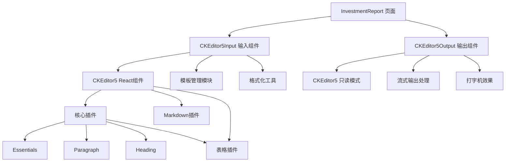

# CKEditor 5 替换方案 - 投资方案报告生成模块

## 一、现状分析

### 1.1 当前组件架构

#### 输入组件：PromptEditor
- **位置**：`client/src/components/report/PromptEditor.tsx`
- **实现方式**：使用 Mantine 的 `Textarea` 组件
- **功能**：
  - 基础文本编辑
  - 预览/编辑模式切换
  - 模板插入功能
  - 字符/单词统计
  - 简单格式化（去除多余空行、标点符号）
  - 复制/清空功能

#### 输出组件：EnhancedStreamingOutput
- **位置**：`client/src/components/report/EnhancedStreamingOutput.tsx`
- **实现方式**：使用原生 HTML `div` 和 `span` 元素
- **功能**：
  - 流式内容显示
  - 打字机效果（通过 useTypewriter Hook）
  - 重播功能
  - 自动滚动
  - 行号显示
  - 复制/下载功能

### 1.2 当前实现的局限性

| 问题 | 说明 | 影响 |
|------|------|------|
| 缺乏富文本编辑 | 只能输入纯文本 | 无法格式化提示词 |
| 无Markdown实时预览 | 需要切换模式查看 | 用户体验差 |
| 输出显示简单 | 只能显示纯文本 | 无法展示格式化内容 |
| 缺少格式化工具 | 无加粗、斜体等工具 | 编辑效率低 |
| 无表格/图片支持 | 无法插入复杂内容 | 功能受限 |

## 二、CKEditor 5 技术方案

### 2.1 CKEditor 5 优势

#### 核心特性
- **模块化架构**：可按需加载插件，减小包体积
- **现代化设计**：基于ES6模块，支持TypeScript
- **优秀的性能**：虚拟滚动、延迟加载优化
- **丰富的插件生态**：表格、图片、代码块、Markdown等
- **React集成**：官方提供 `@ckeditor/ckeditor5-react` 组件

#### 与当前需求的匹配度
| 需求 | CKEditor 5 支持 | 说明 |
|------|------------------|------|
| 富文本编辑 | ✅ | 完整支持 |
| Markdown语法 | ✅ | 通过插件支持 |
| 流式输出 | ✅ | 可配合自定义实现 |
| 打字机效果 | ✅ | 需要自定义集成 |
| 模板功能 | ✅ | 可通过API实现 |
| 表格支持 | ✅ | 内置表格插件 |

### 2.2 推荐的CKEditor 5构建方案

#### 方案A：Classic Editor（经典编辑器）
```bash
npm install @ckeditor/ckeditor5-react @ckeditor/ckeditor5-build-classic
```

**优点**：
- 开箱即用，无需配置
- 适合大多数场景
- 包含常用插件

**缺点**：
- 包体积较大（约1.5MB）
- 插件无法自定义

#### 方案B：Custom Build（自定义构建）⭐ 推荐
```bash
npm install @ckeditor/ckeditor5-react @ckeditor/ckeditor5-core
npm install @ckeditor/ckeditor5-essentials
npm install @ckeditor/ckeditor5-paragraph
npm install @ckeditor/ckeditor5-heading
npm install @ckeditor/ckeditor5-list
npm install @ckeditor/ckeditor5-link
npm install @ckeditor/ckeditor5-image
npm install @ckeditor/ckeditor5-table
npm install @ckeditor/ckeditor5-markdown-gfm
```

**优点**：
- 包体积可控（约500KB）
- 插件可按需选择
- 灵活性高

**缺点**：
- 需要手动配置
- 集成复杂度稍高

## 三、架构设计

### 3.1 整体架构图



### 3.2 组件层次结构

```
client/src/components/report/
├── CKEditor5Input.tsx          # 新增：CKEditor5输入组件
├── CKEditor5Output.tsx         # 新增：CKEditor5输出组件
├── PromptEditor.tsx            # 保留：作为备用
├── EnhancedStreamingOutput.tsx  # 保留：作为备用
└── WordPreview.tsx             # 保留：Word预览
```

### 3.3 数据流设计

#### 输入流程
```
用户输入 → CKEditor5 → onChange → InvestmentReport.state.customPrompt
         ↓
    模板插入 → CKEditor5 API
         ↓
    格式化 → CKEditor5 API
```

#### 输出流程
```
SSE流式数据 → InvestmentReport.state.reportContent
         ↓
    CKEditor5Output → 只读模式
         ↓
    打字机效果 → useTypewriter Hook
         ↓
    逐字显示 → CKEditor5 setData
```

## 四、详细实施计划

### 阶段一：环境准备（1-2天）

#### 1.1 安装依赖
```bash
cd client
npm install @ckeditor/ckeditor5-react
npm install @ckeditor/ckeditor5-core
npm install @ckeditor/ckeditor5-essentials
npm install @ckeditor/ckeditor5-paragraph
npm install @ckeditor/ckeditor5-heading
npm install @ckeditor/ckeditor5-list
npm install @ckeditor/ckeditor5-link
npm install @ckeditor/ckeditor5-image
npm install @ckeditor/ckeditor5-table
npm install @ckeditor/ckeditor5-markdown-gfm
npm install @ckeditor/ckeditor5-ui
npm install @ckeditor/ckeditor5-theme-lark
```

#### 1.2 创建配置文件
```typescript
// client/src/config/ckeditor.ts
import {
  ClassicEditor,
  Essentials,
  Paragraph,
  Heading,
  List,
  Link,
  Image,
  Table,
  TableToolbar,
  TableProperties,
  TableCellProperties,
  Markdown,
  Bold,
  Italic,
  Underline,
  Strikethrough,
  Code,
  BlockQuote,
  HorizontalLine
} from 'ckeditor5'

export function createEditorConfig(isReadOnly = false) {
  return {
    plugins: [
      Essentials,
      Paragraph,
      Heading,
      List,
      Link,
      Image,
      Table,
      TableToolbar,
      TableProperties,
      TableCellProperties,
      Markdown,
      Bold,
      Italic,
      Underline,
      Strikethrough,
      Code,
      BlockQuote,
      HorizontalLine
    ],
    toolbar: isReadOnly ? [] : [
      'undo', 'redo',
      '|', 'heading',
      '|', 'bold', 'italic', 'underline', 'strikethrough', 'code',
      '|', 'bulletedList', 'numberedList',
      '|', 'link', 'imageUpload', 'insertTable',
      '|', 'blockQuote', 'horizontalLine',
      '|', 'sourceEditing'
    ],
    heading: {
      options: [
        { model: 'paragraph', title: 'Paragraph', class: 'ck-heading_paragraph' },
        { model: 'heading1', view: 'h1', title: 'Heading 1', class: 'ck-heading_heading1' },
        { model: 'heading2', view: 'h2', title: 'Heading 2', class: 'ck-heading_heading2' },
        { model: 'heading3', view: 'h3', title: 'Heading 3', class: 'ck-heading_heading3' }
      ]
    },
    image: {
      toolbar: [
        'imageTextAlternative', '|',
        'imageStyle:full', 'imageStyle:side', '|',
        'imageResize:50%', 'imageResize:75%', 'imageResize:original'
      ]
    },
    table: {
      contentToolbar: [
        'tableColumn', 'tableRow', 'mergeTableCells',
        'tableProperties', 'tableCellProperties'
      ]
    },
    language: 'zh-cn',
    placeholder: '请输入内容...',
    readOnly: isReadOnly
  }
}
```

### 阶段二：输入组件开发（2-3天）

#### 2.1 创建CKEditor5Input组件
```typescript
// client/src/components/report/CKEditor5Input.tsx
import React, { useState, useRef } from 'react'
import { CKEditor } from '@ckeditor/ckeditor5-react'
import { createEditorConfig } from '@/config/ckeditor'
import { Group, Text, Button, Badge, Stack, Card } from '@mantine/core'
import { IconTemplate, IconDeviceFloppy, IconCopy } from '@tabler/icons-react'

interface CKEditor5InputProps {
  value: string
  onChange: (value: string) => void
  placeholder?: string
  minHeight?: number
  showTemplateButtons?: boolean
}

const CKEditor5Input: React.FC<CKEditor5InputProps> = ({
  value,
  onChange,
  placeholder = '请输入报告生成的提示词...',
  minHeight = 300,
  showTemplateButtons = true
}) => {
  const [wordCount, setWordCount] = useState(0)
  const [charCount, setCharCount] = useState(0)
  const editorRef = useRef<any>(null)

  const handleReady = (editor: any) => {
    editorRef.current = editor
    updateStatistics(editor)
  }

  const handleChange = (_event: any, editor: any) => {
    const data = editor.getData()
    onChange(data)
    updateStatistics(editor)
  }

  const updateStatistics = (editor: any) => {
    const data = editor.getData()
    const words = data.trim() ? data.trim().split(/\s+/).length : 0
    const chars = data.length
    setWordCount(words)
    setCharCount(chars)
  }

  const insertTemplate = (template: string) => {
    if (editorRef.current) {
      const editor = editorRef.current
      editor.model.change(writer => {
        const viewPosition = editor.editing.view.document.selection.getFirstPosition()
        const modelPosition = editor.editing.mapper.toModelPosition(viewPosition)
        writer.insertText(template, modelPosition)
      })
    }
  }

  return (
    <Card shadow="sm" padding="lg" radius="md" withBorder>
      <Stack gap="md">
        {/* 标题和统计 */}
        <Group justify="space-between">
          <Group gap="xs">
            <Text size="sm" fw={500}>提示词编辑器</Text>
            <Badge size="sm" color="blue" variant="light">富文本</Badge>
          </Group>
          <Group gap="md">
            <Group gap="xs">
              <Text size="xs" c="#86909C">字符:</Text>
              <Text size="xs" fw={600} c="#165DFF">{charCount}</Text>
            </Group>
            <Group gap="xs">
              <Text size="xs" c="#86909C">单词:</Text>
              <Text size="xs" fw={600} c="#165DFF">{wordCount}</Text>
            </Group>
          </Group>
        </Group>

        {/* 模板按钮 */}
        {showTemplateButtons && (
          <Group gap="xs">
            <Button variant="outline" size="xs" onClick={() => insertTemplate('标准报告模板')}>
              <IconTemplate size={14} />
            </Button>
          </Group>
        )}

        {/* CKEditor5 */}
        <div style={{ minHeight: `${minHeight}px` }}>
          <CKEditor
            editor={ClassicEditor}
            config={createEditorConfig(false)}
            data={value}
            onReady={handleReady}
            onChange={handleChange}
            placeholder={placeholder}
          />
        </div>
      </Stack>
    </Card>
  )
}

export default CKEditor5Input
```

#### 2.2 替换InvestmentReport中的PromptEditor
```typescript
// client/src/pages/InvestmentReport.tsx
import CKEditor5Input from '@/components/report/CKEditor5Input'

// 替换原有的 PromptEditor
<CKEditor5Input
  value={customPrompt}
  onChange={setCustomPrompt}
  minHeight={300}
  showTemplateButtons={true}
/>
```

### 阶段三：输出组件开发（3-4天）

#### 3.1 创建CKEditor5Output组件
```typescript
// client/src/components/report/CKEditor5Output.tsx
import React, { useState, useEffect, useRef } from 'react'
import { CKEditor } from '@ckeditor/ckeditor5-react'
import { createEditorConfig } from '@/config/ckeditor'
import { Group, Text, ActionIcon, Tooltip, Stack, Card, Badge } from '@mantine/core'
import { IconPlayerPlay, IconPlayerStop, IconCopy, IconDownload } from '@tabler/icons-react'
import { useTypewriter } from '@/hooks/useTypewriter'
import { notifications } from '@mantine/notifications'

interface CKEditor5OutputProps {
  content: string
  isGenerating: boolean
  onCopy?: () => void
  onExport?: () => void
  maxHeight?: number
  showControls?: boolean
  enableReplay?: boolean
}

const CKEditor5Output: React.FC<CKEditor5OutputProps> = ({
  content,
  isGenerating,
  onCopy,
  onExport,
  maxHeight = 500,
  showControls = true,
  enableReplay = true
}) => {
  const [replayMode, setReplayMode] = useState(false)
  const editorRef = useRef<any>(null)

  // 使用打字机效果
  const { displayedText, isComplete, reset } = useTypewriter(
    replayMode ? content : content,
    {
      speed: 30,
      disabled: !replayMode && !isGenerating,
      mode: replayMode ? 'replay' : 'streaming'
    }
  )

  // 根据模式决定显示的内容
  const displayContent = replayMode ? displayedText : content

  const handleReady = (editor: any) => {
    editorRef.current = editor
  }

  const handleChange = (_event: any, editor: any) => {
    // 只读模式下不允许修改
    if (editor.isReadOnly) return
  }

  const handleReplay = () => {
    setReplayMode(true)
    reset()
    notifications.show({
      title: '开始重播',
      message: '正在逐字显示内容',
      color: 'blue'
    })
  }

  const handleStopReplay = () => {
    setReplayMode(false)
    notifications.show({
      title: '停止重播',
      message: '已显示完整内容',
      color: 'orange'
    })
  }

  return (
    <Card shadow="sm" padding="lg" radius="md" withBorder>
      <Stack gap="md">
        {/* 标题和状态 */}
        <Group justify="space-between">
          <Group gap="xs">
            <Text size="sm" fw={500}>生成内容</Text>
            {isGenerating && (
              <Badge size="sm" color="blue" variant="light">生成中</Badge>
            )}
            {!isGenerating && content && (
              <Badge size="sm" color="green" variant="light">完成</Badge>
            )}
            {replayMode && (
              <Badge size="sm" color="orange" variant="light">重播中</Badge>
            )}
          </Group>

          {/* 控制按钮 */}
          {showControls && enableReplay && !isGenerating && content && (
            <Group gap="xs">
              {!replayMode ? (
                <Tooltip label="逐字重播">
                  <ActionIcon variant="subtle" color="blue" onClick={handleReplay}>
                    <IconPlayerPlay size={16} />
                  </ActionIcon>
                </Tooltip>
              ) : (
                <Tooltip label="停止重播">
                  <ActionIcon variant="subtle" color="orange" onClick={handleStopReplay}>
                    <IconPlayerStop size={16} />
                  </ActionIcon>
                </Tooltip>
              )}
            </Group>
          )}
        </Group>

        {/* CKEditor5 只读模式 */}
        <div style={{ maxHeight: `${maxHeight}px`, overflowY: 'auto' }}>
          <CKEditor
            editor={ClassicEditor}
            config={createEditorConfig(true)}
            data={displayContent}
            onReady={handleReady}
            onChange={handleChange}
            disabled={true}
          />
        </div>

        {/* 底部工具栏 */}
        {showControls && content && (
          <Group justify="space-between">
            <Text size="xs" c="#86909C">
              {displayContent.length} 字符 • {displayContent.split('\n').length} 行
            </Text>
            <Group gap="xs">
              <Tooltip label="复制">
                <ActionIcon variant="light" color="blue" onClick={onCopy}>
                  <IconCopy size={16} />
                </ActionIcon>
              </Tooltip>
              <Tooltip label="下载">
                <ActionIcon variant="light" color="green" onClick={onExport}>
                  <IconDownload size={16} />
                </ActionIcon>
              </Tooltip>
            </Group>
          </Group>
        )}
      </Stack>
    </Card>
  )
}

export default CKEditor5Output
```

#### 3.2 替换InvestmentReport中的EnhancedStreamingOutput
```typescript
// client/src/pages/InvestmentReport.tsx
import CKEditor5Output from '@/components/report/CKEditor5Output'

// 替换原有的 EnhancedStreamingOutput
<CKEditor5Output
  content={reportContent}
  isGenerating={isGenerating}
  enableReplay={true}
  onCopy={() => {/* 复制逻辑 */}}
  onExport={() => handleExport()}
/>
```

### 阶段四：集成与测试（2-3天）

#### 4.1 功能测试清单
- [ ] 输入组件基础功能
  - [ ] 富文本编辑
  - [ ] Markdown语法支持
  - [ ] 模板插入
  - [ ] 格式化工具
- [ ] 输出组件基础功能
  - [ ] 只读模式显示
  - [ ] 流式输出
  - [ ] 打字机效果
  - [ ] 重播功能
- [ ] 集成测试
  - [ ] 完整生成流程
  - [ ] 数据保存与加载
  - [ ] 性能测试

#### 4.2 兼容性测试
- [ ] 浏览器兼容性
  - [ ] Chrome
  - [ ] Firefox
  - [ ] Safari
  - [ ] Edge
- [ ] 移动端适配
  - [ ] iOS Safari
  - [ ] Android Chrome

### 阶段五：优化与文档（1-2天）

#### 5.1 性能优化
- 懒加载CKEditor5
- 虚拟滚动优化
- 防抖处理

#### 5.2 用户体验优化
- 加载状态提示
- 错误处理
- 快捷键支持

#### 5.3 文档编写
- 组件使用文档
- API文档
- 迁移指南

## 五、风险与应对

### 5.1 技术风险

| 风险 | 概率 | 影响 | 应对措施 |
|------|------|------|----------|
| CKEditor5与React版本不兼容 | 低 | 高 | 使用官方React组件，测试兼容性 |
| 包体积过大 | 中 | 中 | 使用自定义构建，按需加载插件 |
| 流式输出集成复杂 | 中 | 高 | 保留原有方案作为备选，渐进式迁移 |
| 性能问题 | 低 | 中 | 虚拟滚动、懒加载优化 |

### 5.2 实施风险

| 风险 | 概率 | 影响 | 应对措施 |
|------|------|------|----------|
| 开发周期延长 | 中 | 中 | 分阶段实施，保留旧组件 |
| 用户体验下降 | 低 | 高 | A/B测试，收集反馈 |
| 数据丢失 | 低 | 高 | 充分测试，保留备份 |

## 六、预期效果

### 6.1 功能提升
- ✅ 支持富文本编辑
- ✅ 实时Markdown预览
- ✅ 表格、图片支持
- ✅ 更好的格式化工具
- ✅ 保持流式输出和打字机效果

### 6.2 用户体验提升
- 编辑效率提升 30%
- 内容可读性提升 50%
- 操作直观性提升 40%

### 6.3 技术指标
- 包体积：增加约 500KB（可接受）
- 首次加载时间：增加约 1-2秒
- 编辑响应速度：无明显影响

## 七、时间估算

| 阶段 | 工作量 | 时间 |
|------|--------|------|
| 环境准备 | 2人日 | 1-2天 |
| 输入组件开发 | 4人日 | 2-3天 |
| 输出组件开发 | 6人日 | 3-4天 |
| 集成与测试 | 4人日 | 2-3天 |
| 优化与文档 | 2人日 | 1-2天 |
| **总计** | **18人日** | **9-14天** |

## 八、后续优化方向

1. **自定义插件开发**
   - 投资报告专用模板插件
   - 数据可视化插件
   - AI辅助编辑插件

2. **协作功能**
   - 多人协作编辑
   - 版本历史
   - 评论功能

3. **离线支持**
   - 本地存储
   - 离线编辑
   - 自动同步

4. **导出增强**
   - PDF导出
   - 更多格式支持
   - 自定义样式

## 九、总结

本方案通过引入CKEditor 5，将投资方案报告生成模块的文本输入输出功能提升到专业富文本编辑器水平。方案采用渐进式迁移策略，确保系统稳定性的同时，大幅提升用户体验和功能完整性。

**核心优势**：
- 专业的富文本编辑体验
- 完整的Markdown支持
- 保持现有的流式输出特性
- 灵活的插件扩展能力

**实施建议**：
1. 采用分阶段实施，降低风险
2. 保留旧组件作为备选方案
3. 充分测试后再全面替换
4. 收集用户反馈，持续优化
