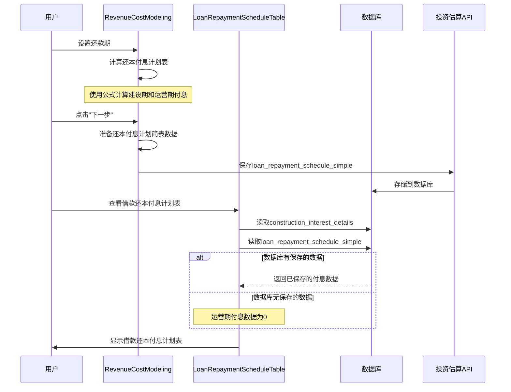

# 借款还本付息计划表"付息"数据来源分析

## 概述

本文档详细说明"借款还本付息计划表"中"付息"字段的数据来源。**根据最新需求，"付息"数据仅从数据库读取，不进行实时计算。**

## 数据来源示意图

```mermaid
graph TD
    A[项目基础信息] -->|loan_interest_rate| B[年利率]
    C[投资估算数据] -->|loan_amount| D[贷款总额]
    E[还款期设置] -->|repaymentPeriod| F[还款年限]
    
    B --> G[建设期利息计算]
    D --> G
    F --> G
    
    G --> H[construction_interest_details<br/>建设期利息详情]
    H -->|分年数据[].当期利息| I[建设期付息]
    
    D --> K[loan_repayment_schedule_simple<br/>还本付息计划简表]
    K -->|还款计划[].当期付息| L[运营期付息]
    
    I --> M[借款还本付息计划表<br/>序号2.2 付息行]
    L --> M
    
    style M fill:#90EE90
    style H fill:#87CEEB
    style K fill:#FFA07A
```

## 详细数据流

### 1. 建设期付息数据来源

**数据来源路径：**
```
数据库 → investment_estimates.construction_interest_details → 分年数据[].当期利息
```

**数据存储：**
- 数据库字段：`investment_estimates.construction_interest_details` (JSON类型)
- 数据结构：
```json
{
  "基本信息": {
    "贷款总额": 1000,
    "年利率": 0.049,
    "建设期年限": 3,
    "贷款期限": 10
  },
  "分年数据": [
    {
      "年份": 1,
      "期初借款余额": 0,
      "当期借款金额": 333.33,
      "当期利息": 8.17,
      "期末借款余额": 333.33
    }
  ],
  "汇总信息": {
    "总借款金额": 1000,
    "总利息": 24.5,
    "期末借款余额": 1000
  }
}
```

### 2. 运营期付息数据来源

**数据来源路径：**
```
数据库 → investment_estimates.loan_repayment_schedule_simple → 还款计划[].当期付息
```

**关键说明：**
- **仅从数据库读取，不进行实时计算**
- 如果数据库中没有保存的还本付息计划简表数据，则运营期付息数据为0

**代码位置：**
- 文件：`client/src/components/revenue-cost/LoanRepaymentScheduleTable.tsx`
- 行号：第201-223行

```typescript
// 运营期还款数据 - 仅从数据库读取，不进行实时计算
// 如果数据库中没有保存的还本付息计划简表数据，则所有运营期付息数据为0
const yearlyPrincipal: number[] = Array(operationYears).fill(0);
const yearlyInterest: number[] = Array(operationYears).fill(0);
const yearlyPayment: number[] = Array(operationYears).fill(0);
const beginningBalance: number[] = Array(operationYears).fill(0);
const endingBalance: number[] = Array(operationYears).fill(0);

// 从数据库读取运营期还本付息数据
if (savedLoanData.loanRepaymentScheduleSimple?.还款计划) {
  const savedSchedule = savedLoanData.loanRepaymentScheduleSimple.还款计划;
  
  // 从数据库读取运营期数据
  savedSchedule.forEach((yearData: any) => {
    const yearIndex = yearData.年份 - 1;
    if (yearIndex >= 0 && yearIndex < operationYears) {
      yearlyPrincipal[yearIndex] = yearData.当期还本 || 0;
      yearlyInterest[yearIndex] = yearData.当期付息 || 0;
      yearlyPayment[yearIndex] = yearData.当期还本付息 || 0;
      beginningBalance[yearIndex] = yearData.期初借款余额 || 0;
      endingBalance[yearIndex] = yearData.期末借款余额 || 0;
    }
  });
}
// 如果数据库没有数据，yearlyInterest 等数组保持为全0
```

**数据存储：**
- 数据库字段：`investment_estimates.loan_repayment_schedule_simple` (JSON类型)
- 数据结构：
```json
{
  "基本信息": {
    "贷款总额": 1000,
    "年利率": 0.049,
    "贷款期限": 10,
    "还款方式": "equal-principal",
    "运营期年限": 10
  },
  "还款计划": [
    {
      "年份": 1,
      "期初借款余额": 1000,
      "当期还本": 100,
      "当期付息": 49,
      "当期还本付息": 149,
      "期末借款余额": 900
    }
  ],
  "汇总信息": {
    "贷款总额": 1000,
    "总利息": 245,
    "总还本付息": 1245,
    "还款年数": 10
  }
}
```

### 3. 数据流转过程



## 数据存储位置

### 数据库表结构
```sql
CREATE TABLE investment_estimates (
  id INT PRIMARY KEY,
  project_id INT,
  construction_interest_details JSON,  -- 建设期利息详情
  loan_repayment_schedule_simple JSON, -- 还本付息计划简表（等额本金）
  loan_repayment_schedule_detailed JSON, -- 还本付息计划详细表（等额本息）
  ...
);
```

### 关键字段说明

| 字段名 | 类型 | 说明 | 用途 |
|--------|------|------|------|
| `construction_interest_details` | JSON | 建设期利息详情 | 存储建设期各年的借款和利息数据 |
| `loan_repayment_schedule_simple` | JSON | 还本付息计划简表 | 存储运营期各年的还本付息数据（等额本金） |
| `loan_repayment_schedule_detailed` | JSON | 还本付息计划详细表 | 存储运营期各年的还本付息数据（等额本息） |

## 数据使用场景

### 1. 总成本费用估算表
- **用途**：计算"利息支出"
- **数据来源**：借款还本付息计划表序号2.2（付息行）
- **代码位置**：`client/src/components/revenue-cost/DynamicCostTable.tsx`
- **行号**：第3920-3940行

```typescript
// 利息支出 = 利息支出（引用还本付息计划表序号2.2的付息行）
const interestRow = repaymentTableData.find(row => row.序号 === '2.2');
let yearInterest = interestRow?.分年数据[yearIndex] || 0;
```

### 2. 利润与利润分配表
- **用途**：计算财务费用中的利息支出
- **数据来源**：借款还本付息计划表序号2.2（付息行）

### 3. 财务评价指标计算
- **用途**：计算利息备付率、偿债备付率
- **数据来源**：借款还本付息计划表序号2.2（付息行）

## 数据验证与检查

### 数据完整性检查
1. 建设期付息数据必须与建设期年限匹配
2. 运营期付息数据必须与运营期年限匹配
3. 付息合计 = 建设期付息合计 + 运营期付息合计

### 数据一致性检查
1. 付息数据应与还本数据匹配
2. 当期还本付息 = 当期还本 + 当期付息
3. 期末借款余额 = 期初借款余额 - 当期还本

## 总结

"借款还本付息计划表"中的"付息"数据**仅从数据库读取**，包括：

1. **建设期付息**：从数据库字段 `construction_interest_details` 读取
2. **运营期付息**：从数据库字段 `loan_repayment_schedule_simple` 读取
   - 如果数据库无数据，运营期付息为0

**数据流转过程：**
```
用户输入 → 计算逻辑（RevenueCostModeling.tsx） 
  → 数据存储（数据库JSON字段） 
  → 数据读取（LoanRepaymentScheduleTable.tsx，仅读库）
  → 表格显示（借款还本付息计划表序号2.2）
  → 数据使用（总成本费用表、利润分配表、财务评价指标）
```

**关键变更：**
- ✅ 删除实时计算运营期付息的逻辑
- ✅ 付息数据完全依赖数据库读取
- ✅ 如果数据库无数据，运营期付息为0
