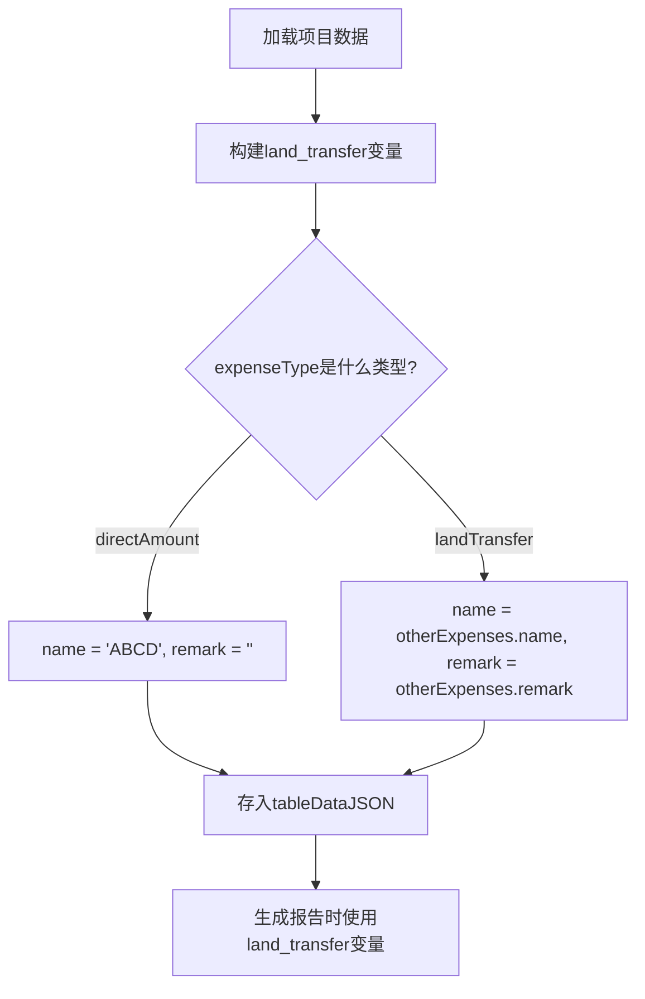

# 其他费用配置逻辑修改计划

## 背景说明

本计划针对"其他费用配置modal"和"土地流转信息JSON"的逻辑修改，以满足以下需求：

1. **"费用类型"为"直接填金额"时：**
   - 删除费用名称中必须包含"土地"或"流转"的条件限制
   - 不会出现备注字段，备注强制清空
   - "土地流转信息"JSON的name字段固定为"ABCD"

2. **"费用类型"为"土地流转费"时：**
   - "土地流转信息"JSON才包含remark信息
   - name字段为"土地流转费"

## 涉及文件

1. `client/src/components/revenue-cost/DynamicCostTable.tsx` - 其他费用配置modal
2. `client/src/stores/reportStore.ts` - land_transfer变量构建逻辑

## 实施步骤

### 步骤1：修改 DynamicCostTable.tsx

#### 1.1 删除 `needsRemark` 函数（行3876-3880）

**当前代码：**
```typescript
// 检测费用名称是否需要备注（包含"土地"或"流转"）
const needsRemark = (name: string): boolean => {
  const normalizedName = name || '';
  return normalizedName.includes('土地') || normalizedName.includes('流转');
};
```

**修改方案：**
- 删除整个`needsRemark`函数，因为备注字段不再依赖费用名称判断

#### 1.2 修改 `showRemarkField` 变量逻辑（行4069-4070）

**当前代码：**
```typescript
// 检测是否显示备注输入框 - 只在"土地流转费"类型时显示
const showRemarkField = isLandTransfer;
```

**修改方案：**
- 保持不变，因为`showRemarkField`已经基于`isLandTransfer`判断

#### 1.3 修改备注清空逻辑（行4072-4083）

**当前代码：**
```typescript
// 当切换到"直接填金额"类型时，清空备注
React.useEffect(() => {
  if (!showOtherModal) return;
  
  if (!isLandTransfer && tempOtherConfig?.remark) {
    // 切换到非土地流转费类型时，清空备注
    setTempOtherConfig((prev: any) => ({
      ...prev,
      remark: ''
    }));
  }
}, [isLandTransfer, showOtherModal]);
```

**修改方案：**
- 保持不变，确保切换到"直接填金额"时备注被清空

#### 1.4 修改备注输入框显示条件（行4323-4335）

**当前代码：**
```typescript
{/* 备注输入框 - 仅当费用名称包含"土地"或"流转"时显示 */}
{showRemarkField && (
  <TextInput
    label="备注"
    value={currentConfig.remark || ''}
    onChange={(e) => setTempOtherConfig({
      ...currentConfig,
      remark: e.target.value
    })}
    placeholder="请输入备注信息"
    description={isLandTransfer ? '💡 土地流转费说明信息' : undefined}
  />
)}
```

**修改方案：**
- 修改注释为：`{/* 备注输入框 - 仅当"费用类型"为"土地流转费"时显示 */}`
- 保持现有逻辑不变

### 步骤2：修改 reportStore.ts

#### 2.1 修改 land_transfer 变量构建逻辑（行618-628）

**当前代码：**
```typescript
// 【新增】构建 land_transfer 变量（土地流转信息）
const otherExpenses = projectData.revenueCost?.costConfig?.otherExpenses || {}
const hasLandTransfer = (otherExpenses.name || '').includes('土地') || 
                        (otherExpenses.name || '').includes('流转')
const landTransferValue = hasLandTransfer 
  ? JSON.stringify({
      name: otherExpenses.name,
      remark: otherExpenses.remark || ''
    }, null, 2)
  : JSON.stringify({ name: 'ABCD', remark: '' }, null, 2)  // 如果不包含"土地"或"流转"关键词，则赋值为JSON格式的ABCD
tableDataJSON['land_transfer'] = landTransferValue
```

**修改方案：**
```typescript
// 【修改】构建 land_transfer 变量（土地流转信息）
const otherExpenses = projectData.revenueCost?.costConfig?.otherExpenses || {}
const isDirectAmount = otherExpenses.expenseType === 'directAmount'

const landTransferValue = isDirectAmount
  ? JSON.stringify({ name: 'ABCD', remark: '' }, null, 2)  // "直接填金额"类型时，name固定为ABCD
  : JSON.stringify({
      name: otherExpenses.name || '土地流转费',
      remark: otherExpenses.remark || ''
    }, null, 2)  // "土地流转费"类型时，使用实际名称和备注

tableDataJSON['land_transfer'] = landTransferValue
```

**关键修改点：**
- 将判断条件从`name.includes('土地') || name.includes('流转')`改为`expenseType === 'directAmount'`
- "直接填金额"时：name为"ABCD"，remark为空
- "土地流转费"时：name为费用名称，remark为实际备注

## 流程图



## 测试验证点

### 测试场景1："直接填金额"类型
1. 在其他费用配置modal中选择"费用类型"为"直接填金额"
2. 验证备注输入框是否隐藏
3. 验证保存后remark字段是否为空
4. 验证land_transfer变量的JSON是否为：`{"name": "ABCD", "remark": ""}`

### 测试场景2："土地流转费"类型
1. 在其他费用配置modal中选择"费用类型"为"土地流转费"
2. 验证备注输入框是否显示
3. 验证备注是否自动生成（包含亩数、单价的说明）
4. 验证land_transfer变量的JSON是否包含name和remark字段

## 风险评估

| 风险点 | 影响 | 应对措施 |
|--------|------|----------|
| 依赖name判断的旧代码 | 修改后可能导致旧数据不兼容 | 保留向后兼容性，通过expenseType判断更准确 |
| UI显示问题 | 备注字段显示逻辑变化 | 确保所有相关组件同步更新 |

## 回滚方案

如果修改后出现问题，可以通过以下方式回滚：
1. 恢复reportStore.ts中的原始逻辑
2. 恢复DynamicCostTable.tsx中的needsRemark函数和相关逻辑
