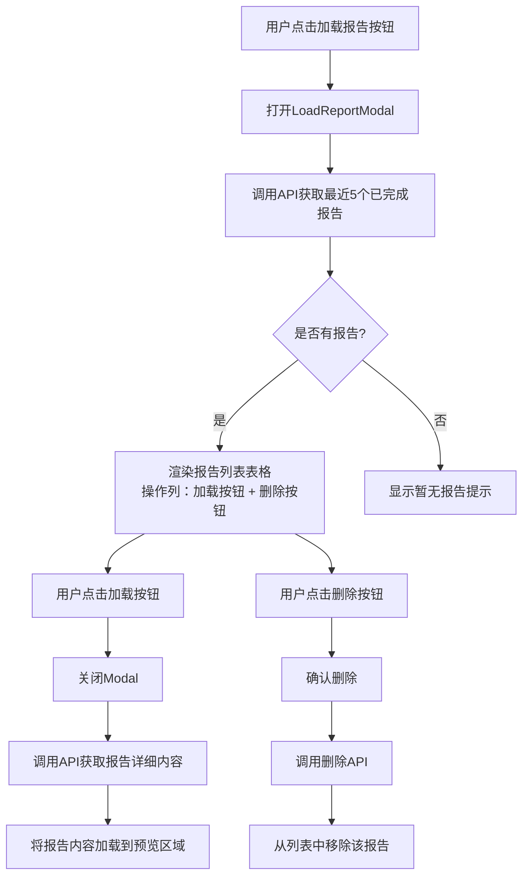

# 投资项目方案报告生成页面 - 加载报告功能实施计划

## 任务概述

在投资项目方案报告生成页面进行以下修改：
1. 删除"暂停"按钮
2. 添加"加载报告"按钮（在"导出Word"按钮后）
3. 实现加载报告Modal，显示最近5个已完成报告
4. 支持删除报告功能

## 当前代码结构分析

### ReportGeneration.tsx 按钮区域（第161-198行）
```
控制按钮区域包含：
- 开始生成/重新生成按钮
- 暂停/继续按钮 ← 需要删除
- 停止按钮
- 导出Word按钮 ← "加载报告"按钮添加在此之后
```

### 数据库表 generated_reports
关键字段：
- `id` - 报告ID
- `project_id` - 项目ID
- `report_title` - 报告标题
- `generation_status` - 生成状态（completed/failed/generating/paused）
- `report_content` - 报告内容
- `created_at` - 创建时间
- `updated_at` - 更新时间

## 实施步骤

### 第一步：后端API开发

#### 1.1 新增获取最近已完成报告列表API
**文件**: `server/src/controllers/reportController.ts`

```typescript
/**
 * 获取项目最近5个已完成报告
 * GET /api/reports/project/:projectId/recent-completed
 */
static async getRecentCompletedReports(req: Request, res: Response): Promise<void> {
  try {
    const { projectId } = req.params
    const userId = ReportController.getUserId(req)

    // 按created_at降序排列，限制5条
    const [reports] = await pool.execute(
      `SELECT id, report_title, generation_status, created_at, updated_at 
       FROM generated_reports 
       WHERE project_id = ? AND user_id = ? AND generation_status = 'completed'
       ORDER BY created_at DESC
       LIMIT 5`,
      [projectId, userId]
    ) as any[]

    res.json({ success: true, reports })
  } catch (error) {
    console.error('获取最近报告列表失败:', error)
    res.status(500).json({ success: false, error: '获取报告列表失败' })
  }
}
```

#### 1.2 新增删除报告API
**文件**: `server/src/controllers/reportController.ts`

```typescript
/**
 * 删除报告
 * DELETE /api/reports/:id
 */
static async deleteReport(req: Request, res: Response): Promise<void> {
  try {
    const { id } = req.params
    const userId = ReportController.getUserId(req)

    // 验证权限
    const [reports] = await pool.execute(
      'SELECT * FROM generated_reports WHERE id = ?',
      [id]
    ) as any[]
    
    if (reports.length === 0) {
      res.status(404).json({ success: false, error: '报告不存在' })
      return
    }

    if (reports[0].user_id !== userId) {
      res.status(403).json({ success: false, error: '无权删除此报告' })
      return
    }

    await pool.execute('DELETE FROM generated_reports WHERE id = ?', [id])

    res.json({ success: true, message: '报告已删除' })
  } catch (error) {
    console.error('删除报告失败:', error)
    res.status(500).json({ success: false, error: '删除报告失败' })
  }
}
```

#### 1.3 注册新路由
**文件**: `server/src/routes/report.ts`

```typescript
// 添加新路由
router.get('/project/:projectId/recent-completed', ReportController.getRecentCompletedReports)
router.delete('/:id', ReportController.deleteReport)
```

### 第二步：前端API调用

#### 2.1 添加API方法
**文件**: `client/src/lib/api.ts`

```typescript
export const reportApi = {
  // ... 现有方法 ...

  // 获取最近5个已完成报告
  getRecentCompletedReports: (projectId: string) =>
    api.get<any, ApiResponse<{ reports: any[] }>>(`/reports/project/${projectId}/recent-completed`),

  // 删除报告
  deleteReport: (reportId: string) =>
    api.delete<any, ApiResponse>(`/reports/${reportId}`),

  // 加载报告内容
  loadReportContent: (reportId: string) =>
    api.get<any, ApiResponse<{ report: any }>>(`/reports/${reportId}`),
}
```

### 第三步：创建加载报告Modal组件

**新建文件**: `client/src/components/report/LoadReportModal.tsx`

```typescript
import { useEffect, useState, useMemo } from 'react'
import { Modal, Table, Button, Text, Group, Stack, Badge } from '@mantine/core'
import { reportApi } from '@/lib/api'

interface LoadReportModalProps {
  opened: boolean
  onClose: () => void
  onLoadReport: (reportContent: string, reportId: string) => void
  projectId: string
}

interface ReportItem {
  id: string
  report_title: string
  generation_status: string
  created_at: string
}

export function LoadReportModal({ 
  opened, 
  onClose, 
  onLoadReport,
  projectId 
}: LoadReportModalProps) {
  const [reports, setReports] = useState<ReportItem[]>([])
  const [loading, setLoading] = useState(false)

  // 加载报告列表
  useEffect(() => {
    if (opened) {
      loadReports()
    }
  }, [opened])

  const loadReports = async () => {
    setLoading(true)
    try {
      const response = await reportApi.getRecentCompletedReports(projectId)
      if (response.success) {
        setReports(response.reports || [])
      }
    } catch (error) {
      console.error('加载报告列表失败:', error)
    } finally {
      setLoading(false)
    }
  }

  // 处理加载报告 - 关闭Modal并加载内容
  const handleLoad = async (report: ReportItem) => {
    try {
      const response = await reportApi.loadReportContent(report.id)
      if (response.success && response.report) {
        // 关闭Modal
        onClose()
        // 加载报告内容到预览区域
        onLoadReport(response.report.report_content, report.id)
      }
    } catch (error) {
      console.error('加载报告内容失败:', error)
    }
  }

  // 处理删除报告
  const handleDelete = async (reportId: string) => {
    if (!confirm('确定要删除此报告吗？')) return
    
    try {
      const response = await reportApi.deleteReport(reportId)
      if (response.success) {
        // 从列表中移除
        setReports(prev => prev.filter(r => r.id !== reportId))
      }
    } catch (error) {
      console.error('删除报告失败:', error)
    }
  }

  // 使用useMemo缓存表格数据，避免重复计算
  const tableData = useMemo(() => {
    return reports.map((report, index) => ({
      ...report,
      index: index + 1,
      formattedDate: new Date(report.created_at).toLocaleString('zh-CN')
    }))
  }, [reports])

  return (
    <Modal
      opened={opened}
      onClose={onClose}
      title="加载历史报告"
      size="lg"
    >
      <Stack gap="md">
        {loading ? (
          <Text>加载中...</Text>
        ) : tableData.length === 0 ? (
          <Text c="dimmed">暂无已完成的报告</Text>
        ) : (
          <Table striped highlightOnHover>
            <Table.Thead>
              <Table.Tr>
                <Table.Th style={{ width: '60px' }}>序号</Table.Th>
                <Table.Th>日期</Table.Th>
                <Table.Th>标题</Table.Th>
                <Table.Th style={{ width: '120px' }}>操作</Table.Th>
              </Table.Tr>
            </Table.Thead>
            <Table.Tbody>
              {tableData.map((item) => (
                <Table.Tr key={item.id}>
                  <Table.Td>{item.index}</Table.Td>
                  <Table.Td>{item.formattedDate}</Table.Td>
                  <Table.Td>{item.report_title}</Table.Td>
                  <Table.Td>
                    <Group gap="xs">
                      {/* 加载按钮 - 关闭Modal并加载报告内容 */}
                      <Button 
                        size="xs" 
                        variant="light"
                        color="blue"
                        onClick={() => handleLoad(item)}
                      >
                        加载
                      </Button>
                      {/* 删除按钮 */}
                      <Button 
                        size="xs" 
                        variant="light"
                        color="red"
                        onClick={() => handleDelete(item.id)}
                      >
                        删除
                      </Button>
                    </Group>
                  </Table.Td>
                </Table.Tr>
              ))}
            </Table.Tbody>
          </Table>
        )}
      </Stack>
    </Modal>
  )
}
```

### 第四步：修改ReportGeneration.tsx

**修改文件**: `client/src/pages/ReportGeneration.tsx`

#### 4.1 删除"暂停"按钮相关代码
- 删除 `handlePause` 函数（第57-63行）
- 删除"暂停/继续"按钮（第172-178行）

#### 4.2 添加"加载报告"按钮
在"导出Word"按钮后添加：

```typescript
// 添加状态
const [showLoadReportModal, setShowLoadReportModal] = useState(false)

// 添加处理函数
const handleLoadReport = (reportContent: string, reportId: string) => {
  if (reportContent) {
    store.setReportContent(reportContent)
    store.setReportId(reportId)
  }
}

// 在按钮区域添加
<Button 
  onClick={() => setShowLoadReportModal(true)}
  variant="light"
  color="blue"
>
  加载报告
</Button>
```

#### 4.3 添加Modal组件
在文件末尾的Modal定义区域添加：

```typescript
import { LoadReportModal } from '../components/report/LoadReportModal'

// 在组件末尾添加
<LoadReportModal
  opened={showLoadReportModal}
  onClose={() => setShowLoadReportModal(false)}
  onLoadReport={handleLoadReport}
  projectId={projectId || ''}
/>
```

### 第五步：更新reportStore

**修改文件**: `client/src/stores/reportStore.ts`

确保有 `setReportContent` 方法用于更新报告内容。

## 流程图



## 涉及文件清单

| 文件 | 操作 | 说明 |
|------|------|------|
| `server/src/controllers/reportController.ts` | 修改 | 添加两个新API方法 |
| `server/src/routes/report.ts` | 修改 | 注册新路由 |
| `client/src/lib/api.ts` | 修改 | 添加reportApi新方法 |
| `client/src/components/report/LoadReportModal.tsx` | 新建 | 加载报告Modal组件 |
| `client/src/pages/ReportGeneration.tsx` | 修改 | 删除暂停按钮，添加加载报告按钮和Modal |
| `client/src/stores/reportStore.ts` | 修改 | 确保setReportContent方法存在 |

## 注意事项

1. **权限控制**: 所有API都需要验证用户ID
2. **状态筛选**: 只显示 `generation_status = 'completed'` 的报告
3. **项目筛选**: 只显示当前项目ID的报告
4. **数量限制**: 最多显示5条，按创建时间倒序
5. **表格规范**: 遵循JSX表格渲染规范，使用useMemo缓存数据
6. **key规范**: 使用报告ID作为表格行的key
