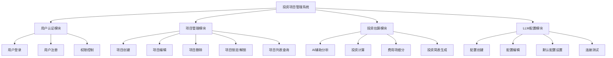

# 投资项目管理系统 - 开发需求文档

**文档版本**: v1.0  
**编制日期**: 2025-12-14  
**项目名称**: 投资项目管理系统（Investment Project Management System）  
**系统代号**: miaoda-react-admin  

---

## 目录

1. [项目概述](#1-项目概述)
2. [技术架构](#2-技术架构)
3. [功能需求](#3-功能需求)
4. [数据库设计](#4-数据库设计)
5. [核心业务算法](#5-核心业务算法)
6. [UI设计规范](#6-ui设计规范)
7. [接口设计](#7-接口设计)
8. [安全性需求](#8-安全性需求)
9. [性能需求](#9-性能需求)
10. [开发规范](#10-开发规范)
11. [部署方案](#11-部署方案)

---

## 1. 项目概述

### 1.1 项目背景
投资项目管理系统是一个基于现代Web技术栈的全栈应用，旨在为投资项目的管理、估算、分析提供智能化解决方案。系统集成了AI大语言模型能力，能够自动分析项目信息、生成投资估算表、智能拆分工程费用项等。

### 1.2 核心价值
- **智能化管理**：利用AI技术辅助项目信息分析和费用项拆分
- **精准估算**：采用迭代算法精确计算投资总额和建设期利息
- **多用户协同**：支持管理员和普通用户双角色权限管理
- **可配置性**：支持多LLM服务商配置，灵活切换

### 1.3 目标用户
- **管理员用户**：具有全局查看权限，可管理所有项目和LLM配置
- **普通用户**：仅能查看和管理自己创建的项目

---

## 2. 技术架构

### 2.1 整体架构
采用前后端分离的全栈架构：
```
┌─────────────────┐
│   前端层 (Client) │
│  React 18 + Vite │
└────────┬────────┘
         │ HTTP/REST API
┌────────▼────────┐
│   后端层 (Server) │
│  Node.js + Express│
└────────┬────────┘
         │ SQL
┌────────▼────────┐
│   数据层 (DB)    │
│    MariaDB      │
└─────────────────┘
```

### 2.2 技术栈清单

#### 前端技术栈
| 技术/库 | 版本 | 用途 |
|--------|------|------|
| React | 18.x | 用户界面框架 |
| TypeScript | 5.x | 类型安全的JavaScript |
| Vite | 5.x | 快速开发构建工具 |
| React Router | 6.x | 前端路由管理 |
| Axios | 1.x | HTTP客户端 |
| Tailwind CSS | 3.x | 原子化CSS框架 |
| Mantine UI | 7.x | UI组件库 |
| Radix UI | - | 无障碍组件基础 |

#### 后端技术栈
| 技术/库 | 版本 | 用途 |
|--------|------|------|
| Node.js | ≥18.x | JavaScript运行时 |
| Express | 4.x | Web应用框架 |
| TypeScript | 5.x | 类型安全 |
| MySQL2 | 3.x | MariaDB数据库驱动 |
| jsonwebtoken | 9.x | JWT认证 |
| bcryptjs | 3.x | 密码加密 |
| Zod | 3.x | 数据验证 |
| dotenv | 16.x | 环境变量管理 |

#### 数据库
- **MariaDB 10.x**：开源关系型数据库

### 2.3 开发环境要求
- Node.js >= 18.0
- npm >= 9.0
- MariaDB >= 10.x

### 2.4 目录结构
```
/opt/Solution_Assistant/
├── client/                # 前端项目
│   ├── src/
│   │   ├── components/   # 可复用组件
│   │   ├── pages/        # 页面组件
│   │   ├── lib/          # 工具库
│   │   ├── types/        # TypeScript类型定义
│   │   ├── routes/       # 路由配置
│   │   └── styles/       # 全局样式
│   └── package.json
├── server/               # 后端项目
│   ├── src/
│   │   ├── controllers/  # 控制器层
│   │   ├── models/       # 数据模型
│   │   ├── routes/       # 路由定义
│   │   ├── middleware/   # 中间件
│   │   ├── lib/          # 业务逻辑库
│   │   ├── db/           # 数据库配置和迁移
│   │   └── types/        # TypeScript类型定义
│   ├── .env             # 环境变量配置
│   └── package.json
├── doc/                 # 项目文档
└── package.json         # 根项目配置
```

---

## 3. 功能需求

### 3.1 功能模块概览



### 3.2 用户认证模块

#### 3.2.1 用户登录
**功能描述**：用户通过用户名和密码登录系统

**输入参数**：
- 用户名（username）：字符串，必填
- 密码（password）：字符串，必填

**业务逻辑**：
1. 验证用户名和密码格式
2. 查询数据库验证用户凭证
3. 检查用户是否过期（is_expired字段）
4. 生成JWT令牌（包含userId、username、isAdmin）
5. 返回用户信息和访问令牌

**输出结果**：
```typescript
{
  success: boolean
  data?: {
    user: {
      id: string
      username: string
      is_admin: boolean
    }
    token: string  // JWT令牌
  }
  error?: string
}
```

**测试账号**：
- 管理员：admin / 123456
- 普通用户：user / 123456

#### 3.2.2 用户注册
**功能描述**：管理员创建新用户账号

**权限要求**：仅管理员可操作

**输入参数**：
- username：字符串，唯一
- password：字符串，长度≥6
- isAdmin：布尔值，是否为管理员

**业务逻辑**：
1. 检查用户名唯一性
2. 使用bcrypt加密密码（加盐轮数：10）
3. 创建用户记录
4. 返回创建结果

#### 3.2.3 JWT认证中间件
**功能描述**：验证API请求的JWT令牌

**验证流程**：
1. 从请求头提取Authorization字段
2. 解析Bearer令牌
3. 验证JWT签名和有效期
4. 将用户信息附加到request.user
5. 验证失败返回401或403

**JWT配置**：
- 签名算法：HS256
- 密钥：环境变量JWT_SECRET
- 有效期：默认7天

### 3.3 项目管理模块

#### 3.3.1 项目创建
**功能描述**：创建新的投资项目

**输入参数**：
```typescript
{
  project_name: string           // 项目名称，必填
  total_investment: number       // 总投资（万元），必填
  project_info?: string          // 项目描述
  construction_years: number     // 建设年限，默认3
  operation_years: number        // 运营年限，默认20
  loan_ratio: number            // 贷款比例，默认0.7
  loan_interest_rate: number    // 贷款利率，默认0.049
  
  // 用地信息
  land_mode?: 'A' | 'B' | 'C' | 'D'  // 用地模式
  land_area?: number                  // 土地面积（亩）
  land_unit_price?: number            // 土地单价
  land_cost?: number                  // 土地费用
  land_remark?: string                // 备注
  
  // 混合用地（D模式）
  land_lease_area?: number            // 租赁面积
  land_lease_unit_price?: number      // 租赁单价
  land_purchase_area?: number         // 征地面积
  land_purchase_unit_price?: number   // 征地单价
  seedling_compensation?: number      // 青苗补偿费
}
```

**用地模式说明**：
- **A模式（一次性征地）**：一次性购买土地
- **B模式（长期租赁）**：按年租赁土地
- **C模式（无土地需求）**：不涉及土地费用，AI不分析用地信息
- **D模式（混合用地）**：同时包含征地和租赁

**业务逻辑**：
1. 验证用户权限
2. 生成UUID作为项目ID
3. 关联用户ID（user_id = 当前登录用户）
4. 设置初始状态为'draft'
5. 如果是C模式，自动清空所有土地相关字段
6. 插入数据库
7. 返回创建的项目信息

**特殊处理**：
- C模式（无土地需求）下，用地模式下拉框在AI分析期间锁定（disabled=true）
- AI分析完成后自动解锁
- 项目表单采用左右布局（lg:grid-cols-2），项目基本信息和用地信息并排显示

#### 3.3.2 项目编辑
**功能描述**：更新现有项目信息

**权限要求**：
- 普通用户：只能编辑自己创建的项目
- 管理员：可编辑所有项目

**输入参数**：同项目创建，所有字段可选

**业务逻辑**：
1. 验证项目所有权
2. 检查项目是否被锁定（is_locked）
3. 锁定项目不可编辑，返回错误
4. 更新允许的字段
5. 更新updated_at时间戳

#### 3.3.3 项目删除
**功能描述**：删除项目及其关联的所有估算数据

**权限要求**：同编辑

**业务逻辑**：
1. 验证项目所有权
2. 检查锁定状态
3. 级联删除关联的investment_estimates记录
4. 删除项目记录

**数据库约束**：
```sql
FOREIGN KEY (project_id) REFERENCES investment_projects(id) ON DELETE CASCADE
```

#### 3.3.4 项目锁定/解锁
**功能描述**：锁定项目防止误操作，或解锁以允许编辑

**锁定效果**：
- 锁定后项目不可编辑
- 不可删除
- 锁定状态在列表中显示锁定图标
- 记录锁定时间（locked_at）

**解锁条件**：
- 仅项目所有者或管理员可解锁

#### 3.3.5 项目列表查询
**功能描述**：获取项目列表，支持分页和筛选

**查询规则**：
- 管理员：查看所有项目
- 普通用户：仅查看自己创建的项目

**排序**：按创建时间倒序（created_at DESC）

**返回字段**：
```typescript
{
  id: string
  project_name: string
  total_investment: number
  status: 'draft' | 'completed'
  is_locked: boolean
  created_at: string
  // ... 其他字段
}
```

### 3.4 投资估算模块

#### 3.4.1 AI辅助分析

##### 项目信息分析（analyzeProjectInfo）
**功能描述**：AI分析项目描述，提取结构化信息

**输入参数**：
```typescript
{
  project_info: string         // 项目描述文本
  use_default_config: boolean  // 是否使用默认LLM配置
}
```

**AI处理流程**：
1. 获取默认LLM配置（或用户指定配置）
2. 构建分析prompt
3. 调用LLM API
4. 解析返回的JSON结构
5. 提取项目名称、总投资、建设年限、土地信息等

**输出示例**：
```typescript
{
  analyzed_data: {
    project_name: "某工业园基础设施建设项目"
    total_investment: 50000
    construction_years: 3
    land_mode: "A"
    land_area: 200
    // ... 其他字段
  }
  config_name: "百炼 - qwen-plus"
}
```

##### 工程费用项分析（analyzeEngineeringItems）
**功能描述**：AI根据项目信息拆分工程费用二级子项

**输入参数**：
```typescript
{
  project_name: string
  project_description?: string
  total_investment: number
  use_default_config: boolean
}
```

**AI分析要求**：
- 拆分的子项与项目类型匹配（建筑工程、市政工程等）
- 单个子项占比不低于总投资的1%
- 返回子项列表，包含名称和投资金额

**输出示例**：
``typescript
{
  items: [
    {
      category: "建筑工程",
      name: "主厂房建设",
      investment: 15000,
      percentage: 30
    },
    // ... 更多子项
  ],
  suggestions: ["建议考虑预留X万元应急费用"],
  analysis: {
    project_type: "工业项目",
    cost_breakdown: "建筑工程占比最高",
    reasoning: "根据项目规模..."
  },
  config_name: "百炼 - qwen-plus"
}
```

##### 二级子项细分（subdivideEngineeringItem）
**功能描述**：AI将二级子项进一步拆分为三级明细

**输入参数**：
```typescript
{
  parent_item_name: string      // 二级子项名称
  parent_investment: number     // 二级子项投资额
  project_name: string
  project_type?: string
  use_default_config: boolean
}
```

**AI拆分规则**：
- 三级子项总额必须等于二级子项投资额
- 偏差率≤1.5%（可通过迭代调整实现）
- 单个三级子项占比不低于1%
- 拆分数量建议3-8个

**输出示例**：
``typescript
{
  sub_items: [
    {
      name: "土建工程",
      investment: 8000,
      percentage: 53.3,
      unit: "m²",
      quantity: 5000,
      unit_price: 1.6
    },
    // ... 更多三级子项
  ],
  config_name: "百炼 - qwen-plus"
}
```

**细分后的交互规范**（来自记忆）：
1. AI细分结果自动填充到表格
2. 支持手动编辑三级子项的名称、数量、单价
3. 修改后实时重算投资额（数量 × 单价）
4. 三级子项应用后：
   - 自然数序号（1, 2, 3...）
   - 表格样式紧凑（间距3px）
   - 使用高精度计算（6位小数）
   - 禁止四舍五入，直接截断

**数据持久化**：
- 三级子项数据需要持久化保存
- 与项目估算数据关联存储

**总额校验**：
- 细分完成后检查三级子项总和
- 总和必须≤二级子项总投资
- 允许占比显示（每个子项占二级子项的百分比）

#### 3.4.2 投资计算

##### 统一循环迭代算法
**算法目标**：精确计算项目总投资和建设期利息

**输入参数**：
```typescript
{
  construction_cost: number      // 建筑工程费
  equipment_cost: number         // 设备购置费
  installation_cost: number      // 安装工程费
  other_cost: number            // 其他费用
  land_cost: number             // 土地费用
  basicReserveRate: number      // 基本预备费率
  priceReserveRate: number      // 涨价预备费率
  construction_period: number    // 建设期（年）
  loan_rate: number             // 贷款利率
  custom_loan_amount?: number   // 自定义贷款金额（可选）
}
```

**计算步骤**：
1. **计算建设投资**
   ```
   基础投资 = 建筑+设备+安装+其他+土地
   基本预备费 = 基础投资 × 基本预备费率
   涨价预备费 = 基础投资 × 涨价预备费率
   建设投资 = 基础投资 + 基本预备费 + 涨价预备费
   ```

2. **迭代计算建设期利息**
   - 如果用户提供custom_loan_amount，使用自定义金额
   - 否则：贷款金额 = 项目总投资 × 贷款比例（默认70%）
   
   迭代公式：
   ```
   初始：项目总投资 = 建设投资
   循环：
     贷款金额 = 项目总投资 × 0.7
     建设期利息 = (贷款金额 × 利率 × (建设期+1)) / 2
     新项目总投资 = 建设投资 + 建设期利息
     
     如果 |新项目总投资 - 旧项目总投资| < 0.0001万元：
       收敛，退出循环
     否则：
       继续迭代
   
   最大迭代次数：100次
   ```

3. **计算差额率**
   ```
   差额率 = |项目总投资 - 建设投资| / 建设投资
   ```

**输出结果**：
```typescript
{
  construction_cost: number
  equipment_cost: number
  installation_cost: number
  other_cost: number
  land_cost: number
  basic_reserve: number          // 基本预备费
  price_reserve: number          // 涨价预备费
  building_investment: number    // 建设投资
  construction_interest: number  // 建设期利息
  total_investment: number       // 项目总投资
  loan_amount: number           // 贷款金额
  iteration_count: number       // 迭代次数
  gap_rate?: number             // 差额率
}
```

**精度要求**（来自记忆）：
- 全局计算精度：6位小数
- 数量列显示精度：动态规则（整数显示为整数，小数保留2-6位）
- 金额单位：万元
- 禁止使用四舍五入，采用截断方式

##### 建设期利息计算详细规则
（详见文档：doc/建息算法.md）

**核心公式**：
```
当期建设期利息 = (期初贷款本金累计 + 当期借款金额 ÷ 2) × 年利率
```

**贷款金额取整规则**：
- 贷款≥1亿元：向下取整到1000万
- 贷款<1亿元：向下取整到100万

**分年借款分配（头大尾小算法）**：
1. 前n-1年：每年借款金额相同（取整后平均值）
2. 第n年：使用减法得出尾数

**利率格式自动检测**：
- 如果利率<1，自动转换为百分比（如0.049→4.9%）
- 如果利率≥1，直接使用

#### 3.4.3 投资简表生成
**功能描述**：生成包含详细费用项的投资估算简表

**生成流程**：
1. 调用AI分析工程费用项（二级子项）
2. 用户可选择继续细分为三级子项
3. 应用迭代算法计算总投资
4. 生成投资简表数据结构
5. 保存到investment_estimates表

**简表布局规范**（来自记忆）：
- Card组件固定宽度（避免布局抖动）
- 左右布局：表格在左，操作按钮在右
- Modal弹窗宽度统一
- 表格列宽使用像素值（禁止百分比）

**表格样式规范**：
- 表头字体：增大1号
- 0值显示：显示为"0"，不留空
- 序号列：自然数序号（1, 2, 3...）
- 无底色：避免视觉干扰

**浮动按钮规范**：
- 圆形样式，固定尺寸
- 位置固定在页面右下角
- 主色调：#1E6FFF

#### 3.4.4 费用项细分功能

##### "细化全部"功能
**功能描述**：批量将所有二级子项细分为三级子项

**交互流程**：
1. 用户点击"细化全部"按钮
2. 系统依次调用AI细分每个二级子项
3. 细化期间：
   - 禁止删除任何三级子项
   - 显示加载状态
   - 按钮交互锁定
4. 完成后解锁所有操作

**数据校验**：
- 每个二级子项的三级子项总额≤二级子项投资额
- 总费用占比计算并显示

##### 单项细化功能
**功能描述**：针对单个二级子项进行细分

**Modal弹窗规范**：
- 弹窗布局：标题 + 表格 + 操作按钮
- 样式统一：遵循UI设计规范
- 按钮去重：避免重复的"应用"或"取消"按钮

**操作按钮**：
- "应用"：保存三级子项数据，关闭弹窗
- "取消"：放弃修改，关闭弹窗
- "重新生成"：重新调用AI生成三级子项

##### 二级子项变更后的自动重算
**触发条件**：
- 用户修改二级子项的投资额
- 用户删除二级子项

**重算机制**（来自记忆）：
1. 检测二级子项投资额变化
2. 如果该子项已有三级子项：
   - 按比例调整所有三级子项投资额
   - 或提示用户重新细分
3. 更新总额和占比

### 3.5 LLM配置模块

#### 3.5.1 配置管理

##### 支持的LLM服务商
| 服务商 | Base URL | 默认模型 | 推荐模型 |
|--------|----------|---------|---------|
| 百炼（阿里云） | https://dashscope.aliyuncs.com/compatible-mode/v1 | qwen-plus | qwen-plus, qwen-max, qwen-turbo |
| 智谱AI | https://open.bigmodel.cn/api/paas/v4 | glm-4.5-flash | glm-4.5-flash, glm-4.6 |
| 火山引擎 | https://ark.cn-beijing.volces.com/api/v3 | doubao-seed-1-6-251015 | doubao-seed-1-6-251015, deepseek-v3-250324 |
| 硅基流动 | https://api.siliconflow.cn/v1 | zai-org/GLM-4.5-Air | zai-org/GLM-4.5-Air, deepseek-ai/DeepSeek-V3.2 |
| 自定义 | 用户输入 | 用户输入 | - |

##### 配置创建
**输入参数**：
```typescript
{
  name: string              // 配置名称（自动生成：服务商-模型）
  provider: string          // 服务商ID
  api_key: string          // API密钥（明文输入）
  base_url: string         // 自动填充或手动输入
  model: string            // 模型名称（下拉选择或手动输入）
  is_default: boolean      // 是否设为默认
}
```

**自动填充逻辑**：
1. 选择服务商后自动填充base_url
2. 自动显示该服务商的模型列表
3. 自动选择默认模型
4. 自动生成配置名称

**UI交互优化**（来自记忆）：
- 推荐模型列表：点击快速填充到模型输入框
- 模型输入框：使用Autocomplete组件，支持下拉和手动输入
- 统一下拉列表样式：text-foreground颜色，避免硬编码

##### 配置编辑
**权限规则**：
- 普通用户：只能编辑自己创建的配置
- 管理员：可编辑所有配置

**可编辑字段**：name、api_key、model

**不可编辑字段**：provider、base_url（如需修改请新建配置）

##### 设为默认配置
**功能描述**：将指定配置设为用户的默认LLM配置

**业务逻辑**（来自记忆）：
1. 取消当前用户的所有默认配置（is_default=false）
2. 设置选中配置为默认（is_default=true）
3. 事务保证原子性
4. **必须立即验证连通性**
5. 连通性验证失败时，按钮显示"验证失败"状态
6. 验证成功后才能设为默认

**界面规范**：
- 默认配置在列表中显示标识
- 设为默认后按钮状态变化

##### 连接测试
**功能描述**：测试LLM配置的连通性

**测试流程**：
1. 使用提供的api_key和base_url
2. 发送测试prompt（如："你好，请回复1"）
3. 检查API响应状态
4. 解析返回内容
5. 返回测试结果

**输出结果**：
```typescript
{
  success: boolean
  message: string       // "连接成功" 或 错误信息
  content?: string      // LLM回复内容（验证成功时）
}
```

##### 配置列表查询
**查询规则**（来自记忆）：
- 管理员：查看所有LLM配置
- 普通用户：查看自己的配置 + 所有管理员的配置

**SQL示例**：
```sql
-- 普通用户查询
SELECT lc.*, u.is_admin 
FROM llm_configs lc
LEFT JOIN users u ON lc.user_id = u.id
WHERE lc.user_id = ? OR u.is_admin = TRUE
ORDER BY lc.created_at DESC
```

**列表显示**：
- 配置名称
- 服务商
- 模型
- 是否默认
- 创建时间
- 操作按钮（编辑/删除/设为默认/测试连接）

##### LLM配置命名规范
**格式**：`{服务商名称} - {模型名称}`

**示例**：
- "百炼 - qwen-plus"
- "智谱AI - glm-4.5-flash"
- "火山引擎 - doubao-seed-1-6-251015"

#### 3.5.2 权限管理规范

**普通用户权限**：
- 查看：自己创建的配置 + 所有管理员创建的配置
- 创建：仅能创建属于自己的配置
- 编辑：仅能编辑自己创建的配置
- 删除：仅能删除自己创建的配置
- 设为默认：仅能设置自己的配置为默认
- 使用：可使用自己的配置和管理员的配置

**管理员权限**：
- 查看：所有配置
- 创建：创建全局配置
- 编辑：编辑所有配置
- 删除：删除所有配置
- 设为默认：设置任意配置为默认
- 使用：所有配置

---

## 4. 数据库设计

### 4.1 数据库选型
- **数据库类型**：MariaDB 10.x
- **字符集**：utf8mb4
- **排序规则**：utf8mb4_unicode_ci

### 4.2 表结构设计

#### 4.2.1 用户表（users）
```sql
CREATE TABLE IF NOT EXISTS users (
  id VARCHAR(36) PRIMARY KEY DEFAULT (UUID()),
  username VARCHAR(50) UNIQUE NOT NULL,
  password_hash VARCHAR(255) NOT NULL,
  is_admin BOOLEAN DEFAULT FALSE,
  is_expired BOOLEAN DEFAULT FALSE,
  expired_at TIMESTAMP NULL,
  created_at TIMESTAMP DEFAULT CURRENT_TIMESTAMP,
  updated_at TIMESTAMP DEFAULT CURRENT_TIMESTAMP ON UPDATE CURRENT_TIMESTAMP
);
```

**字段说明**：
- id：用户唯一标识（UUID）
- username：用户名（唯一索引）
- password_hash：bcrypt加密的密码哈希
- is_admin：是否为管理员
- is_expired：账号是否过期
- expired_at：过期时间

**索引**：
- PRIMARY KEY (id)
- UNIQUE KEY (username)

#### 4.2.2 投资项目表（investment_projects）
```sql
CREATE TABLE IF NOT EXISTS investment_projects (
  id VARCHAR(36) PRIMARY KEY DEFAULT (UUID()),
  user_id VARCHAR(36) NOT NULL,
  project_name VARCHAR(255) NOT NULL,
  total_investment DECIMAL(15,2) NOT NULL,
  project_info TEXT,
  status ENUM('draft', 'completed') DEFAULT 'draft',
  construction_years INT NOT NULL DEFAULT 3,
  operation_years INT NOT NULL DEFAULT 20,
  loan_ratio DECIMAL(5,4) NOT NULL DEFAULT 0.7000,
  loan_interest_rate DECIMAL(8,6) NOT NULL DEFAULT 0.049000,
  
  -- 用地信息字段
  land_mode VARCHAR(10) DEFAULT 'A',
  land_area DECIMAL(15,4) DEFAULT 0,
  land_unit_price DECIMAL(15,4) DEFAULT 0,
  land_lease_area DECIMAL(15,4) DEFAULT 0,
  land_lease_unit_price DECIMAL(15,4) DEFAULT 0,
  land_purchase_area DECIMAL(15,4) DEFAULT 0,
  land_purchase_unit_price DECIMAL(15,4) DEFAULT 0,
  land_cost DECIMAL(15,4) DEFAULT 0,
  land_remark TEXT,
  seedling_compensation DECIMAL(15,4) DEFAULT 0,
  
  is_locked BOOLEAN DEFAULT FALSE,
  locked_at TIMESTAMP NULL,
  created_at TIMESTAMP DEFAULT CURRENT_TIMESTAMP,
  updated_at TIMESTAMP DEFAULT CURRENT_TIMESTAMP ON UPDATE CURRENT_TIMESTAMP,
  
  FOREIGN KEY (user_id) REFERENCES users(id) ON DELETE CASCADE,
  INDEX idx_user_id (user_id),
  INDEX idx_status (status)
);
```

**字段说明**：
- id：项目唯一标识
- user_id：创建者ID（外键关联users.id）
- project_name：项目名称
- total_investment：总投资（万元）
- project_info：项目描述
- status：项目状态（draft草稿/completed完成）
- construction_years：建设年限
- operation_years：运营年限
- loan_ratio：贷款比例（如0.7表示70%）
- loan_interest_rate：贷款利率（如0.049表示4.9%）
- land_mode：用地模式（A/B/C/D）
- land_*：各类土地信息字段
- is_locked：是否锁定
- locked_at：锁定时间

**外键约束**：
- ON DELETE CASCADE：删除用户时级联删除其项目

#### 4.2.3 投资估算表（investment_estimates）
```sql
CREATE TABLE IF NOT EXISTS investment_estimates (
  id VARCHAR(36) PRIMARY KEY DEFAULT (UUID()),
  project_id VARCHAR(36) NOT NULL,
  estimate_data JSON,
  total_investment DECIMAL(15,2),
  building_investment DECIMAL(15,2),
  construction_interest DECIMAL(15,2),
  gap_rate DECIMAL(8,6),
  construction_cost DECIMAL(15,2) NOT NULL DEFAULT 0,
  equipment_cost DECIMAL(15,2) NOT NULL DEFAULT 0,
  installation_cost DECIMAL(15,2) NOT NULL DEFAULT 0,
  other_cost DECIMAL(15,2) NOT NULL DEFAULT 0,
  land_cost DECIMAL(15,2) NOT NULL DEFAULT 0,
  basic_reserve DECIMAL(15,2) NOT NULL DEFAULT 0,
  price_reserve DECIMAL(15,2) NOT NULL DEFAULT 0,
  construction_period INT NOT NULL DEFAULT 3,
  iteration_count INT NOT NULL DEFAULT 0,
  final_total DECIMAL(15,2) NOT NULL DEFAULT 0,
  loan_amount DECIMAL(15,2) NOT NULL DEFAULT 0,
  loan_rate DECIMAL(8,6) NOT NULL DEFAULT 0.049000,
  custom_loan_amount DECIMAL(15,2),
  custom_land_cost DECIMAL(15,2),
  created_at TIMESTAMP DEFAULT CURRENT_TIMESTAMP,
  updated_at TIMESTAMP DEFAULT CURRENT_TIMESTAMP ON UPDATE CURRENT_TIMESTAMP,
  
  FOREIGN KEY (project_id) REFERENCES investment_projects(id) ON DELETE CASCADE,
  INDEX idx_project_id (project_id)
);
```

**字段说明**：
- id：估算记录ID
- project_id：关联项目ID
- estimate_data：JSON格式的详细估算数据（包含AI生成的子项）
- total_investment：项目总投资
- building_investment：建设投资
- construction_interest：建设期利息
- gap_rate：差额率
- construction_cost：建筑工程费
- equipment_cost：设备购置费
- installation_cost：安装工程费
- other_cost：其他费用
- land_cost：土地费用
- basic_reserve：基本预备费
- price_reserve：涨价预备费
- construction_period：建设期
- iteration_count：迭代次数
- final_total：最终总额
- loan_amount：贷款金额
- loan_rate：贷款利率
- custom_loan_amount：自定义贷款金额（可为NULL）
- custom_land_cost：自定义土地费用（可为NULL）

**JSON字段（estimate_data）结构示例**：
```json
{
  "engineering_items": [
    {
      "id": "item-1",
      "name": "建筑工程",
      "investment": 20000,
      "sub_items": [
        {
          "id": "sub-1-1",
          "name": "主厂房建设",
          "investment": 12000,
          "quantity": 5000,
          "unit": "m²",
          "unit_price": 2.4
        }
      ]
    }
  ],
  "reserves": {
    "basic": 1500,
    "price": 800
  },
  "loan_details": {
    "distribution": [5000, 5000, 6000],
    "interest_by_year": [122.5, 367.5, 661.5]
  }
}
```

#### 4.2.4 LLM配置表（llm_configs）
```sql
CREATE TABLE IF NOT EXISTS llm_configs (
  id VARCHAR(36) PRIMARY KEY DEFAULT (UUID()),
  user_id VARCHAR(36) NOT NULL,
  name VARCHAR(255) NOT NULL,
  provider VARCHAR(100) NOT NULL,
  api_key VARCHAR(500) NOT NULL,
  base_url VARCHAR(500) NOT NULL,
  model VARCHAR(255) NOT NULL,
  is_default BOOLEAN DEFAULT FALSE,
  created_at TIMESTAMP DEFAULT CURRENT_TIMESTAMP,
  updated_at TIMESTAMP DEFAULT CURRENT_TIMESTAMP ON UPDATE CURRENT_TIMESTAMP,
  
  FOREIGN KEY (user_id) REFERENCES users(id) ON DELETE CASCADE,
  INDEX idx_user_id (user_id),
  INDEX idx_is_default (is_default)
);
```

**字段说明**：
- id：配置ID
- user_id：所属用户ID
- name：配置名称（格式：服务商-模型）
- provider：服务商ID（bailian/zhipuai/volcano/siliconflow/custom）
- api_key：API密钥（加密存储）
- base_url：API基础URL
- model：模型名称
- is_default：是否为该用户的默认配置

#### 4.2.5 营收成本估算表（revenue_cost_estimates）
```sql
CREATE TABLE IF NOT EXISTS revenue_cost_estimates (
  id VARCHAR(36) PRIMARY KEY DEFAULT (UUID()),
  project_id VARCHAR(36) NOT NULL,
  calculation_period INT NOT NULL DEFAULT 25,
  operation_period INT NOT NULL DEFAULT 20,
  production_start_year INT NOT NULL DEFAULT 4,
  full_production_year INT NOT NULL DEFAULT 6,
  annual_revenue DECIMAL(15,2) NOT NULL DEFAULT 0,
  annual_cost DECIMAL(15,2) NOT NULL DEFAULT 0,
  depreciation_years INT NOT NULL DEFAULT 20,
  residual_rate DECIMAL(8,6) NOT NULL DEFAULT 0.050000,
  amortization_years INT NOT NULL DEFAULT 10,
  vat_rate DECIMAL(8,6) NOT NULL DEFAULT 0.130000,
  additional_tax_rate DECIMAL(8,6) NOT NULL DEFAULT 0.120000,
  created_at TIMESTAMP DEFAULT CURRENT_TIMESTAMP,
  updated_at TIMESTAMP DEFAULT CURRENT_TIMESTAMP ON UPDATE CURRENT_TIMESTAMP,
  
  FOREIGN KEY (project_id) REFERENCES investment_projects(id) ON DELETE CASCADE,
  INDEX idx_project_id (project_id)
);
```

**字段说明**：
- calculation_period：计算期（年）
- operation_period：运营期（年）
- production_start_year：生产开始年份
- full_production_year：达产年份
- annual_revenue：年营业收入
- annual_cost：年经营成本
- depreciation_years：折旧年限
- residual_rate：残值率
- amortization_years：摊销年限
- vat_rate：增值税率
- additional_tax_rate：附加税率

### 4.3 数据库初始化

#### 测试数据
```sql
-- 插入测试用户
INSERT IGNORE INTO users (id, username, password_hash, is_admin) VALUES
('admin-user-id', 'admin', '$2b$10$u89OF8bb3F6fhc9CUGOiqeIUhEJUsclPy/n4.XS0Ne9IvttS.Vruu', TRUE),
('user-user-id', 'user', '$2b$10$u89OF8bb3F6fhc9CUGOiqeIUhEJUsclPy/n4.XS0Ne9IvttS.Vruu', FALSE);
-- 密码都是: 123456
```

#### 数据库迁移
- 迁移脚本位置：`server/src/db/migrations/`
- 执行迁移：通过`server/src/db/config.ts`中的`ensureLandFields()`函数
- 迁移内容：添加土地信息字段、自定义费用字段等

---

## 5. 核心业务算法

### 5.1 投资总额迭代算法

#### 算法目标
通过迭代调整使AI拆分的子项投资总额收敛至目标总投资，偏差率≤1.5%。

#### 算法定义
- **目标总投资**：$m_1$（从项目基本信息中提取）
- **第n次迭代项目总资金**：$z_n$（投资表按预设法则核算得出）
- **迭代次数**：$n$（初始值为1）
- **调整对象**：「A 第一部分 工程费用」项下所有子项
- **偏差率**：
  ```
  偏差率 = |z_n - m_1| / m_1 × 100%
  ```

#### 迭代终止规则
满足任一条件即可终止：
1. **核心条件**：偏差率≤1.5%
2. **兜底条件**：迭代次数n≥50（避免无限循环）

#### "高减低加"调整规则
- 对比$m_1$与第n次迭代总额$z_n$
- **下调规则**：若$z_n > m_1$（总额偏高），下调目标子项投资额
- **上调规则**：若$z_n < m_1$（总额偏低），上调目标子项投资额
- **调整幅度**：单次调整所有子项投资额的0.5%~1%（优先取中间值0.75%）
- **调整限制**：单个子项累计调整幅度不超过其初始投资额的20%

#### AI子项拆分约束
- **类别匹配**：拆分的子项需与项目类型匹配
- **占比合理**：单个子项投资额占「A 第一部分 工程费用」总额的比例不低于1%

#### 投资表核算规则
核算逻辑：
```
项目总资金 z_n = 子项投资额汇总 + 各项规费 + 税金
```

#### 算法伪代码
```typescript
function iterateInvestment(
  initialItems: Item[],
  targetTotal: number,
  maxIterations: number = 50
): IterationResult {
  let items = cloneDeep(initialItems)
  let n = 0
  const tolerance = 0.015  // 1.5%
  
  while (n < maxIterations) {
    // 1. 核算项目总资金
    const currentTotal = calculateProjectTotal(items)
    
    // 2. 计算偏差率
    const gapRate = Math.abs(currentTotal - targetTotal) / targetTotal
    
    // 3. 检查收敛
    if (gapRate <= tolerance) {
      return {
        success: true,
        items,
        iterations: n,
        finalTotal: currentTotal,
        gapRate
      }
    }
    
    // 4. 调整子项
    const adjustmentRate = 0.0075  // 0.75%
    if (currentTotal > targetTotal) {
      // 下调
      items = adjustItems(items, -adjustmentRate)
    } else {
      // 上调
      items = adjustItems(items, adjustmentRate)
    }
    
    n++
  }
  
  // 达到最大迭代次数
  return {
    success: false,
    items,
    iterations: n,
    finalTotal: calculateProjectTotal(items),
    gapRate: Math.abs(calculateProjectTotal(items) - targetTotal) / targetTotal
  }
}
```

### 5.2 建设期利息计算算法

#### 核心公式
```
当期建设期利息 = (期初贷款本金累计 + 当期借款金额 ÷ 2) × 年利率
建设期利息合计 = Σ(各年度建设期利息)
```

#### 贷款金额取整规则
```typescript
function roundLoanAmount(amount: number): number {
  const amountInYuan = amount * 10000
  
  if (amountInYuan >= 100000000) {
    // ≥1亿元，向下取整到千万
    return Math.floor(amountInYuan / 10000000) * 1000
  } else {
    // <1亿元，向下取整到百万
    return Math.floor(amountInYuan / 1000000) * 100
  }
}
```

#### "头大尾小"分年借款分配算法
```typescript
function distributeLoanByYear(
  loanTotal: number,
  years: number
): number[] {
  if (years <= 0) return []
  if (years === 1) return [loanTotal]
  
  const baseAmount = loanTotal / years
  const firstYearAmount = roundLoanAmount(baseAmount)
  
  const distribution: number[] = []
  let accumulated = 0
  
  // 前n-1年使用相同的取整后金额
  for (let i = 0; i < years - 1; i++) {
    distribution.push(firstYearAmount)
    accumulated += firstYearAmount
  }
  
  // 最后一年使用减法得出的尾数
  const lastYearAmount = loanTotal - accumulated
  distribution.push(Math.max(0, lastYearAmount))
  
  return distribution
}
```

#### 迭代计算机制
```typescript
function calculateConstructionInterest(
  buildingInvestment: number,
  loanRate: number,
  years: number,
  customLoanAmount?: number
): InterestResult {
  let totalInvestment = buildingInvestment
  let iterations = 0
  const maxIterations = 10
  const tolerance = 0.01  // 0.01万元
  
  while (iterations < maxIterations) {
    const prevTotal = totalInvestment
    
    // 计算贷款金额
    let loanAmount = customLoanAmount || (totalInvestment * 0.7)
    if (!customLoanAmount) {
      loanAmount = roundLoanAmount(loanAmount)
    }
    
    // 分配分年借款
    const distribution = distributeLoanByYear(loanAmount, years)
    
    // 计算分年利息
    let accumulated = 0
    let totalInterest = 0
    for (let i = 0; i < years; i++) {
      const yearInterest = (accumulated + distribution[i] / 2) * (loanRate / 100)
      totalInterest += yearInterest
      accumulated += distribution[i]
    }
    
    // 计算新的项目总资金
    totalInvestment = buildingInvestment + totalInterest
    
    // 检查收敛
    if (Math.abs(totalInvestment - prevTotal) < tolerance) {
      return {
        loanAmount,
        distribution,
        totalInterest,
        totalInvestment,
        iterations: iterations + 1
      }
    }
    
    iterations++
  }
  
  throw new Error('建设期利息计算未收敛')
}
```

---

## 6. UI设计规范

### 6.1 色彩系统

| 色彩类型 | 色值 | 应用场景 |
|---------|------|---------|
| 主色调（蓝色） | `#1E6FFF` | 导航栏、主按钮、标题强调 |
| 辅助色（绿色） | `#00C48C` | AI功能按钮、成功状态提示 |
| 中性色-背景 | `#F5F7FA` | 卡片/模块背景 |
| 中性色-边框 | `#E5E6EB` | 所有组件边框、分割线 |
| 中性色-文字主 | `#1D2129` | 标题、正文核心文字 |
| 中性色-文字次 | `#86909C` | 辅助说明、占位符、标签文字 |

### 6.2 字体规范

| 文字类型 | 字体 | 字号 | 字重 | 颜色 |
|---------|------|------|------|------|
| 页面标题 | 微软雅黑/思源黑体 | 20px | 600 | #1D2129 |
| 模块标题 | 微软雅黑/思源黑体 | 16px | 600 | #1D2129 |
| 正文 | 微软雅黑/思源黑体 | 14px | 400 | #1D2129 |
| 辅助文字 | 微软雅黑/思源黑体 | 12px | 400 | #86909C |

### 6.3 圆角规范

| 组件类型 | 圆角值 |
|---------|--------|
| 卡片/按钮 | 4px |
| 输入框/下拉框 | 2px |

### 6.4 间距规范

- **组件间距**：
  - 卡片间距：16px
  - 表单项间距：12px
  - 按钮组间距：8px

- **内边距**：
  - 卡片内边距：16px
  - 按钮内边距：0 24px
  - 输入框内边距：0 8px

### 6.5 组件规范

#### 按钮
- **主按钮**：
  ```css
  height: 36px
  background: #1E6FFF
  color: #FFFFFF
  border-radius: 4px
  padding: 0 24px
  ```

- **AI按钮**：
  ```css
  height: 36px
  background: #00C48C
  color: #FFFFFF
  border-radius: 4px
  padding: 0 24px
  ```

- **次要按钮**：
  ```css
  height: 36px
  border: 1px solid #E5E6EB
  color: #1D2129
  background: transparent
  ```

#### 输入框
```css
height: 36px
border: 1px solid #E5E6EB
border-radius: 2px
padding: 0 8px
font-size: 14px
```

#### 下拉框
- 统一使用Custom Select组件
- 选项高度：32px
- 选中态：背景#F5F7FA，文字#1E6FFF
- 下拉箭头：16×16px

#### 卡片
```css
background: #FFFFFF
border: 1px solid #E5E6EB
border-radius: 4px
padding: 16px
```

#### 表格
- 表头背景：#F5F7FA
- 表头字体：14px + 1号（增大）
- 行高：40px
- 边框：1px solid #E5E6EB
- 0值显示："0"（不留空）
- 列宽：使用像素值，禁止百分比

### 6.6 响应式设计

#### 断点
- **移动端**：< 768px
- **平板**：768px - 1024px
- **桌面端**：> 1024px

#### 布局调整
- 移动端：单列布局
- 平板/桌面端：多列布局（lg:grid-cols-2）

---

## 7. 接口设计

### 7.1 API规范

#### 7.1.1 基础信息
- **Base URL**: `/api`
- **协议**: HTTP/HTTPS
- **请求格式**: JSON
- **响应格式**: JSON
- **字符编码**: UTF-8

#### 7.1.2 统一响应格式
``typescript
interface ApiResponse<T = any> {
  success: boolean      // 操作是否成功
  data?: T             // 成功时返回的数据
  error?: string       // 失败时返回的错误信息
  message?: string     // 额外的提示信息
}
```

#### 7.1.3 HTTP状态码
| 状态码 | 含义 | 使用场景 |
|-------|------|---------|
| 200 | OK | 请求成功 |
| 201 | Created | 资源创建成功 |
| 400 | Bad Request | 请求参数错误 |
| 401 | Unauthorized | 未认证（JWT令牌无效或缺失） |
| 403 | Forbidden | 无权限访问 |
| 404 | Not Found | 资源不存在 |
| 500 | Internal Server Error | 服务器内部错误 |

### 7.2 认证接口

#### 7.2.1 用户登录
```
POST /api/auth/login
```

**请求体**：
```json
{
  "username": "admin",
  "password": "123456"
}
```

**响应**：
```json
{
  "success": true,
  "data": {
    "user": {
      "id": "admin-user-id",
      "username": "admin",
      "is_admin": true
    },
    "token": "eyJhbGciOiJIUzI1NiIsInR5cCI6IkpXVCJ9..."
  }
}
```

#### 7.2.2 用户注册
```
POST /api/auth/register
```

**权限**：仅管理员

**请求体**：
```json
{
  "username": "newuser",
  "password": "password123",
  "isAdmin": false
}
```

**响应**：
```json
{
  "success": true,
  "data": {
    "user": {
      "id": "uuid-xxx",
      "username": "newuser",
      "is_admin": false
    }
  }
}
```

#### 7.2.3 获取当前用户
```
GET /api/auth/me
```

**请求头**：
```
Authorization: Bearer <token>
```

**响应**：
```json
{
  "success": true,
  "data": {
    "user": {
      "id": "admin-user-id",
      "username": "admin",
      "is_admin": true
    }
  }
}
```

#### 7.2.4 获取测试账号列表
```
GET /api/auth/test-users
```

**响应**：
```json
{
  "success": true,
  "data": {
    "testUsers": [
      { "username": "admin", "password": "123456", "isAdmin": true },
      { "username": "user", "password": "123456", "isAdmin": false }
    ]
  }
}
```

### 7.3 项目管理接口

#### 7.3.1 创建项目
```
POST /api/projects
```

**请求体**：
```json
{
  "project_name": "某工业园基础设施项目",
  "total_investment": 50000,
  "project_info": "项目描述...",
  "construction_years": 3,
  "operation_years": 20,
  "loan_ratio": 0.7,
  "loan_interest_rate": 0.049,
  "land_mode": "A",
  "land_area": 200,
  "land_unit_price": 50
}
```

**响应**：
```json
{
  "success": true,
  "data": {
    "project": {
      "id": "project-uuid",
      "project_name": "某工业园基础设施项目",
      "total_investment": 50000,
      "status": "draft",
      "created_at": "2025-12-14T10:00:00Z"
    }
  }
}
```

#### 7.3.2 获取项目列表
```
GET /api/projects
```

**响应**：
```json
{
  "success": true,
  "data": {
    "projects": [
      {
        "id": "project-uuid-1",
        "project_name": "项目A",
        "total_investment": 50000,
        "status": "draft",
        "is_locked": false,
        "created_at": "2025-12-14T10:00:00Z"
      }
    ]
  }
}
```

#### 7.3.3 获取项目详情
```
GET /api/projects/:id
```

**响应**:
```json
{
  "success": true,
  "data": {
    "project": {
      "id": "project-uuid",
      "project_name": "某工业园基础设施项目",
      "total_investment": 50000,
      "land_mode": "A",
      "land_area": 200,
      "construction_years": 3,
      "operation_years": 20,
      "loan_ratio": 0.7,
      "loan_interest_rate": 0.049,
      "is_locked": false,
      "created_at": "2025-12-14T10:00:00Z"
    },
    "estimate": {
      "id": "estimate-uuid",
      "total_investment": 51500,
      "building_investment": 50000,
      "construction_interest": 1500,
      "iteration_count": 5
    }
  }
}
```

#### 7.3.4 更新项目
```
PUT /api/projects/:id
```

**请求体**：
```

```

#### 7.3.5 删除项目
```
DELETE /api/projects/:id
```

#### 7.3.6 锁定项目
```
POST /api/projects/:id/lock
```

#### 7.3.7 解锁项目
```
POST /api/projects/:id/unlock
```

### 7.4 投资估算接口

#### 7.4.1 生成投资估算
```
POST /api/projects/:id/estimate
```

**请求体**：
```

```

#### 7.4.2 获取投资估算
```
GET /api/projects/:id/estimate
```

#### 7.4.3 更新投资估算
```
PUT /api/projects/:id/estimate
```

**请求体**：
```

```

#### 7.4.4 删除投资估算
```
DELETE /api/projects/:id/estimate
```

### 7.5 LLM配置接口

#### 7.5.1 创建配置
```
POST /api/llm-configs
```

**请求体**：
```

```

#### 7.5.2 获取配置列表
```
GET /api/llm-configs
```

#### 7.5.3 获取配置详情
```
GET /api/llm-configs/:id
```

#### 7.5.4 更新配置
```
PUT /api/llm-configs/:id
```

**请求体**：
```

```

#### 7.5.5 删除配置
```
DELETE /api/llm-configs/:id
```

---

## 8. 安全性需求

### 8.1 认证与授权
- **认证**：使用JWT令牌进行用户认证
- **授权**：基于角色的访问控制（RBAC）

### 8.2 数据加密
- **密码存储**：使用bcrypt加密用户密码
- **敏感数据**：使用AES加密敏感数据

### 8.3 输入验证
- **参数验证**：使用Zod进行参数验证
- **SQL注入防护**：使用参数化查询

### 8.4 日志记录
- **操作日志**：记录所有用户操作
- **错误日志**：记录所有系统错误

### 8.5 安全头
- **CSP**：内容安全策略
- **HSTS**：HTTP严格传输安全
- **XSS防护**：X-XSS-Protection

---

## 9. 性能需求

### 9.1 响应时间
- **API响应**：≤200ms
- **页面加载**：≤1s

### 9.2 并发处理
- **最大并发**：1000请求/秒

### 9.3 数据库性能
- **查询优化**：使用索引优化查询
- **缓存**：使用Redis缓存热点数据

---

## 10. 开发规范

### 10.1 代码风格
- **前端**：遵循Airbnb JavaScript Style Guide
- **后端**：遵循Google JavaScript Style Guide

### 10.2 代码审查
- **代码审查**：所有代码变更需经过代码审查

### 10.3 文档编写
- **文档**：所有功能需编写详细文档

### 10.4 版本控制
- **Git**：使用Git进行版本控制

---

## 11. 部署方案

### 11.1 环境配置
- **开发环境**：使用Docker Compose
- **生产环境**：使用Kubernetes

### 11.2 部署流程
```

```

### 11.3 监控与日志
- **监控**：使用Prometheus进行监控
- **日志**：使用ELK Stack进行日志收集

---

## 附录

### A. 术语表

| 术语 | 说明 |
|-----|------|
| LLM | Large Language Model,大语言模型 |
| JWT | JSON Web Token,用于身份认证的令牌 |
| CORS | Cross-Origin Resource Sharing,跨域资源共享 |
| UUID | Universally Unique Identifier,通用唯一标识符 |

### B. 参考文档

- [React官方文档](https://react.dev/)
- [TypeScript官方文档](https://www.typescriptlang.org/docs/)
- [Express官方文档](https://expressjs.com/)
- [MariaDB文档](https://mariadb.com/kb/en/documentation/)

### C. 相关算法文档

- [建设期利息计算规则](./建息算法.md)
- [总投资迭代算法](./总投资迭代算法.md)
- [UI设计规范文档](./UI设计规范文档.md)

### D. 更新日志

| 版本 | 日期 | 更新内容 | 编写者 |
|-----|------|---------|--------|
| v1.0 | 2025-12-14 | 初始版本 | AI助手 |

---

**文档结束**
