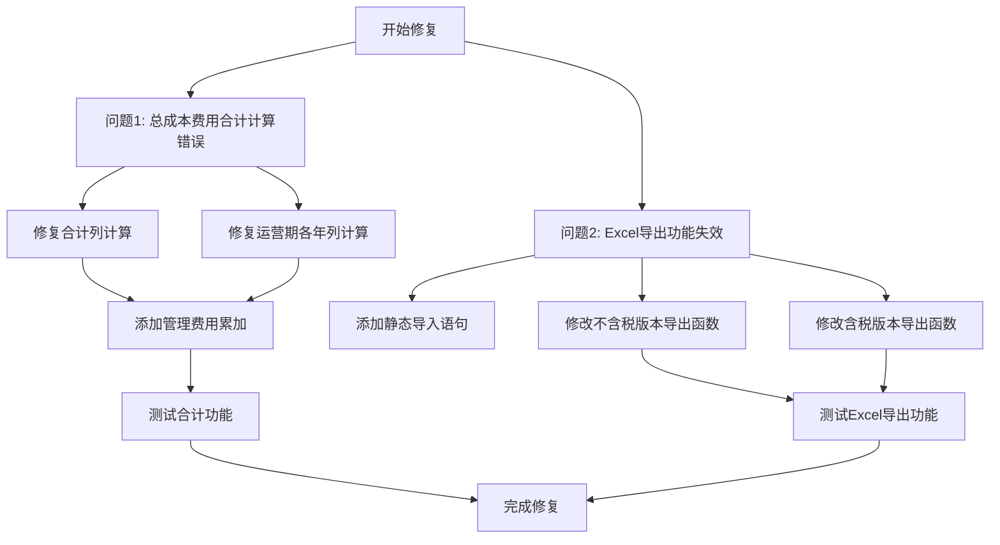

# 总成本费用估算表问题修复计划

## 问题概述

### 问题1: 总成本费用合计计算错误
**现象**: 序号7"总成本费用合计"的运营期列合计不正确,应该合计序号为自然数1到6的运营期列的值。

**根因**: 在总成本费用合计行的计算逻辑中,管理费用(序号2)未被累加到合计中。

### 问题2: Excel导出功能失效
**现象**: Excel表格导出功能失效,含税与不含税版本都失效。

**根因**: 使用了动态导入方式`import('xlsx-js-style')`,在Vite环境中存在兼容性问题,应改为静态导入。

---

## 详细修复方案

### 问题1修复: 总成本费用合计计算错误

#### 修复位置1: 合计列计算 (第5288-5376行)

**当前代码问题**:
```typescript
// 第5347行: 管理费用未被累加
yearTotal += yearRow1;  // 营业成本
yearTotal += calculateManagementExpenses(year, years);  // ❌ 缺少此行
```

**修复方案**:
在合计列计算循环中,为每个运营期年份添加管理费用的累加:

```typescript
// 在第5347行之后添加:
const managementExpense = calculateManagementExpenses(year, years);
yearTotal += managementExpense;
```

**具体修改位置**:
- 文件: `client/src/components/revenue-cost/DynamicCostTable.tsx`
- 行号: 约5347行
- 在`yearTotal += yearRow1;`之后添加管理费用累加

#### 修复位置2: 运营期各年列计算 (第5378-5459行)

**当前代码问题**:
```typescript
// 第5429行: 管理费用未被累加
yearTotal += yearRow1;  // 营业成本
yearTotal += calculateManagementExpenses(year, years);  // ❌ 缺少此行
```

**修复方案**:
在各年列计算循环中,为每个运营期年份添加管理费用的累加:

```typescript
// 在第5429行之后添加:
const managementExpense = calculateManagementExpenses(year, years);
yearTotal += managementExpense;
```

**具体修改位置**:
- 文件: `client/src/components/revenue-cost/DynamicCostTable.tsx`
- 行号: 约5429行
- 在`yearTotal += yearRow1;`之后添加管理费用累加

---

### 问题2修复: Excel导出功能失效

#### 修复位置1: 不含税版本导出 (第2516-2942行)

**当前代码问题**:
```typescript
// 第2532行: 使用动态导入
import('xlsx-js-style').then((XLSXStyle) => {
  // ...
  const wb = XLSXStyle.utils.book_new();
  // ...
});
```

**修复方案**:
1. 在文件顶部添加静态导入语句
2. 将动态导入改为直接使用静态导入的模块

**具体修改步骤**:

**步骤1**: 在文件顶部添加导入语句(约第3-5行附近)
```typescript
import * as XLSX from 'xlsx-js-style'
```

**步骤2**: 修改`handleExportCostTable`函数(第2516-2942行)
```typescript
// 将:
const handleExportCostTable = () => {
  // ...
  import('xlsx-js-style').then((XLSXStyle) => {
    // ...
    const wb = XLSXStyle.utils.book_new();
    // ...
  });
}

// 改为:
const handleExportCostTable = () => {
  // ...
  // 直接使用静态导入的XLSX
  const wb = XLSX.utils.book_new();
  // ...
};
```

#### 修复位置2: 含税版本导出 (第2944-3307行)

**当前代码问题**:
```typescript
// 第2960行: 使用动态导入
import('xlsx-js-style').then((XLSXStyle) => {
  // ...
  const wb = XLSXStyle.utils.book_new();
  // ...
});
```

**修复方案**:
与不含税版本相同,使用静态导入替换动态导入。

**具体修改步骤**:
修改`handleExportCostTableWithTax`函数(第2944-3307行):
```typescript
// 将:
const handleExportCostTableWithTax = () => {
  // ...
  import('xlsx-js-style').then((XLSXStyle) => {
    // ...
    const wb = XLSXStyle.utils.book_new();
    // ...
  });
}

// 改为:
const handleExportCostTableWithTax = () => {
  // ...
  // 直接使用静态导入的XLSX
  const wb = XLSX.utils.book_new();
  // ...
};
```

---

## 修复流程图



---

## 修复优先级

| 优先级 | 任务 | 说明 |
|--------|------|------|
| P0 | 添加静态导入语句 | 影响两个导出功能,必须先完成 |
| P1 | 修复合计列计算 | 影响核心数据准确性 |
| P1 | 修复运营期各年列计算 | 影响核心数据准确性 |
| P1 | 修改不含税版本导出函数 | 修复导出功能 |
| P1 | 修改含税版本导出函数 | 修复导出功能 |

---

## 测试验证清单

### 问题1测试
- [ ] 打开总成本费用估算表modal
- [ ] 检查序号7"总成本费用合计"的合计列值
- [ ] 验证合计值 = 序号1+2+3+4+5+6的合计列值
- [ ] 检查序号7的运营期各年列值
- [ ] 验证各年值 = 序号1+2+3+4+5+6对应年份列值

### 问题2测试
- [ ] 点击不含税版本Excel导出按钮
- [ ] 验证Excel文件成功下载
- [ ] 打开Excel文件,检查数据完整性
- [ ] 点击含税版本Excel导出按钮
- [ ] 验证Excel文件成功下载
- [ ] 打开Excel文件,检查数据完整性

---

## 注意事项

1. **遵循JSX计算规范**: 所有计算逻辑必须在渲染前完成,禁止在JSX中直接计算
2. **空值处理**: 对`undefined`/`null`数据做兜底处理,避免`NaN`
3. **不可变数据**: 生成新数据对象,不污染原始数据源
4. **导入方式**: 使用静态导入而非动态导入,确保Vite兼容性
5. **备份修改**: 修改前备份原文件到backup文件夹

---

## 相关文件

- `client/src/components/revenue-cost/DynamicCostTable.tsx` - 主要修改文件
- `client/package.json` - 确认xlsx-js-style库已安装
- `client/src/pages/InvestmentSummary.tsx` - 参考正确的xlsx-js-style使用方式
