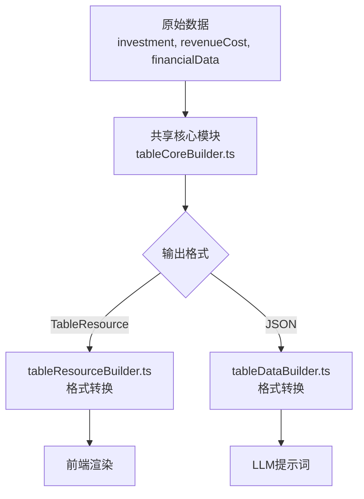

# 表格数据构建器统一重构计划

## 问题背景

当前存在两个功能重复的表格数据构建器：

1. **[`client/src/utils/tableResourceBuilder.ts`](client/src/utils/tableResourceBuilder.ts)** - 客户端，构建 `TableResource` 格式用于前端渲染
2. **[`server/src/utils/tableDataBuilder.ts`](server/src/utils/tableDataBuilder.ts)** - 服务端，构建 JSON 格式用于 LLM 提示词

两个文件实现了相同的数据处理逻辑，导致：
- **重复计算**：同一份 JSON 数据被计算两遍
- **维护困难**：修改一处逻辑需要同步修改另一处
- **不一致风险**：两处实现可能产生差异

## 重构目标

统一计算逻辑，按需输出不同格式，消除重复计算。

## 重构方案

### 架构设计



### 新增共享模块：`shared/tableCoreBuilder.ts`

核心原则：**只做数据转换，不做格式输出**

#### 核心函数签名

```typescript
// 投资估算核心数据
interface InvestmentEstimateCore {
  partA: { total: number; children: any[]; 建设工程费: number; 设备购置费: number; 安装工程费: number; 其它费用: number };
  partB: { total: number; children: any[]; 其它费用: number };
  partC: { total: number };
  partD: { total: number };
  partE: { total: number };
  partF: { total: number; 贷款总额: number; 年利率: number; 建设期年限: number };
  partG: { total: number };
  thirdLevelItems: Record<number, any[]>;
}

// 折旧摊销核心数据
interface DepreciationAmortizationCore {
  A_depreciation: number[];
  D_depreciation: number[];
  E_amortization: number[];
  A: { 原值: number; 年折旧额: number; 折旧年限: number; 残值率: number };
  D: { 原值: number; 年折旧额: number; 折旧年限: number; 残值率: number };
  E: { 原值: number; 年摊销额: number; 摊销年限: number; 残值率: number };
}

// 财务指标核心数据
interface FinancialIndicatorsCore {
  totalRevenue: number;
  totalCost: number;
  totalInvestment: number;
  constructionInvestment: number;
  constructionInterest: number;
  annualTax: number;
  annualVAT: number;
  annualEBIT: number;
  annualNetProfit: number;
  roi: number;
  roe: number;
  interestCoverageRatio: number;
  debtServiceCoverageRatio: number;
  firrBeforeTax: number;
  firrAfterTax: number;
  npvBeforeTax: number;
  npvAfterTax: number;
  paybackPeriodBeforeTax: number;
  paybackPeriodAfterTax: number;
}

// 核心构建函数
function buildInvestmentEstimateCore(estimateData: any): InvestmentEstimateCore;
function buildDepreciationAmortizationCore(depreciationData: any): DepreciationAmortizationCore;
function buildRevenueTaxCore(revenueTaxData: any): any;
function buildFinancialIndicatorsCore(financialData: any): FinancialIndicatorsCore;
function buildLoanRepaymentCore(loanData: any, context?: any): any;
function buildTotalCostCore(projectData: any): any;
```

### 重构步骤

#### 阶段1：创建共享核心模块

- [ ] 创建 `shared/tableCoreBuilder.ts`（位于 server/src/shared/）
- [ ] 迁移 `buildInvestmentEstimateCore` 函数
- [ ] 迁移 `buildDepreciationAmortizationCore` 函数
- [ ] 迁移 `buildRevenueTaxCore` 函数
- [ ] 迁移 `buildFinancialIndicatorsCore` 函数
- [ ] 迁移 `buildLoanRepaymentCore` 函数
- [ ] 迁移 `buildTotalCostCore` 函数
- [ ] 迁移 `buildSalaryWelfareCore` 函数
- [ ] 迁移 `buildRawMaterialsCore` 函数
- [ ] 迁移 `buildFuelPowerCore` 函数
- [ ] 迁移 `buildProfitDistributionCore` 函数
- [ ] 迁移 `buildProjectCashFlowCore` 函数

#### 阶段2：重构客户端 tableResourceBuilder

- [ ] 引入共享核心模块
- [ ] 修改各函数复用 `buildXXXCore` 计算结果
- [ ] 仅保留格式转换逻辑（TableResource）
- [ ] 添加单元测试

#### 阶段3：重构服务端 tableDataBuilder

- [ ] 引入共享核心模块
- [ ] 修改各函数复用 `buildXXXCore` 计算结果
- [ ] 仅保留格式转换逻辑（JSON）
- [ ] 添加单元测试

#### 阶段4：验证和清理

- [ ] 运行前端渲染测试
- [ ] 运行后端API测试
- [ ] 对比重构前后输出结果一致性
- [ ] 删除重复代码
- [ ] 更新相关文档

### 注意事项

1. **位置选择**：共享模块放在 `server/src/shared/tableCoreBuilder.ts`，因为服务端模块更多、更复杂
2. **客户端引用**：通过 npm workspace 或 monorepo 机制引用共享模块
3. **兼容性问题**：如果客户端无法直接引用服务端代码，考虑将共享模块复制到客户端 `client/src/shared/`
4. **格式转换分离**：核心模块只返回纯数据对象，格式转换（TableResource vs JSON）由各自模块负责

## 文件结构变化

```
server/src/
├── utils/
│   ├── tableDataBuilder.ts  [简化 - 仅保留格式转换]
│   └── ...
├── shared/
│   └── tableCoreBuilder.ts  [新增 - 核心计算逻辑]
└── ...

client/src/
├── utils/
│   ├── tableResourceBuilder.ts  [简化 - 仅保留格式转换]
│   └── ...
└── shared/  [可选 - 复制或引用服务端共享模块]
    └── tableCoreBuilder.ts
```

## 输出格式差异

| 模块 | 输出格式 | 用途 |
|------|---------|------|
| tableCoreBuilder | 纯数据对象 `{ key: value }` | 计算核心 |
| tableResourceBuilder | `{ id, title, columns, data, style }` | 前端渲染 |
| tableDataBuilder | `{ key: JSON.stringify(data) }` | LLM提示词 |
