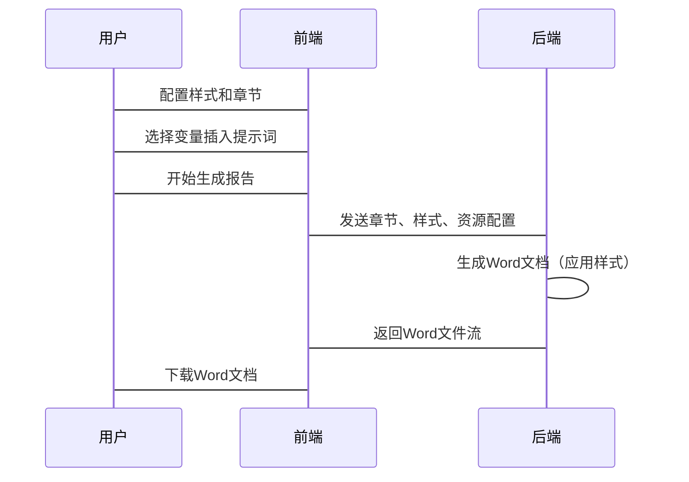

# Word报告排版优化 - 技术实现总结

## 已完成工作

### 1. 类型定义扩展

创建了新的类型文件 `client/src/types/report.ts`，包含：

- **ReportStyleConfig**：样式配置接口
  - 字体设置（正文、标题、数字字体）
  - 字号设置（标题、正文、表格等）
  - 段落设置（行间距、段前段后间距）
  - 页面设置（边距、纸张方向）
  - 表格样式（表头背景、边框、斑马纹、对齐）

- **ReportSections**：章节配置接口
  - CoverSection：封面配置（标题、副标题、项目名称、编制单位、编制人、日期、Logo）
  - TableOfContentsSection：目录配置（启用、标题、页码、深度）
  - BodySection：正文章节（标题、内容、级别）
  - AppendixSection：附录（标题、内容）

- **ResourceMap**：资源映射
  - TableResource：表格资源（ID、标题、列、数据、样式）
  - ChartResource：图表资源（ID、类型、标题、图片数据）

### 2. Store状态管理

更新了 `client/src/stores/reportStore.ts`，新增：

- **styleConfig**：样式配置状态
- **sections**：章节配置状态
- **resources**：表格和图表资源状态
- **updateStyleConfig()**：更新样式配置
- **resetStyleConfig()**：重置样式配置
- **updateSections()**：更新章节配置
- **resetSections()**：重置章节配置
- **updateResources()**：更新资源

### 3. API接口扩展

更新了 `client/src/services/reportApi.ts`，新增：

- **exportWord()**：支持导出时传递章节、样式和资源配置
  ```typescript
  async exportWord(reportId: string, options: {
    sections?: ReportSections
    styleConfig?: ReportStyleConfig
    resources?: ResourceMap
  })
  ```

### 4. 后端服务扩展准备

更新了 `server/src/services/reportService.ts` 的导入，新增：

- Table、TableRow、TableCell、WidthType、BorderStyle、ShadingType、ImageRun
- 类型接口定义（ReportStyleConfig、ReportSections、ResourceMap等）

---

## 待实现功能

### 阶段1：后端Word生成功能

#### 1.1 样式应用函数

创建以下函数以应用样式配置：

```typescript
// 创建带样式的段落
static createStyledParagraph(
  text: string,
  styleConfig: ReportStyleConfig,
  options?: {
    isHeading?: boolean
    alignment?: AlignmentType
  }
): Paragraph

// 创建Word表格（带样式）
static createStyledTable(
  tableData: any[],
  columns: string[],
  styleConfig: ReportStyleConfig
): Table
```

#### 1.2 章节生成函数

创建以下函数以生成章节：

```typescript
// 创建封面页
static createCoverPage(
  cover: CoverSection,
  styleConfig: ReportStyleConfig
): Paragraph[]

// 创建目录页
static createTableOfContents(
  toc: TableOfContentsSection,
  bodySections: BodySection[],
  styleConfig: ReportStyleConfig
): Paragraph[]

// 创建章节内容
static createSectionContent(
  section: BodySection | AppendixSection,
  resources: ResourceMap,
  styleConfig: ReportStyleConfig
): any[]
```

#### 1.3 Word文档组装函数

```typescript
// 创建完整的Word文档（包含所有章节）
static createCompleteDocument(
  sections: ReportSections,
  resources: ResourceMap,
  styleConfig: ReportStyleConfig
): Document
```

#### 1.4 扩展内容解析器

更新 `parseContentToWord()` 函数以支持：

- 解析 `{{TABLE:xxx}}` 标记并生成Word表格
- 解析 `{{CHART:xxx}}` 标记并嵌入图片
- 应用样式配置到所有元素

### 阶段2：后端API接口

#### 2.1 更新报告导出接口

在 `server/src/controllers/reportController.ts` 中：

```typescript
// 新增导出接口
export async function exportReport(req: Request, res: Response) {
  const { reportId } = req.body
  const { sections, styleConfig, resources } = req.body
  
  // 调用reportService生成Word文档
  const buffer = await ReportService.generateWordDocument(
    reportId,
    sections,
    styleConfig,
    resources
  )
  
  // 设置响应头并返回文件流
  res.setHeader('Content-Type', 'application/vnd.openxmlformats-officedocument.wordprocessingml.document')
  res.setHeader('Content-Disposition', `attachment; filename="投资方案报告.docx"`)
  res.send(buffer)
}
```

### 阶段3：前端组件

#### 3.1 创建样式设置面板组件

新建 `client/src/components/report/StyleSettingsPanel.tsx`：

功能：
- 字体设置（正文、标题、数字字体选择）
- 字号设置（标题、正文、表格字号）
- 段落设置（行间距、段前段后间距）
- 页面设置（边距、纸张方向）
- 表格样式（表头背景色、斑马纹、对齐方式）
- 实时预览样式效果
- 保存/重置样式配置

#### 3.2 创建章节配置面板组件

新建 `client/src/components/report/SectionConfigPanel.tsx`：

功能：
- 封面设置（标题、副标题、项目名称、编制单位、编制人、日期、Logo上传）
- 目录设置（启用/禁用、标题、页码、深度）
- 正文章节管理（添加、删除、编辑章节标题和内容）
- 附录管理（添加、删除、编辑附录标题和内容）

#### 3.3 更新ReportPreview组件

更新 `client/src/components/report/ReportPreview.tsx`：

功能：
- 解析并渲染封面
- 自动生成目录
- 解析并渲染正文章节
- 解析并渲染附录
- 应用样式配置到预览
- 解析 `{{TABLE:xxx}}` 并渲染HTML表格
- 解析 `{{CHART:xxx}}` 并渲染图表占位符

#### 3.4 更新ReportGeneration页面

更新 `client/src/pages/ReportGeneration.tsx`：

功能：
- 添加样式设置面板
- 添加章节配置面板
- 集成现有功能（提示词编辑、变量选择、预览）
- 统一管理报告生成流程

### 阶段4：后端路由配置

在 `server/src/routes/report.ts` 中添加新路由：

```typescript
// 导出Word文档路由
router.post('/export', exportReport)
```

---

## 实现优先级

### 高优先级（核心功能）

1. ✅ 类型定义和Store状态管理
2. ✅ API接口扩展
3. ⏳ 后端样式应用函数
4. ⏳ 后端章节生成函数
5. ⏳ 后端Word文档组装函数
6. ⏳ 后端内容解析器扩展（表格/图表支持）
7. ⏳ 后端导出API接口
8. ⏳ 前端样式设置面板组件
9. ⏳ 前端章节配置面板组件
10. ⏳ 前端ReportPreview更新（章节渲染）
11. ⏳ 前端ReportGeneration页面集成

### 中优先级（增强功能）

12. ⏳ 前端表格渲染组件
13. ⏳ 前端图表渲染组件
14. ⏳ 表格和图表资源生成逻辑
15. ⏳ 默认样式模板
16. ⏳ 预设章节模板
17. ⏳ 样式持久化存储
18. ⏳ 章节模板保存功能

### 低优先级（可选功能）

19. ⏳ 页眉页脚支持
20. ⏳ 封面Logo图片上传
21. ⏳ 目录自动页码更新
22. ⏳ 表格条件格式化
23. ⏳ 图表交互功能
24. ⏳ 批量导出功能

---

## 技术要点

### 样式转换规则

**docx库单位转换**：
- 字号：pt（point）→ docx使用双倍值（如12pt = 24）
- 行间距：倍数→ docx使用twip（1.5倍 = 360 twip）
- 边距：cm→ docx使用twip（1cm = 567 twip）

**字体映射**：
- 仿宋_GB2312 → 仿宋
- 黑体 → 黑体
- Times New Roman → Times New Roman

### 表格生成规则

- 使用 `Table`、`TableRow`、`TableCell` 创建表格
- 表头行设置 `tableHeader: true` 以支持跨页重复
- 使用 `WidthType.PERCENTAGE` 设置表格宽度
- 使用 `BorderStyle.SINGLE` 设置边框样式
- 使用 `ShadingType` 设置表头背景色

### 图片嵌入规则

- 使用 `ImageRun` 嵌入图片
- 图片类型：'png'
- 支持自定义宽高
- 支持居中对齐

### 章节组织规则

- 封面：独立section，使用分页符
- 目录：独立section，自动提取标题
- 正文：多个section，每个section包含标题和内容
- 附录：多个section，使用不同边距或方向

---

## 数据流



---

## 测试要点

### 单元测试

1. 样式配置功能测试
   - 字体、字号、行间距修改生效
   - 页边距修改生效
   - 表格样式修改生效

2. 章节功能测试
   - 封面信息正确显示
   - 目录自动生成
   - 正文章节正确渲染
   - 附录正确渲染

3. 导出功能测试
   - Word文档格式正确
   - 样式正确应用
   - 表格正确生成
   - 图片正确嵌入

### 集成测试

1. 端到端流程测试
   - 生成报告→导出Word
   - 验证Word文档包含所有章节
   - 验证样式正确应用

---

## 文件清单

### 已创建/修改

- ✅ `client/src/types/report.ts` - 新建
- ✅ `client/src/stores/reportStore.ts` - 更新
- ✅ `client/src/services/reportApi.ts` - 更新
- ✅ `server/src/services/reportService.ts` - 部分更新（导入语句）

### 待创建

- ⏳ `client/src/components/report/StyleSettingsPanel.tsx`
- ⏳ `client/src/components/report/SectionConfigPanel.tsx`
- ⏳ `client/src/components/report/TableRenderer.tsx`
- ⏳ `client/src/components/report/ChartRenderer.tsx`
- ⏳ `server/src/controllers/reportController.ts` - 添加导出接口
- ⏳ `server/src/routes/report.ts` - 添加路由

---

## 后续建议

1. **分阶段实现**：先实现核心功能（样式应用、章节生成、表格支持），再实现增强功能（图表、模板）
2. **增量开发**：每个功能独立开发测试，避免大规模重构
3. **向后兼容**：保持现有API不变，新增可选参数
4. **文档先行**：每个功能开发前先更新技术文档
5. **用户测试**：每个功能完成后进行用户验收测试

---

## 注意事项

1. **遵循编码规范**：避免在JSX中直接执行计算，所有计算逻辑前置
2. **类型安全**：使用TypeScript严格类型检查
3. **错误处理**：完善的错误处理和用户友好的错误提示
4. **性能优化**：大文件生成时考虑流式处理
5. **测试覆盖**：单元测试和集成测试并重
