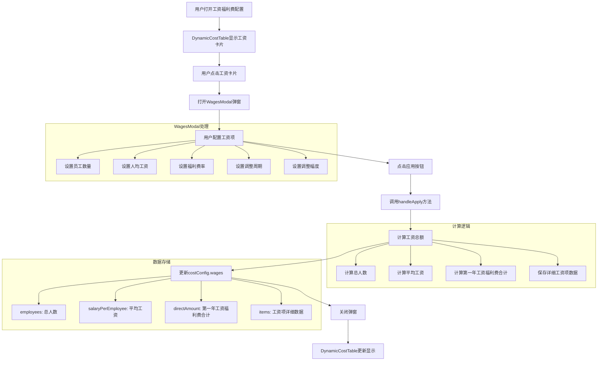

# 工资福利费功能：WagesModal与DynamicCostTable数据关联分析

## 概述
工资福利费功能通过两个主要组件实现：WagesModal（工资及福利费配置弹窗）和DynamicCostTable（动态成本表格）。它们之间通过costConfig.wages数据结构实现数据共享和同步。

## 数据流程图



## 组件功能分析

### WagesModal组件
- **文件路径**: `/opt/Solution_Assistant/client/src/components/revenue-cost/WagesModal.tsx`
- **主要功能**: 提供工资及福利费的详细配置界面
- **关键方法**: 
  - `handleApply()`: 计算工资总额并更新costConfig
  - `calculateSubtotal()`: 计算工资小计（员工数×人均工资）
  - `calculateWelfare()`: 计算福利费（工资小计×福利费率）
  - `calculateTotal()`: 计算工资项总额（工资小计+福利费）
  - `calculateYearlySalary()`: 计算特定年份的工资（考虑调整周期和幅度）

### DynamicCostTable组件
- **文件路径**: `/opt/Solution_Assistant/client/src/components/revenue-cost/DynamicCostTable.tsx`
- **主要功能**: 在营业成本估算表中显示工资及福利费数据
- **关键代码位置**:
  - 第300-400行: 成本配置项卡片定义，包含"工资及福利费"卡片
  - 第2000-2100行: 工资及福利费计算逻辑
  - 第2300-2400行: 工资及福利费在表格中的显示

## 数据关联详细分析

### 1. 数据流向
1. 用户在DynamicCostTable中点击"工资及福利费"卡片
2. 系统打开WagesModal弹窗，加载当前costConfig.wages中的数据
3. 用户修改工资项配置（员工数、工资、福利费率等）
4. 点击"应用"按钮，调用handleApply方法
5. handleApply方法计算工资总额并更新costConfig.wages
6. 弹窗关闭，DynamicCostTable自动更新显示

### 2. 数据结构

```typescript
interface WagesConfig {
  employees: number;          // 总人数
  salaryPerEmployee: number;   // 平均工资（万元/年）
  directAmount: number;        // 第一年工资及福利费合计
  items: WageItem[];          // 工资项详细数据
}

interface WageItem {
  id: string;                // 唯一标识
  name: string;              // 员工类别名称
  employees: number;         // 该类别员工数量
  salaryPerEmployee: number; // 该类别人均工资（万元/年）
  welfareRate: number;       // 福利费率（%）
  changeInterval: number;    // 工资调整间隔（年）
  changePercentage: number;  // 每次调整幅度（%）
}
```

### 3. 计算逻辑

#### WagesModal中的计算
1. **工资小计**: `employees * salaryPerEmployee`
2. **福利费**: `工资小计 * (welfareRate / 100)`
3. **工资项总额**: `工资小计 + 福利费`
4. **第一年工资福利费合计**: 所有工资项的工资项总额之和

#### DynamicCostTable中的显示
1. **年度工资福利费**: 直接使用`costConfig.wages.directAmount`的值
2. **合计列**: `年度工资福利费 * 运营期年数`

## 关键代码片段

### WagesModal的handleApply方法
```typescript
const handleApply = () => {
  // 计算总人数和平均工资
  const totalEmployees = wageItems.reduce((sum, item) => sum + item.employees, 0)
  const totalSalary = wageItems.reduce((sum, item) => sum + (item.employees * item.salaryPerEmployee), 0)
  const averageSalary = totalEmployees > 0 ? totalSalary / totalEmployees : 0

  // 计算第一年的工资及福利费合计（工资+福利费）
  let firstYearTotal = 0;
  wageItems.forEach((item) => {
    const yearlySubtotal = item.employees * item.salaryPerEmployee
    const yearlyWelfare = yearlySubtotal * (item.welfareRate / 100)
    firstYearTotal += yearlySubtotal + yearlyWelfare
  })

  // 更新costConfig，保存详细的工资项数据
  updateCostConfig({
    ...costConfig,
    wages: {
      employees: totalEmployees,
      salaryPerEmployee: averageSalary,
      directAmount: firstYearTotal, // 存储第一年的工资及福利费合计
      items: wageItems // 保存完整的工资项数据
    }
  })
}
```

### DynamicCostTable中工资福利费的显示
```typescript
{/* 1.3 工资及福利费 */}
<Table.Tr>
  <Table.Td style={{ textAlign: 'center', border: '1px solid #dee2e6' }}>1.3</Table.Td>
  <Table.Td style={{ border: '1px solid #dee2e6' }}>工资及福利费</Table.Td>
  <Table.Td style={{ textAlign: 'right', border: '1px solid #dee2e6' }}>
    {(() => {
      // 工资及福利费合计 = 工资及福利明细表合计 × 运营期年数（通常不受达产率影响）
      const yearlyWages = costConfig.wages.directAmount || 0;
      const totalWages = yearlyWages * years.length;
      return totalWages.toFixed(2);
    })()}
  </Table.Td>
  {years.map((year) => (
    <Table.Td key={year} style={{ textAlign: 'right', border: '1px solid #dee2e6' }}>
      {(() => {
        // 工资及福利费 = 直接引用工资及福利明细表合计（通常不受达产率影响）
        const wages = costConfig.wages.directAmount || 0;
        return wages.toFixed(2);
      })()}
    </Table.Td>
  ))}
  <Table.Td style={{ textAlign: 'center', border: '1px solid #dee2e6' }}></Table.Td>
</Table.Tr>
```

## 总结

WagesModal和DynamicCostTable通过costConfig.wages数据结构实现了紧密的数据关联。WagesModal负责工资及福利费的详细配置和计算，将计算结果保存在costConfig.wages.directAmount中；DynamicCostTable则直接引用这个值来显示在营业成本估算表中。这种设计使得工资配置与成本显示能够保持同步，为用户提供了直观的工资管理功能。

需要注意的是，目前DynamicCostTable只显示了第一年的工资福利费（directAmount），而WagesModal中已经考虑了多年期的工资调整机制。如果需要在未来支持多年期的工资变化显示，需要扩展DynamicCostTable的计算逻辑，使其能够根据WagesModal中的changeInterval和changePercentage参数计算每年的工资福利费。